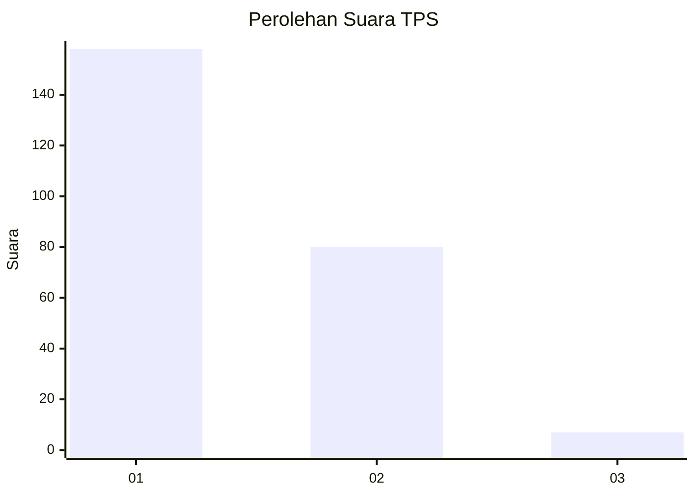
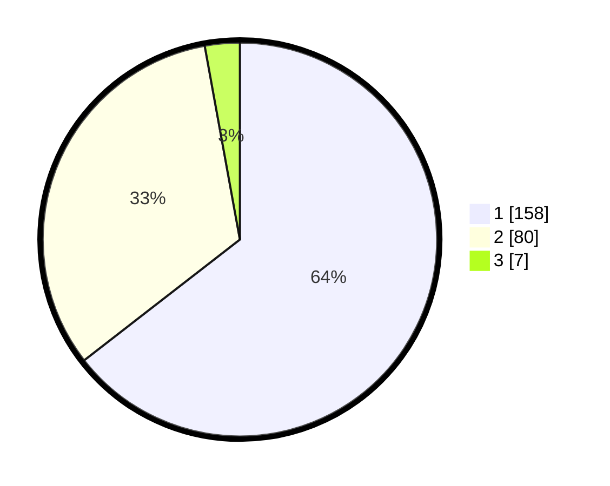

# Hasil

## Grafik

## Tabel

| No. | Nama Paslon    | Suara | Suara (raw) | Persentase |
|:--- |:-------------- | -----:| -----------:| ----------:|
| 1   | ANIES MUHAIMIN | 158   | [158][p-1]  | 64,49      |
| 2   | PRABOWO GIBRAN | 80    | [80][p-2]   | 32,65      |
| 3   | GANJAR MAHFUD  | 7     | [7][p-3]    | 2,86       |

[p-1]: https://github.com/gigit-pemilu/pemilu-2024-14-riau/blob/main/pilpres/hitung-suara/sub/14-riau/sub/07--rokan-hilir/sub/03-tanah-putih/sub/2001-ujung-tanjung/sub/003-tps/sub/paslon-1.txt
[p-2]: https://github.com/gigit-pemilu/pemilu-2024-14-riau/blob/main/pilpres/hitung-suara/sub/14-riau/sub/07--rokan-hilir/sub/03-tanah-putih/sub/2001-ujung-tanjung/sub/003-tps/sub/paslon-2.txt
[p-3]: https://github.com/gigit-pemilu/pemilu-2024-14-riau/blob/main/pilpres/hitung-suara/sub/14-riau/sub/07--rokan-hilir/sub/03-tanah-putih/sub/2001-ujung-tanjung/sub/003-tps/sub/paslon-3.txt

## Foto C Plano

https://sirekap-obj-formc.kpu.go.id/21b4/pemilu/ppwp/14/07/03/20/01/1407032001003-20240215-083727--b0ece25a-c759-40dd-adfb-270ab8a1723a.jpg

https://sirekap-obj-formc.kpu.go.id/21b4/pemilu/ppwp/14/07/03/20/01/1407032001003-20240215-083845--f6107d7a-eacf-4e98-af32-fb87101ec19a.jpg

https://sirekap-obj-formc.kpu.go.id/21b4/pemilu/ppwp/14/07/03/20/01/1407032001003-20240215-084102--12c11690-19d6-4d35-8886-156c1dd1e8ee.jpg

## Metadata

| Key        | Value               |
| ---------- | ------------------- |
| Time Stamp | 2024-02-16 12:51:22 |

