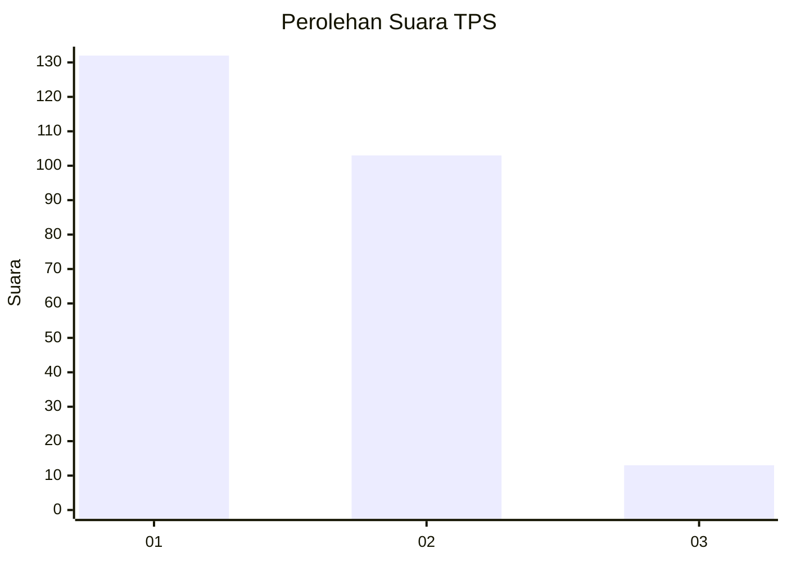
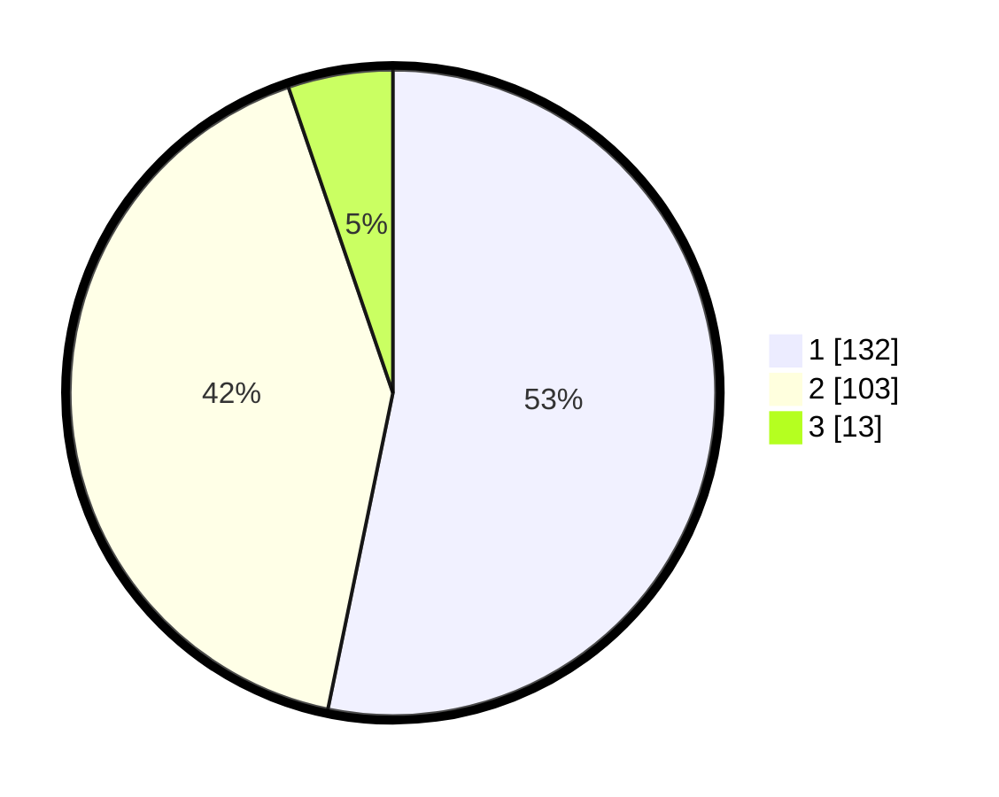

# Hasil

## Grafik

## Tabel

| No. | Nama Paslon    | Suara | Suara (raw) | Persentase |
|:--- |:-------------- | -----:| -----------:| ----------:|
| 1   | ANIES MUHAIMIN | 132   | [132][p-1]  | 53,23      |
| 2   | PRABOWO GIBRAN | 103   | [103][p-2]  | 41,53      |
| 3   | GANJAR MAHFUD  | 13    | [13][p-3]   | 5,24       |

[p-1]: https://github.com/gigit-pemilu/pemilu-2024-14-riau/blob/main/pilpres/hitung-suara/sub/14-riau/sub/07--rokan-hilir/sub/03-tanah-putih/sub/2001-ujung-tanjung/sub/007-tps/sub/paslon-1.txt
[p-2]: https://github.com/gigit-pemilu/pemilu-2024-14-riau/blob/main/pilpres/hitung-suara/sub/14-riau/sub/07--rokan-hilir/sub/03-tanah-putih/sub/2001-ujung-tanjung/sub/007-tps/sub/paslon-2.txt
[p-3]: https://github.com/gigit-pemilu/pemilu-2024-14-riau/blob/main/pilpres/hitung-suara/sub/14-riau/sub/07--rokan-hilir/sub/03-tanah-putih/sub/2001-ujung-tanjung/sub/007-tps/sub/paslon-3.txt

## Foto C Plano

https://sirekap-obj-formc.kpu.go.id/0dbb/pemilu/ppwp/14/07/03/20/01/1407032001007-20240215-033305--7cbe3cac-a3a5-4ee1-8a74-dcc9afee1083.jpg

https://sirekap-obj-formc.kpu.go.id/0dbb/pemilu/ppwp/14/07/03/20/01/1407032001007-20240215-033458--c300497f-fed1-4d27-ac04-012f81a3558d.jpg

https://sirekap-obj-formc.kpu.go.id/0dbb/pemilu/ppwp/14/07/03/20/01/1407032001007-20240215-000709--a9bba577-253a-471d-aa3f-89734537ac95.jpg

## Metadata

| Key        | Value               |
| ---------- | ------------------- |
| Time Stamp | 2024-02-16 12:51:22 |

