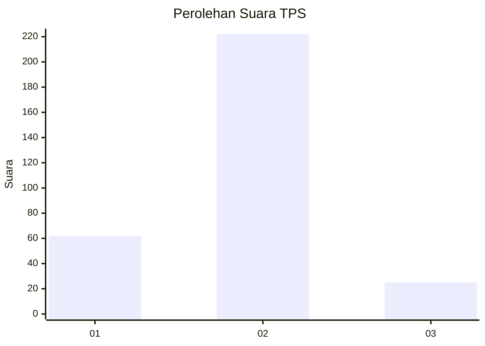
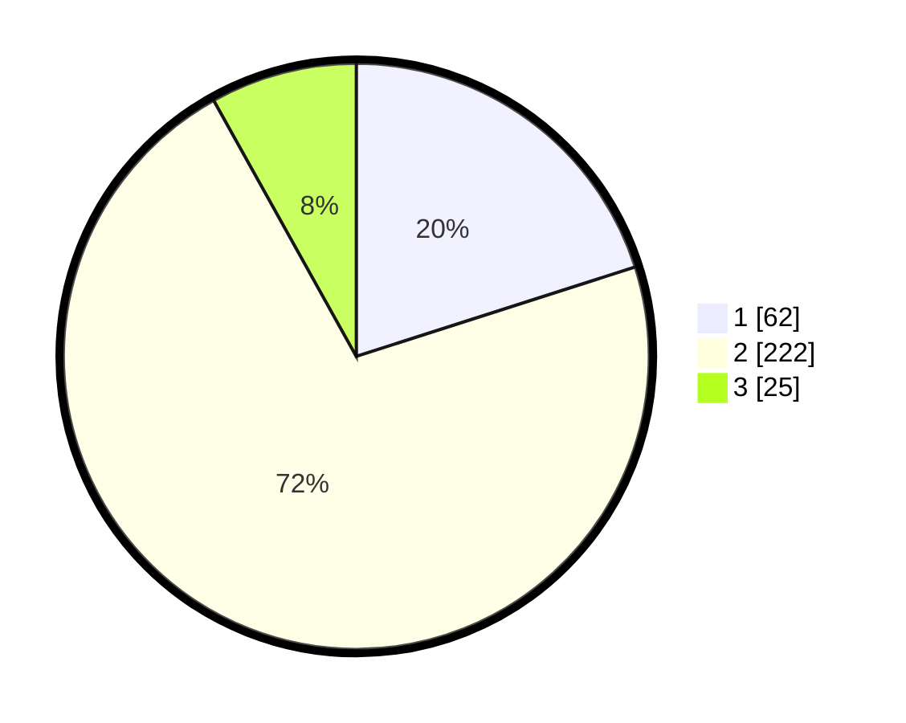

# Hasil

## Grafik

## Tabel

| No. | Nama Paslon    | Suara | Suara (raw) | Persentase |
|:--- |:-------------- | -----:| -----------:| ----------:|
| 1   | ANIES MUHAIMIN | 62    | [62][p-1]   | 20,06      |
| 2   | PRABOWO GIBRAN | 222   | [222][p-2]  | 71,84      |
| 3   | GANJAR MAHFUD  | 25    | [25][p-3]   | 8,09       |

[p-1]: https://github.com/gigit-pemilu/pemilu-2024-14-riau/blob/main/pilpres/hitung-suara/sub/14-riau/sub/07--rokan-hilir/sub/03-tanah-putih/sub/2002-rantau-bais/sub/007-tps/sub/paslon-1.txt
[p-2]: https://github.com/gigit-pemilu/pemilu-2024-14-riau/blob/main/pilpres/hitung-suara/sub/14-riau/sub/07--rokan-hilir/sub/03-tanah-putih/sub/2002-rantau-bais/sub/007-tps/sub/paslon-2.txt
[p-3]: https://github.com/gigit-pemilu/pemilu-2024-14-riau/blob/main/pilpres/hitung-suara/sub/14-riau/sub/07--rokan-hilir/sub/03-tanah-putih/sub/2002-rantau-bais/sub/007-tps/sub/paslon-3.txt

## Foto C Plano

https://sirekap-obj-formc.kpu.go.id/1b14/pemilu/ppwp/14/07/03/20/02/1407032002007-20240219-222037--2a88e63b-f923-47a9-9a35-7388a0bb7d68.jpg

https://sirekap-obj-formc.kpu.go.id/1b14/pemilu/ppwp/14/07/03/20/02/1407032002007-20240219-222258--a162e623-a423-4b23-b911-729eec05d23b.jpg

https://sirekap-obj-formc.kpu.go.id/1b14/pemilu/ppwp/14/07/03/20/02/1407032002007-20240219-222357--1e30b4a2-88bb-49f3-8e58-241d4f767c84.jpg

## Metadata

| Key        | Value               |
| ---------- | ------------------- |
| Time Stamp | 2024-02-19 23:00:00 |

## DATA PEMILIH TETAP

Jumlah pemilih dalam DPT: **255**.
 * L: **135**.
 * P: **121**.

## DATA PENGGUNA HAK PILIH

Jumlah pengguna hak pilih dalam DPT: **154**.
 * L: **131**.
 * P: **833**.

Jumlah pengguna hak pilih dalam DPTb: **888**.
 * L: **400**.
 * P: **8**.

Jumlah pengguna hak pilih dalam DPK: **415**.
 * L: **847**.
 * P: **888**.

Jumlah pengguna hak pilih: **203**.
 * L: **178**.
 * P: **101**.

## JUMLAH SUARA SAH DAN TIDAK SAH

JUMLAH SELURUH SUARA SAH: **204**.

JUMLAH SUARA TIDAK SAH: **0**.

JUMLAH SELURUH SUARA SAH DAN SUARA TIDAK SAH: **204**.

