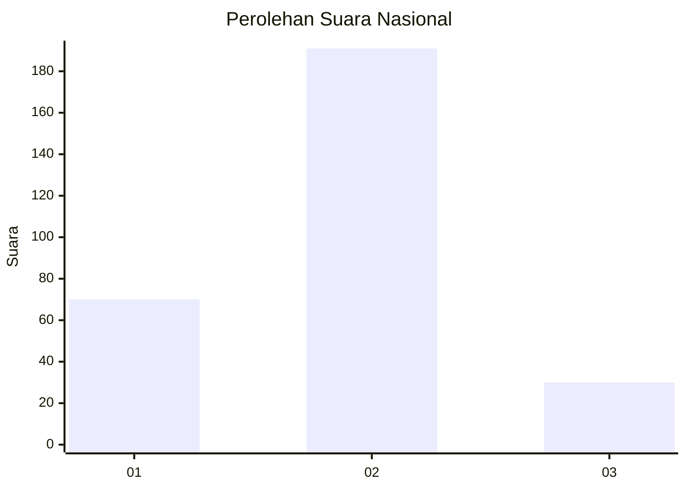

# Hasil

## Grafik

## Tabel

| No. | Nama Paslon    | Suara | Suara (raw) | Persentase |
|:--- |:-------------- | -----:| -----------:| ----------:|
| 1   | ANIES MUHAIMIN | 70    | [70][p-1]   | 24,05      |
| 2   | PRABOWO GIBRAN | 191   | [191][p-2]  | 65,64      |
| 3   | GANJAR MAHFUD  | 30    | [30][p-3]   | 10,31      |

[p-1]: https://github.com/gigit-pemilu/pemilu-2024/blob/main/pilpres/hitung-suara/sub/14-riau/sub/07--rokan-hilir/sub/03-tanah-putih/sub/2013-menggala-sakti/sub/001-tps/sub/paslon-1.txt
[p-2]: https://github.com/gigit-pemilu/pemilu-2024/blob/main/pilpres/hitung-suara/sub/14-riau/sub/07--rokan-hilir/sub/03-tanah-putih/sub/2013-menggala-sakti/sub/001-tps/sub/paslon-2.txt
[p-3]: https://github.com/gigit-pemilu/pemilu-2024/blob/main/pilpres/hitung-suara/sub/14-riau/sub/07--rokan-hilir/sub/03-tanah-putih/sub/2013-menggala-sakti/sub/001-tps/sub/paslon-3.txt

## Foto C Plano

https://sirekap-obj-formc.kpu.go.id/a17e/pemilu/ppwp/14/07/03/20/13/1407032013001-20240220-103759--13c17e0f-2905-453e-ba28-7c0d1d16b8b3.jpg

https://sirekap-obj-formc.kpu.go.id/a17e/pemilu/ppwp/14/07/03/20/13/1407032013001-20240220-103850--45916ae2-b098-4698-a3df-314284a43c56.jpg

https://sirekap-obj-formc.kpu.go.id/a17e/pemilu/ppwp/14/07/03/20/13/1407032013001-20240220-103935--8c18e30a-9dcb-4a14-941c-83d055799d90.jpg

## Metadata

| Key        | Value               |
| ---------- | ------------------- |
| Time Stamp | 2024-02-20 13:00:00 |

