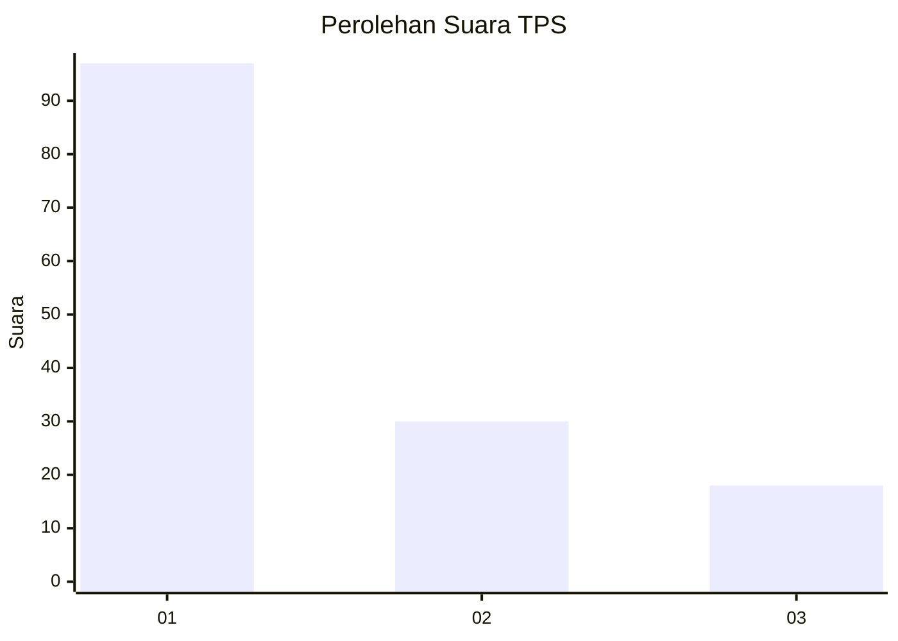
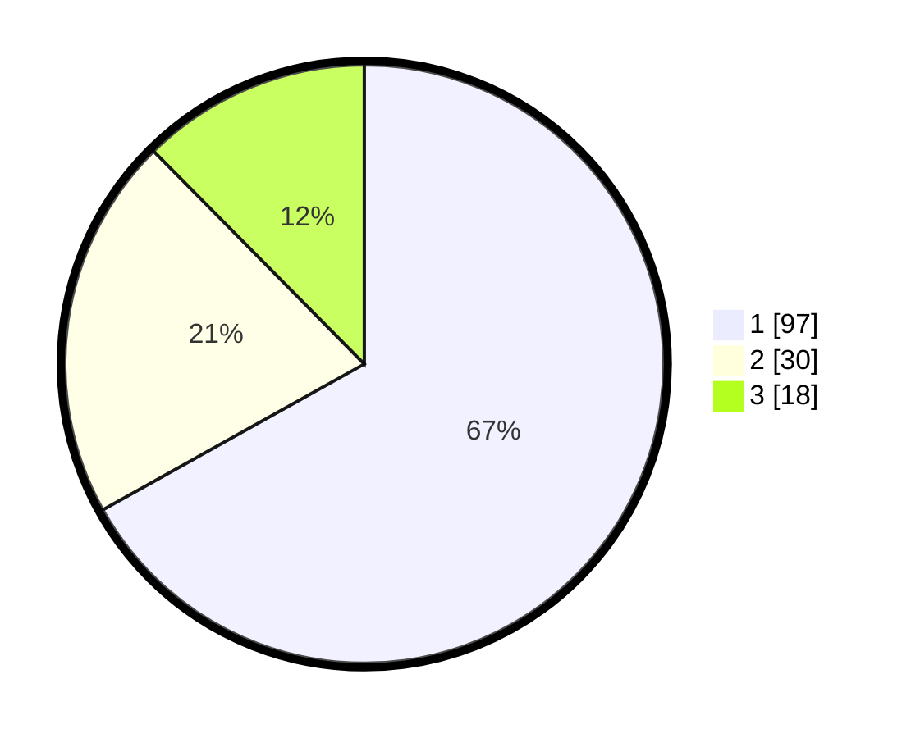

# Hasil

## Grafik

## Tabel

| No. | Nama Paslon    | Suara | Suara (raw) | Persentase |
|:--- |:-------------- | -----:| -----------:| ----------:|
| 1   | ANIES MUHAIMIN | 97    | [97][p-1]   | 66,90      |
| 2   | PRABOWO GIBRAN | 30    | [30][p-2]   | 20,69      |
| 3   | GANJAR MAHFUD  | 18    | [18][p-3]   | 12,41      |

[p-1]: https://github.com/gigit-pemilu/pemilu-2024-14-riau/blob/main/pilpres/hitung-suara/sub/14-riau/sub/07--rokan-hilir/sub/03-tanah-putih/sub/2013-menggala-sakti/sub/005-tps/sub/paslon-1.txt
[p-2]: https://github.com/gigit-pemilu/pemilu-2024-14-riau/blob/main/pilpres/hitung-suara/sub/14-riau/sub/07--rokan-hilir/sub/03-tanah-putih/sub/2013-menggala-sakti/sub/005-tps/sub/paslon-2.txt
[p-3]: https://github.com/gigit-pemilu/pemilu-2024-14-riau/blob/main/pilpres/hitung-suara/sub/14-riau/sub/07--rokan-hilir/sub/03-tanah-putih/sub/2013-menggala-sakti/sub/005-tps/sub/paslon-3.txt

## Foto C Plano

https://sirekap-obj-formc.kpu.go.id/fb78/pemilu/ppwp/14/07/03/20/13/1407032013005-20240220-215557--414c74b8-66de-4e94-b158-dc798b71216a.jpg

https://sirekap-obj-formc.kpu.go.id/fb78/pemilu/ppwp/14/07/03/20/13/1407032013005-20240220-221414--8be458ce-2051-4056-956e-82eb4e0044e8.jpg

https://sirekap-obj-formc.kpu.go.id/fb78/pemilu/ppwp/14/07/03/20/13/1407032013005-20240220-222117--fc0ab775-6123-4881-9a7d-e5a805ed71c3.jpg

## Metadata

| Key        | Value               |
| ---------- | ------------------- |
| Time Stamp | 2024-02-20 23:00:00 |

