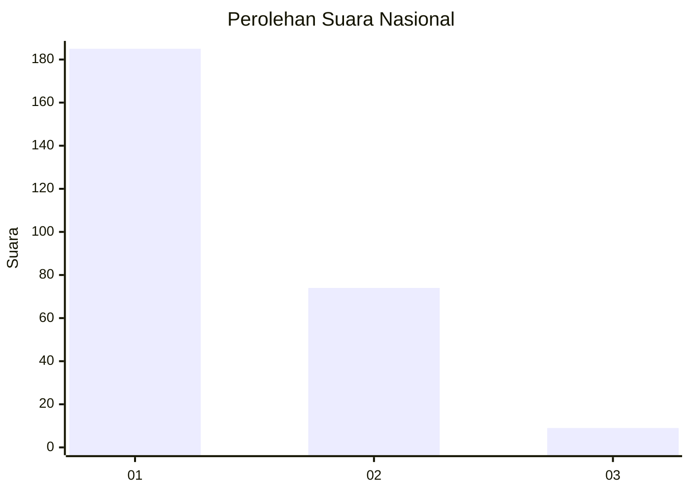
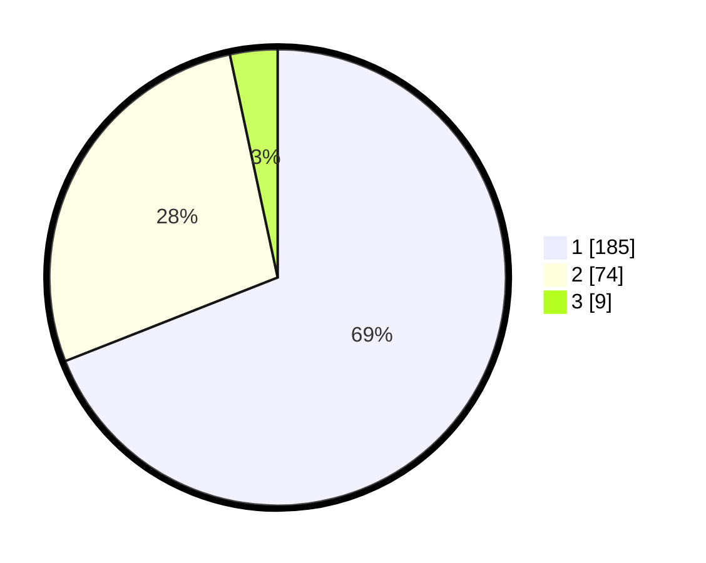

# Hasil

## Grafik

## Tabel

| No. | Nama Paslon    | Suara | Suara (raw) | Persentase |
|:--- |:-------------- | -----:| -----------:| ----------:|
| 1   | ANIES MUHAIMIN | 185   | [185][p-1]  | 69,03      |
| 2   | PRABOWO GIBRAN | 74    | [74][p-2]   | 27,61      |
| 3   | GANJAR MAHFUD  | 9     | [9][p-3]    | 3,36       |

[p-1]: https://github.com/gigit-pemilu/pemilu-2024/blob/main/pilpres/hitung-suara/sub/14-riau/sub/07--rokan-hilir/sub/03-tanah-putih/sub/2013-menggala-sakti/sub/008-tps/sub/paslon-1.txt
[p-2]: https://github.com/gigit-pemilu/pemilu-2024/blob/main/pilpres/hitung-suara/sub/14-riau/sub/07--rokan-hilir/sub/03-tanah-putih/sub/2013-menggala-sakti/sub/008-tps/sub/paslon-2.txt
[p-3]: https://github.com/gigit-pemilu/pemilu-2024/blob/main/pilpres/hitung-suara/sub/14-riau/sub/07--rokan-hilir/sub/03-tanah-putih/sub/2013-menggala-sakti/sub/008-tps/sub/paslon-3.txt

## Foto C Plano

https://sirekap-obj-formc.kpu.go.id/c970/pemilu/ppwp/14/07/03/20/13/1407032013008-20240221-102708--9a4e021f-8e38-41ba-b1fd-824730ca8297.jpg

https://sirekap-obj-formc.kpu.go.id/c970/pemilu/ppwp/14/07/03/20/13/1407032013008-20240221-103621--905ff007-e070-4483-b05b-e0a693474439.jpg

https://sirekap-obj-formc.kpu.go.id/c970/pemilu/ppwp/14/07/03/20/13/1407032013008-20240221-102855--3f0d006c-4836-4ff5-bc97-6d961b04765b.jpg

## Metadata

| Key        | Value               |
| ---------- | ------------------- |
| Time Stamp | 2024-02-21 11:00:00 |

