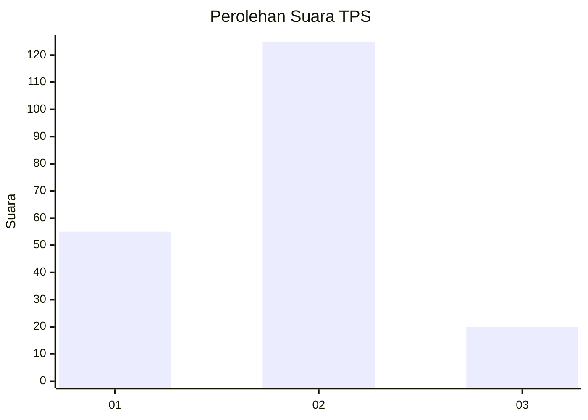
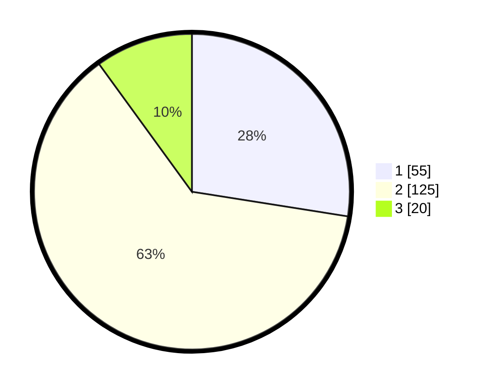

# Hasil

## Grafik

## Tabel

| No. | Nama Paslon    | Suara | Suara (raw) | Persentase |
|:--- |:-------------- | -----:| -----------:| ----------:|
| 1   | ANIES MUHAIMIN | 55    | [55][p-1]   | 27,50      |
| 2   | PRABOWO GIBRAN | 125   | [125][p-2]  | 62,50      |
| 3   | GANJAR MAHFUD  | 20    | [20][p-3]   | 10,00      |

[p-1]: https://github.com/gigit-pemilu/pemilu-2024-14-riau/blob/main/pilpres/hitung-suara/sub/14-riau/sub/07--rokan-hilir/sub/03-tanah-putih/sub/2013-menggala-sakti/sub/022-tps/sub/paslon-1.txt
[p-2]: https://github.com/gigit-pemilu/pemilu-2024-14-riau/blob/main/pilpres/hitung-suara/sub/14-riau/sub/07--rokan-hilir/sub/03-tanah-putih/sub/2013-menggala-sakti/sub/022-tps/sub/paslon-2.txt
[p-3]: https://github.com/gigit-pemilu/pemilu-2024-14-riau/blob/main/pilpres/hitung-suara/sub/14-riau/sub/07--rokan-hilir/sub/03-tanah-putih/sub/2013-menggala-sakti/sub/022-tps/sub/paslon-3.txt

## Foto C Plano

https://sirekap-obj-formc.kpu.go.id/4a07/pemilu/ppwp/14/07/03/20/13/1407032013022-20240222-171956--29d8cb6f-5af5-479b-bc8f-a54089eb17d5.jpg

https://sirekap-obj-formc.kpu.go.id/4a07/pemilu/ppwp/14/07/03/20/13/1407032013022-20240222-172536--b2e11b9b-98e4-444e-8e87-899ed6790f03.jpg

https://sirekap-obj-formc.kpu.go.id/4a07/pemilu/ppwp/14/07/03/20/13/1407032013022-20240222-172147--67ae90f1-5d50-41d4-b7db-0f3324ce8caa.jpg

## Metadata

| Key        | Value               |
| ---------- | ------------------- |
| Time Stamp | 2024-02-22 21:00:00 |

## DATA PEMILIH TETAP

Jumlah pemilih dalam DPT: **232**.
 * L: **302**.
 * P: **129**.

## DATA PENGGUNA HAK PILIH

Jumlah pengguna hak pilih dalam DPT: **655**.
 * L: **555**.
 * P: **554**.

Jumlah pengguna hak pilih dalam DPTb: **808**.
 * L: **88**.
 * P: **80**.

Jumlah pengguna hak pilih dalam DPK: **806**.
 * L: **883**.
 * P: **802**.

Jumlah pengguna hak pilih: **204**.
 * L: **827**.
 * P: **603**.

## JUMLAH SUARA SAH DAN TIDAK SAH

JUMLAH SELURUH SUARA SAH: **201**.

JUMLAH SUARA TIDAK SAH: **3**.

JUMLAH SELURUH SUARA SAH DAN SUARA TIDAK SAH: **204**.

