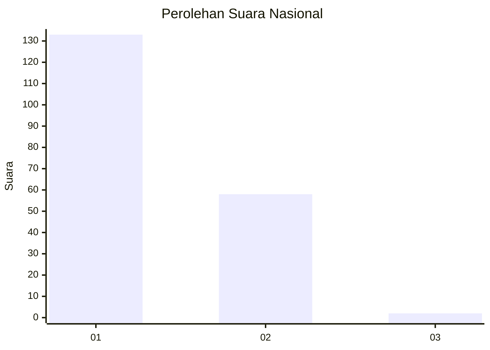
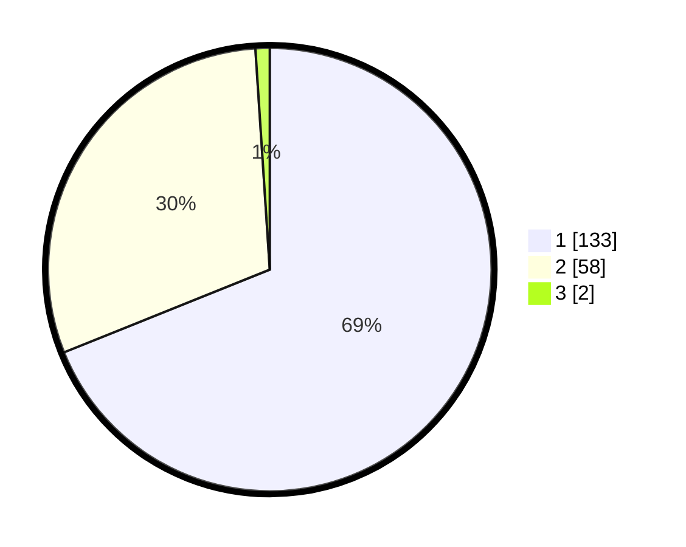

# Hasil

## Grafik

## Tabel

| No. | Nama Paslon    | Suara | Suara (raw) | Persentase |
|:--- |:-------------- | -----:| -----------:| ----------:|
| 1   | ANIES MUHAIMIN | 133   | [133][p-1]  | 68,91      |
| 2   | PRABOWO GIBRAN | 58    | [58][p-2]   | 30,05      |
| 3   | GANJAR MAHFUD  | 2     | [2][p-3]    | 1,04       |

[p-1]: https://github.com/gigit-pemilu/pemilu-2024/blob/main/pilpres/hitung-suara/sub/14-riau/sub/07--rokan-hilir/sub/03-tanah-putih/sub/2014-sekeladi-hilir/sub/001-tps/sub/paslon-1.txt
[p-2]: https://github.com/gigit-pemilu/pemilu-2024/blob/main/pilpres/hitung-suara/sub/14-riau/sub/07--rokan-hilir/sub/03-tanah-putih/sub/2014-sekeladi-hilir/sub/001-tps/sub/paslon-2.txt
[p-3]: https://github.com/gigit-pemilu/pemilu-2024/blob/main/pilpres/hitung-suara/sub/14-riau/sub/07--rokan-hilir/sub/03-tanah-putih/sub/2014-sekeladi-hilir/sub/001-tps/sub/paslon-3.txt

## Foto C Plano

https://sirekap-obj-formc.kpu.go.id/c703/pemilu/ppwp/14/07/03/20/14/1407032014001-20240215-045331--e0508672-3906-4cee-9336-4db1d4f3e7d8.jpg

https://sirekap-obj-formc.kpu.go.id/c703/pemilu/ppwp/14/07/03/20/14/1407032014001-20240215-045217--a42e8cb6-a1de-4cbf-9084-0a1c553eb497.jpg

https://sirekap-obj-formc.kpu.go.id/c703/pemilu/ppwp/14/07/03/20/14/1407032014001-20240215-045751--264f5dc7-8c52-4d02-a852-53b673324f60.jpg

## Metadata

| Key        | Value               |
| ---------- | ------------------- |
| Time Stamp | 2024-02-16 14:30:33 |

