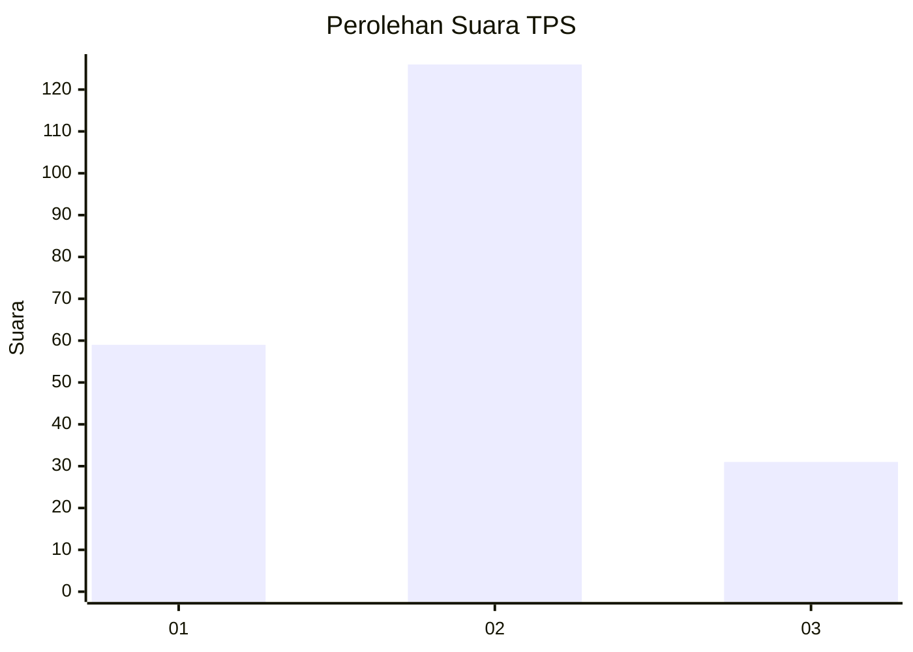
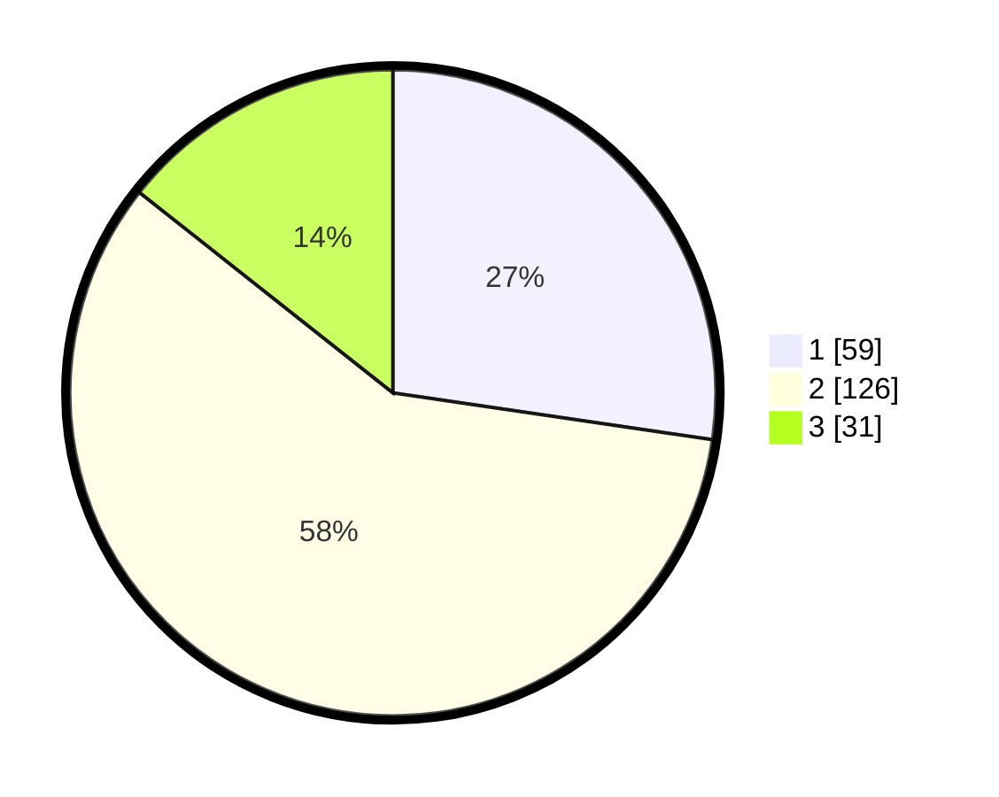

# Hasil

## Grafik

## Tabel

| No. | Nama Paslon    | Suara | Suara (raw) | Persentase |
|:--- |:-------------- | -----:| -----------:| ----------:|
| 1   | ANIES MUHAIMIN | 59    | [59][p-1]   | 27,31      |
| 2   | PRABOWO GIBRAN | 126   | [126][p-2]  | 58,33      |
| 3   | GANJAR MAHFUD  | 31    | [31][p-3]   | 14,35      |

[p-1]: https://github.com/gigit-pemilu/pemilu-2024-14-riau/blob/main/pilpres/hitung-suara/sub/14-riau/sub/07--rokan-hilir/sub/03-tanah-putih/sub/2015-menggala-sempurna/sub/004-tps/sub/paslon-1.txt
[p-2]: https://github.com/gigit-pemilu/pemilu-2024-14-riau/blob/main/pilpres/hitung-suara/sub/14-riau/sub/07--rokan-hilir/sub/03-tanah-putih/sub/2015-menggala-sempurna/sub/004-tps/sub/paslon-2.txt
[p-3]: https://github.com/gigit-pemilu/pemilu-2024-14-riau/blob/main/pilpres/hitung-suara/sub/14-riau/sub/07--rokan-hilir/sub/03-tanah-putih/sub/2015-menggala-sempurna/sub/004-tps/sub/paslon-3.txt

## Foto C Plano

https://sirekap-obj-formc.kpu.go.id/4813/pemilu/ppwp/14/07/03/20/15/1407032015004-20240215-095636--d6130c93-f330-42e0-b499-ef3a816b90bf.jpg

https://sirekap-obj-formc.kpu.go.id/4813/pemilu/ppwp/14/07/03/20/15/1407032015004-20240225-100856--9427bb1d-9d04-4e56-bf33-53c8af4b763b.jpg

https://sirekap-obj-formc.kpu.go.id/4813/pemilu/ppwp/14/07/03/20/15/1407032015004-20240225-101934--5e9a16bd-8a90-4c7a-a634-bdd520e55ddd.jpg

## Metadata

| Key        | Value               |
| ---------- | ------------------- |
| Time Stamp | 2024-02-25 16:00:00 |

