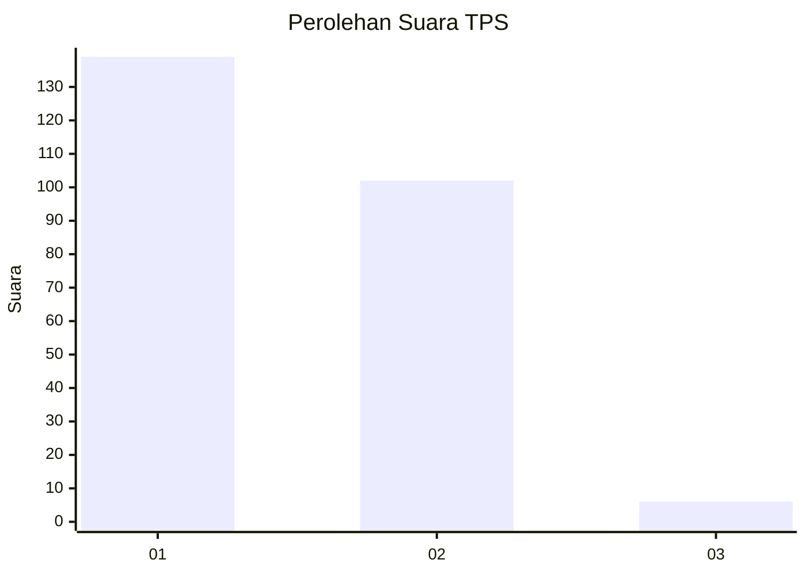
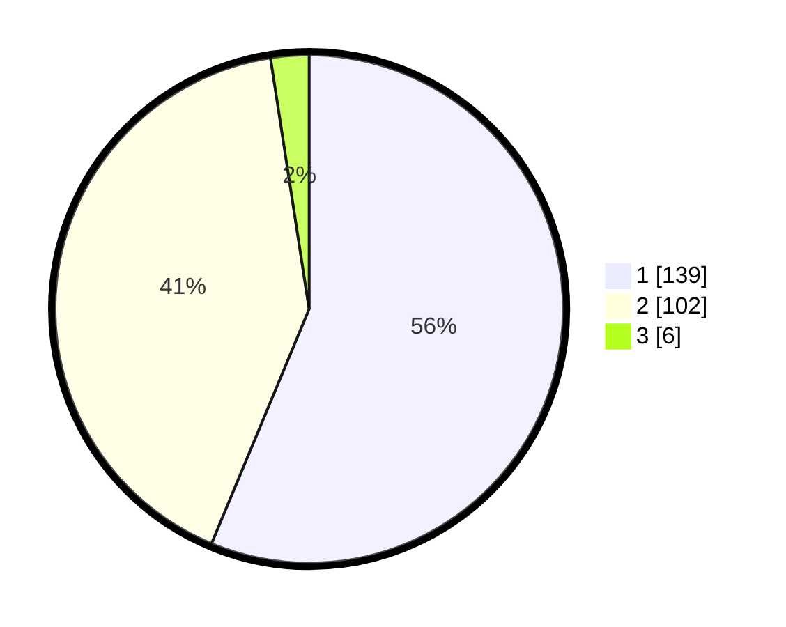

# Hasil

## Grafik

## Tabel

| No. | Nama Paslon    | Suara | Suara (raw) | Persentase |
|:--- |:-------------- | -----:| -----------:| ----------:|
| 1   | ANIES MUHAIMIN | 139   | [139][p-1]  | 56,28      |
| 2   | PRABOWO GIBRAN | 102   | [102][p-2]  | 41,30      |
| 3   | GANJAR MAHFUD  | 6     | [6][p-3]    | 2,43       |

[p-1]: https://github.com/gigit-pemilu/pemilu-2024-14-riau/blob/main/pilpres/hitung-suara/sub/14-riau/sub/07--rokan-hilir/sub/03-tanah-putih/sub/2016-sintong-pusaka/sub/001-tps/sub/paslon-1.txt
[p-2]: https://github.com/gigit-pemilu/pemilu-2024-14-riau/blob/main/pilpres/hitung-suara/sub/14-riau/sub/07--rokan-hilir/sub/03-tanah-putih/sub/2016-sintong-pusaka/sub/001-tps/sub/paslon-2.txt
[p-3]: https://github.com/gigit-pemilu/pemilu-2024-14-riau/blob/main/pilpres/hitung-suara/sub/14-riau/sub/07--rokan-hilir/sub/03-tanah-putih/sub/2016-sintong-pusaka/sub/001-tps/sub/paslon-3.txt

## Foto C Plano

https://sirekap-obj-formc.kpu.go.id/4cdc/pemilu/ppwp/14/07/03/20/16/1407032016001-20240215-013613--45f47833-3eba-4076-b414-d5d5246ded32.jpg

https://sirekap-obj-formc.kpu.go.id/4cdc/pemilu/ppwp/14/07/03/20/16/1407032016001-20240215-014214--7944d15e-7556-49f4-b046-2dd86a408add.jpg

https://sirekap-obj-formc.kpu.go.id/4cdc/pemilu/ppwp/14/07/03/20/16/1407032016001-20240215-015049--0f6cc5ea-1c64-42fa-a247-ddc51c3ae916.jpg

## Metadata

| Key        | Value               |
| ---------- | ------------------- |
| Time Stamp | 2024-02-16 14:30:33 |

