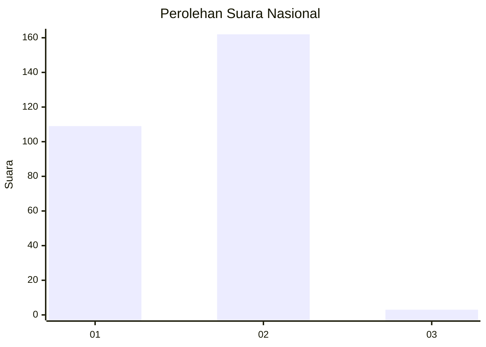
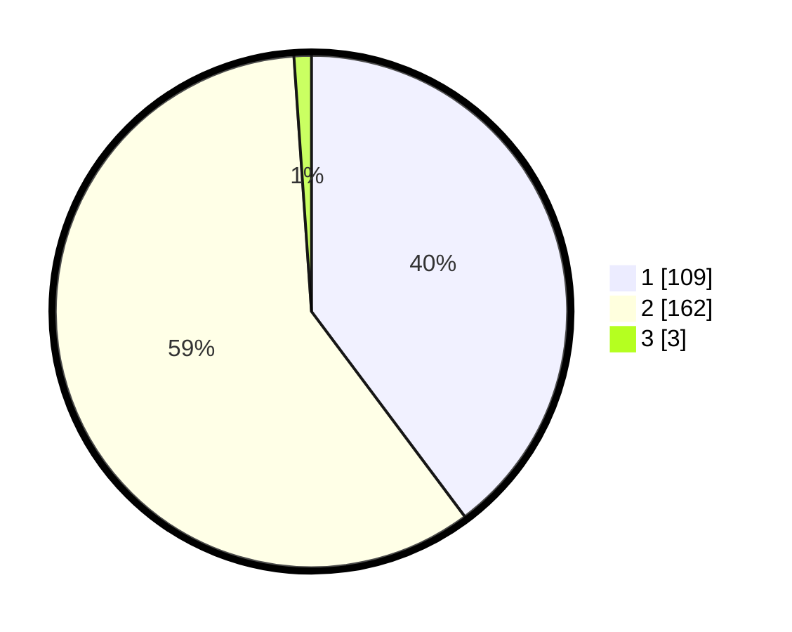

# Hasil

## Grafik

## Tabel

| No. | Nama Paslon    | Suara | Suara (raw) | Persentase |
|:--- |:-------------- | -----:| -----------:| ----------:|
| 1   | ANIES MUHAIMIN | 109   | [109][p-1]  | 39,78      |
| 2   | PRABOWO GIBRAN | 162   | [162][p-2]  | 59,12      |
| 3   | GANJAR MAHFUD  | 3     | [3][p-3]    | 1,09       |

[p-1]: https://github.com/gigit-pemilu/pemilu-2024/blob/main/pilpres/hitung-suara/sub/14-riau/sub/07--rokan-hilir/sub/03-tanah-putih/sub/2017-sintong-bakti/sub/001-tps/sub/paslon-1.txt
[p-2]: https://github.com/gigit-pemilu/pemilu-2024/blob/main/pilpres/hitung-suara/sub/14-riau/sub/07--rokan-hilir/sub/03-tanah-putih/sub/2017-sintong-bakti/sub/001-tps/sub/paslon-2.txt
[p-3]: https://github.com/gigit-pemilu/pemilu-2024/blob/main/pilpres/hitung-suara/sub/14-riau/sub/07--rokan-hilir/sub/03-tanah-putih/sub/2017-sintong-bakti/sub/001-tps/sub/paslon-3.txt

## Foto C Plano

https://sirekap-obj-formc.kpu.go.id/2348/pemilu/ppwp/14/07/03/20/17/1407032017001-20240215-025253--d88556d3-f7c5-4903-bdbd-b7373a0c438d.jpg

https://sirekap-obj-formc.kpu.go.id/2348/pemilu/ppwp/14/07/03/20/17/1407032017001-20240215-025418--b19c4f9c-e4f8-4c24-b8aa-fd3be840bc6a.jpg

https://sirekap-obj-formc.kpu.go.id/2348/pemilu/ppwp/14/07/03/20/17/1407032017001-20240215-025538--5d8569a6-db7a-4143-9799-ff2f08fa8175.jpg

## Metadata

| Key        | Value               |
| ---------- | ------------------- |
| Time Stamp | 2024-02-16 12:51:22 |

