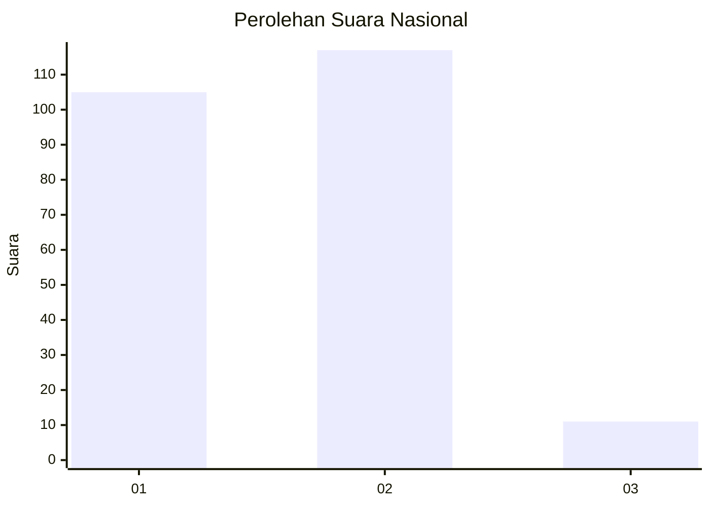
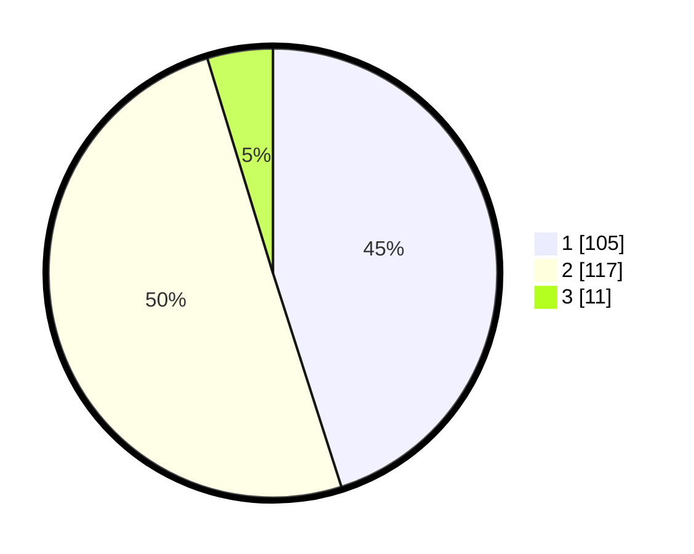

# Hasil

## Grafik

## Tabel

| No. | Nama Paslon    | Suara | Suara (raw) | Persentase |
|:--- |:-------------- | -----:| -----------:| ----------:|
| 1   | ANIES MUHAIMIN | 105   | [105][p-1]  | 45,06      |
| 2   | PRABOWO GIBRAN | 117   | [117][p-2]  | 50,21      |
| 3   | GANJAR MAHFUD  | 11    | [11][p-3]   | 4,72       |

[p-1]: https://github.com/gigit-pemilu/pemilu-2024/blob/main/pilpres/hitung-suara/sub/14-riau/sub/07--rokan-hilir/sub/04-rimba-melintang/sub/2002-jumrah/sub/002-tps/sub/paslon-1.txt
[p-2]: https://github.com/gigit-pemilu/pemilu-2024/blob/main/pilpres/hitung-suara/sub/14-riau/sub/07--rokan-hilir/sub/04-rimba-melintang/sub/2002-jumrah/sub/002-tps/sub/paslon-2.txt
[p-3]: https://github.com/gigit-pemilu/pemilu-2024/blob/main/pilpres/hitung-suara/sub/14-riau/sub/07--rokan-hilir/sub/04-rimba-melintang/sub/2002-jumrah/sub/002-tps/sub/paslon-3.txt

## Foto C Plano

https://sirekap-obj-formc.kpu.go.id/6f40/pemilu/ppwp/14/07/04/20/02/1407042002002-20240214-235431--dec9468b-7592-459f-afd0-3a3eab30b7ce.jpg

https://sirekap-obj-formc.kpu.go.id/6f40/pemilu/ppwp/14/07/04/20/02/1407042002002-20240214-235552--ee3452b6-72a4-42b3-8b09-9cabe22e3283.jpg

https://sirekap-obj-formc.kpu.go.id/6f40/pemilu/ppwp/14/07/04/20/02/1407042002002-20240214-235511--fbaaba4f-0b3d-4e1a-9d06-2a97d407f7e8.jpg

## Metadata

| Key        | Value               |
| ---------- | ------------------- |
| Time Stamp | 2024-02-16 11:00:29 |

