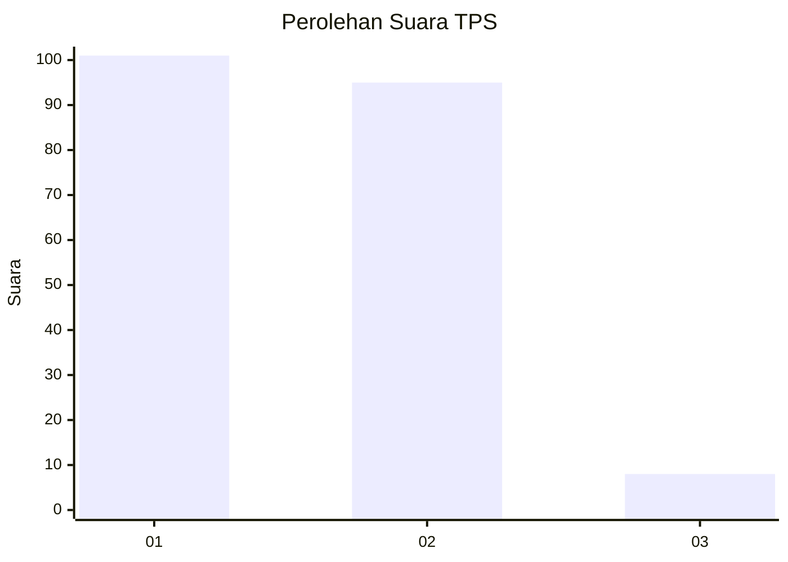
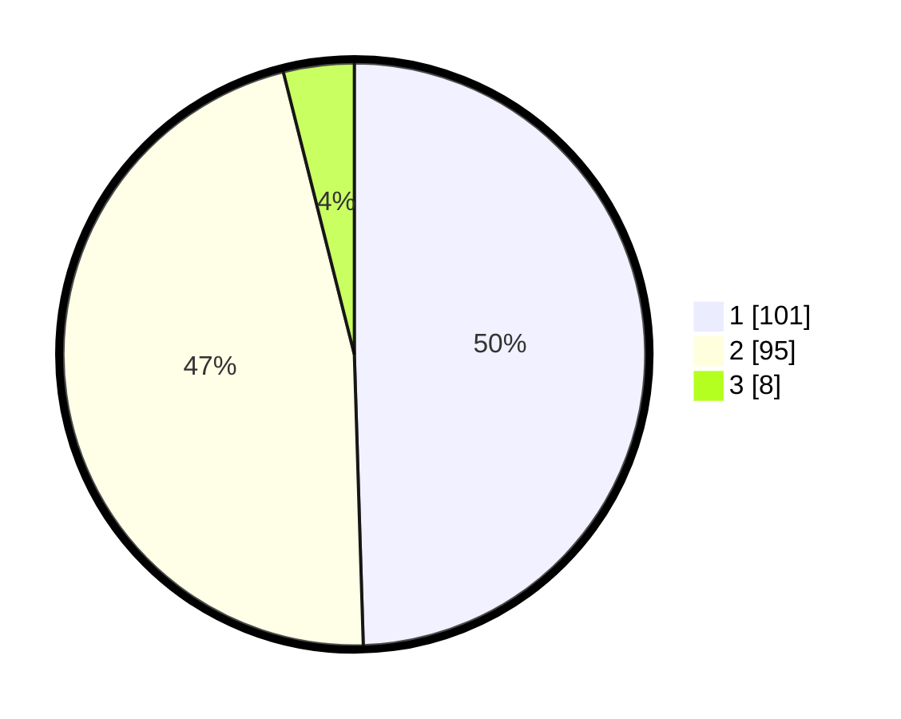

# Hasil

## Grafik

## Tabel

| No. | Nama Paslon    | Suara | Suara (raw) | Persentase |
|:--- |:-------------- | -----:| -----------:| ----------:|
| 1   | ANIES MUHAIMIN | 101   | [101][p-1]  | 49,51      |
| 2   | PRABOWO GIBRAN | 95    | [95][p-2]   | 46,57      |
| 3   | GANJAR MAHFUD  | 8     | [8][p-3]    | 3,92       |

[p-1]: https://github.com/gigit-pemilu/pemilu-2024-14-riau/blob/main/pilpres/hitung-suara/sub/14-riau/sub/07--rokan-hilir/sub/04-rimba-melintang/sub/2004-telukpulau-hulu/sub/002-tps/sub/paslon-1.txt
[p-2]: https://github.com/gigit-pemilu/pemilu-2024-14-riau/blob/main/pilpres/hitung-suara/sub/14-riau/sub/07--rokan-hilir/sub/04-rimba-melintang/sub/2004-telukpulau-hulu/sub/002-tps/sub/paslon-2.txt
[p-3]: https://github.com/gigit-pemilu/pemilu-2024-14-riau/blob/main/pilpres/hitung-suara/sub/14-riau/sub/07--rokan-hilir/sub/04-rimba-melintang/sub/2004-telukpulau-hulu/sub/002-tps/sub/paslon-3.txt

## Foto C Plano

https://sirekap-obj-formc.kpu.go.id/77bc/pemilu/ppwp/14/07/04/20/04/1407042004002-20240220-150315--a1d3200f-af48-4692-9337-247558f559a4.jpg

https://sirekap-obj-formc.kpu.go.id/77bc/pemilu/ppwp/14/07/04/20/04/1407042004002-20240220-150512--08f6cffc-b744-45dd-b5bb-549252374979.jpg

https://sirekap-obj-formc.kpu.go.id/77bc/pemilu/ppwp/14/07/04/20/04/1407042004002-20240215-010119--e50ab1a7-b362-41c6-b82e-ec40fcffa014.jpg

## Metadata

| Key        | Value               |
| ---------- | ------------------- |
| Time Stamp | 2024-02-20 17:00:00 |

