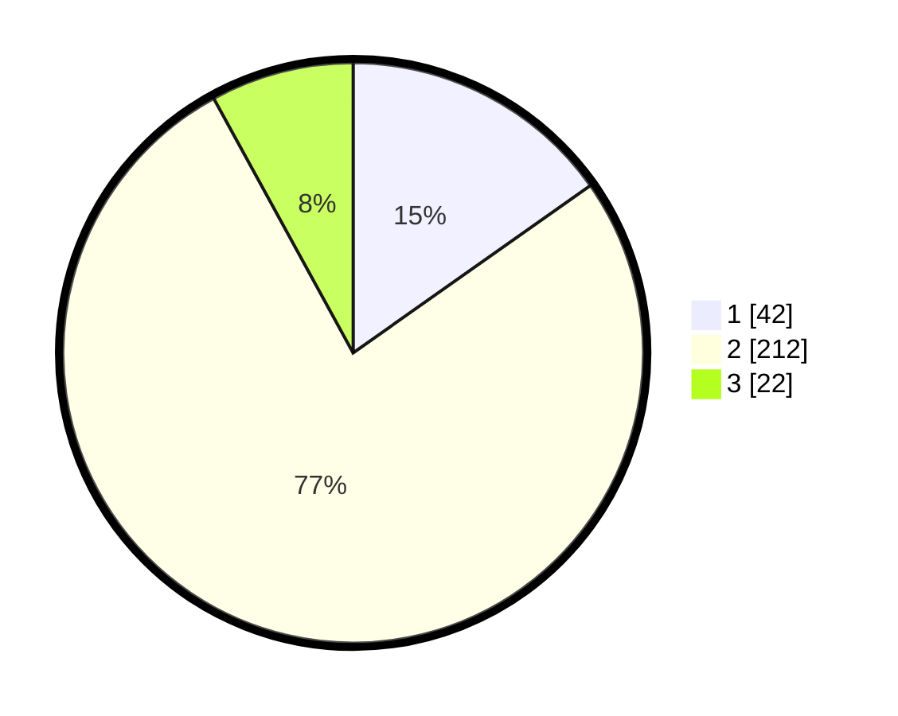

# Hasil

## Grafik

## Tabel

| No. | Nama Paslon    | Suara | Suara (raw) | Persentase |
|:--- |:-------------- | -----:| -----------:| ----------:|
| 1   | ANIES MUHAIMIN | 42    | [42][p-1]   | 15,22      |
| 2   | PRABOWO GIBRAN | 212   | [212][p-2]  | 76,81      |
| 3   | GANJAR MAHFUD  | 22    | [22][p-3]   | 7,97       |

[p-1]: https://github.com/gigit-pemilu/pemilu-2024/blob/main/pilpres/hitung-suara/sub/14-riau/sub/07--rokan-hilir/sub/04-rimba-melintang/sub/2004-telukpulau-hulu/sub/008-tps/sub/paslon-1.txt
[p-2]: https://github.com/gigit-pemilu/pemilu-2024/blob/main/pilpres/hitung-suara/sub/14-riau/sub/07--rokan-hilir/sub/04-rimba-melintang/sub/2004-telukpulau-hulu/sub/008-tps/sub/paslon-2.txt
[p-3]: https://github.com/gigit-pemilu/pemilu-2024/blob/main/pilpres/hitung-suara/sub/14-riau/sub/07--rokan-hilir/sub/04-rimba-melintang/sub/2004-telukpulau-hulu/sub/008-tps/sub/paslon-3.txt

## Foto C Plano

https://sirekap-obj-formc.kpu.go.id/7102/pemilu/ppwp/14/07/04/20/04/1407042004008-20240215-083727--0686de43-ad4c-458e-b02b-61196e9aff6f.jpg

https://sirekap-obj-formc.kpu.go.id/7102/pemilu/ppwp/14/07/04/20/04/1407042004008-20240215-083957--343ba0f2-cd36-47da-aaf4-d0e7783418fb.jpg

https://sirekap-obj-formc.kpu.go.id/7102/pemilu/ppwp/14/07/04/20/04/1407042004008-20240215-084136--4de44609-717c-4765-95a0-e0af537789f4.jpg

## Metadata

| Key        | Value               |
| ---------- | ------------------- |
| Time Stamp | 2024-02-16 11:00:29 |

