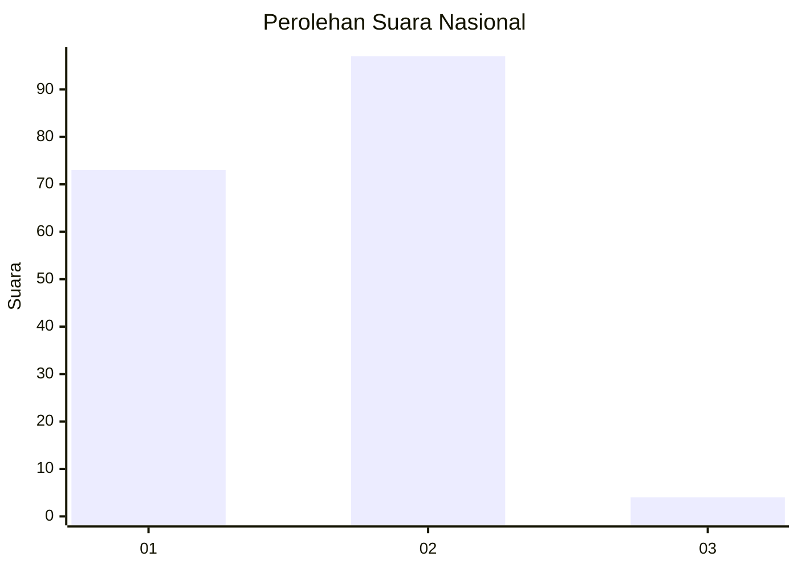
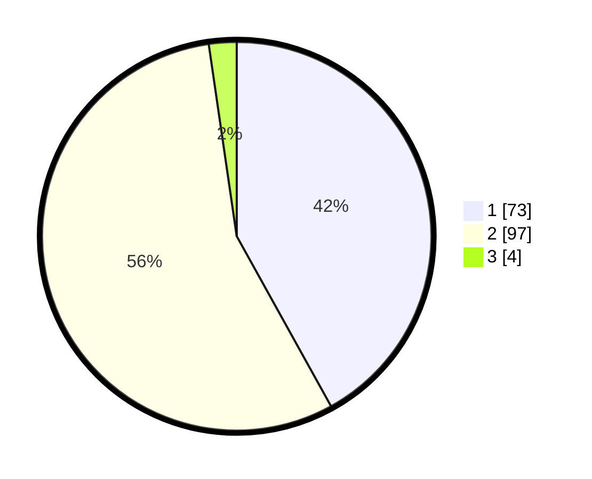

# Hasil

## Grafik

## Tabel

| No. | Nama Paslon    | Suara | Suara (raw) | Persentase |
|:--- |:-------------- | -----:| -----------:| ----------:|
| 1   | ANIES MUHAIMIN | 73    | [73][p-1]   | 41,95      |
| 2   | PRABOWO GIBRAN | 97    | [97][p-2]   | 55,75      |
| 3   | GANJAR MAHFUD  | 4     | [4][p-3]    | 2,30       |

[p-1]: https://github.com/gigit-pemilu/pemilu-2024/blob/main/pilpres/hitung-suara/sub/14-riau/sub/07--rokan-hilir/sub/04-rimba-melintang/sub/2005-langgadai-hulu/sub/003-tps/sub/paslon-1.txt
[p-2]: https://github.com/gigit-pemilu/pemilu-2024/blob/main/pilpres/hitung-suara/sub/14-riau/sub/07--rokan-hilir/sub/04-rimba-melintang/sub/2005-langgadai-hulu/sub/003-tps/sub/paslon-2.txt
[p-3]: https://github.com/gigit-pemilu/pemilu-2024/blob/main/pilpres/hitung-suara/sub/14-riau/sub/07--rokan-hilir/sub/04-rimba-melintang/sub/2005-langgadai-hulu/sub/003-tps/sub/paslon-3.txt

## Foto C Plano

https://sirekap-obj-formc.kpu.go.id/9c0e/pemilu/ppwp/14/07/04/20/05/1407042005003-20240214-155719--d63c8c1b-4de7-482e-93ab-55504c8c1384.jpg

https://sirekap-obj-formc.kpu.go.id/9c0e/pemilu/ppwp/14/07/04/20/05/1407042005003-20240214-155801--4357a48b-a377-4dc9-aa69-2e555c5e7da3.jpg

https://sirekap-obj-formc.kpu.go.id/9c0e/pemilu/ppwp/14/07/04/20/05/1407042005003-20240214-155837--9a7263da-c176-41eb-8cee-073953a1b342.jpg

## Metadata

| Key        | Value               |
| ---------- | ------------------- |
| Time Stamp | 2024-02-16 14:30:33 |

