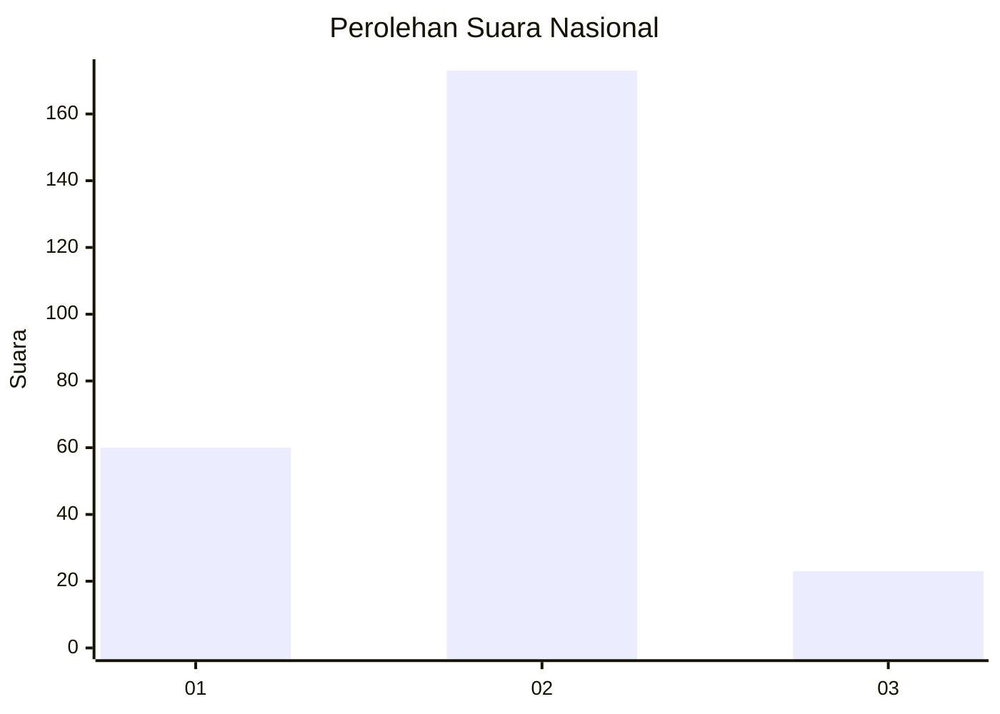

# Hasil

## Grafik

## Tabel

| No. | Nama Paslon    | Suara | Suara (raw) | Persentase |
|:--- |:-------------- | -----:| -----------:| ----------:|
| 1   | ANIES MUHAIMIN | 60    | [60][p-1]   | 23,44      |
| 2   | PRABOWO GIBRAN | 173   | [173][p-2]  | 67,58      |
| 3   | GANJAR MAHFUD  | 23    | [23][p-3]   | 8,98       |

[p-1]: https://github.com/gigit-pemilu/pemilu-2024/blob/main/pilpres/hitung-suara/sub/14-riau/sub/07--rokan-hilir/sub/04-rimba-melintang/sub/2010-seremban-jaya/sub/005-tps/sub/paslon-1.txt
[p-2]: https://github.com/gigit-pemilu/pemilu-2024/blob/main/pilpres/hitung-suara/sub/14-riau/sub/07--rokan-hilir/sub/04-rimba-melintang/sub/2010-seremban-jaya/sub/005-tps/sub/paslon-2.txt
[p-3]: https://github.com/gigit-pemilu/pemilu-2024/blob/main/pilpres/hitung-suara/sub/14-riau/sub/07--rokan-hilir/sub/04-rimba-melintang/sub/2010-seremban-jaya/sub/005-tps/sub/paslon-3.txt

## Foto C Plano

https://sirekap-obj-formc.kpu.go.id/6a45/pemilu/ppwp/14/07/04/20/10/1407042010005-20240215-105555--346e8426-f596-4d94-9686-30334cd94d70.jpg

https://sirekap-obj-formc.kpu.go.id/6a45/pemilu/ppwp/14/07/04/20/10/1407042010005-20240215-105728--91a78552-5ef7-4ae4-a241-ef1bf02d281e.jpg

https://sirekap-obj-formc.kpu.go.id/6a45/pemilu/ppwp/14/07/04/20/10/1407042010005-20240215-105906--86d2c74d-ea76-4e5d-b0e4-1140531c7ac3.jpg

## Metadata

| Key        | Value               |
| ---------- | ------------------- |
| Time Stamp | 2024-02-16 14:30:33 |

