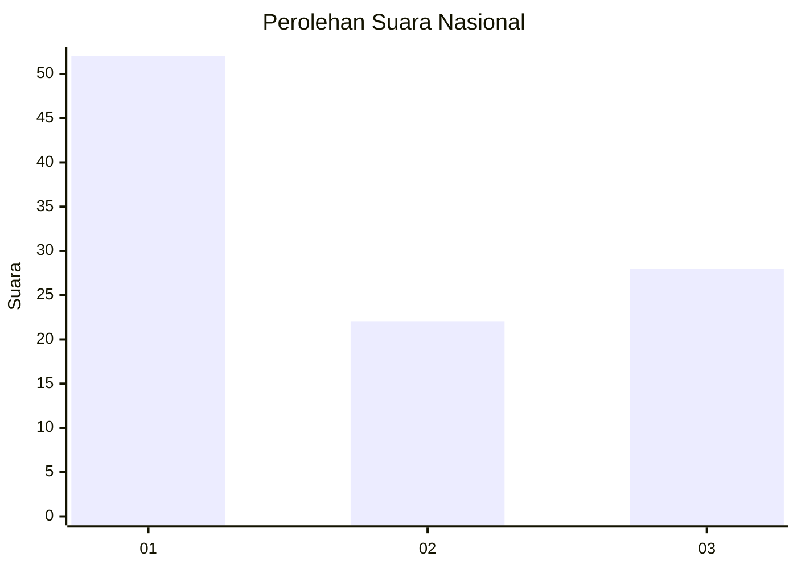
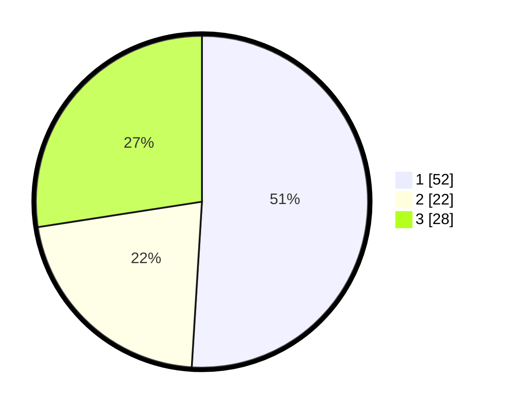

# Hasil

## Grafik

## Tabel

| No. | Nama Paslon    | Suara | Suara (raw) | Persentase |
|:--- |:-------------- | -----:| -----------:| ----------:|
| 1   | ANIES MUHAIMIN | 52    | [52][p-1]   | 50,98      |
| 2   | PRABOWO GIBRAN | 22    | [22][p-2]   | 21,57      |
| 3   | GANJAR MAHFUD  | 28    | [28][p-3]   | 27,45      |

[p-1]: https://github.com/gigit-pemilu/pemilu-2024/blob/main/pilpres/hitung-suara/sub/14-riau/sub/07--rokan-hilir/sub/04-rimba-melintang/sub/2012-pematang-sikek/sub/003-tps/sub/paslon-1.txt
[p-2]: https://github.com/gigit-pemilu/pemilu-2024/blob/main/pilpres/hitung-suara/sub/14-riau/sub/07--rokan-hilir/sub/04-rimba-melintang/sub/2012-pematang-sikek/sub/003-tps/sub/paslon-2.txt
[p-3]: https://github.com/gigit-pemilu/pemilu-2024/blob/main/pilpres/hitung-suara/sub/14-riau/sub/07--rokan-hilir/sub/04-rimba-melintang/sub/2012-pematang-sikek/sub/003-tps/sub/paslon-3.txt

## Foto C Plano

https://sirekap-obj-formc.kpu.go.id/46c2/pemilu/ppwp/14/07/04/20/12/1407042012003-20240221-120358--d4f7358f-ceff-45de-aa42-2a3479cbc895.jpg

https://sirekap-obj-formc.kpu.go.id/46c2/pemilu/ppwp/14/07/04/20/12/1407042012003-20240221-120840--fbbdde05-0c18-4c0a-a45d-fa0b65944d34.jpg

https://sirekap-obj-formc.kpu.go.id/46c2/pemilu/ppwp/14/07/04/20/12/1407042012003-20240221-121042--243fecef-9130-44ed-ba1a-9ea691171440.jpg

## Metadata

| Key        | Value               |
| ---------- | ------------------- |
| Time Stamp | 2024-02-22 13:00:00 |

## DATA PEMILIH TETAP

Jumlah pemilih dalam DPT: **574**.
 * L: **0**.
 * P: **556**.

## DATA PENGGUNA HAK PILIH

Jumlah pengguna hak pilih dalam DPT: **387**.
 * L: **691**.
 * P: **186**.

Jumlah pengguna hak pilih dalam DPTb: **2**.
 * L: **0**.
 * P: **0**.

Jumlah pengguna hak pilih dalam DPK: **507**.
 * L: **0**.
 * P: **5**.

Jumlah pengguna hak pilih: **782**.
 * L: **0**.
 * P: **7**.

## JUMLAH SUARA SAH DAN TIDAK SAH

JUMLAH SELURUH SUARA SAH: **234**.

JUMLAH SUARA TIDAK SAH: **3**.

JUMLAH SELURUH SUARA SAH DAN SUARA TIDAK SAH: **237**.

