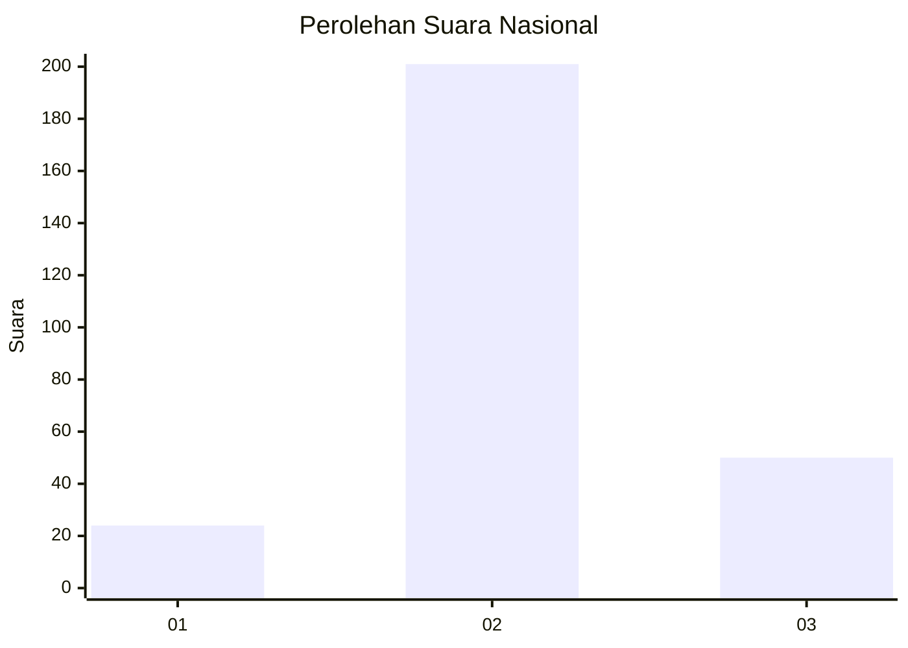

# Hasil

## Grafik

## Tabel

| No. | Nama Paslon    | Suara | Suara (raw) | Persentase |
|:--- |:-------------- | -----:| -----------:| ----------:|
| 1   | ANIES MUHAIMIN | 24    | [24][p-1]   | 8,73       |
| 2   | PRABOWO GIBRAN | 201   | [201][p-2]  | 73,09      |
| 3   | GANJAR MAHFUD  | 50    | [50][p-3]   | 18,18      |

[p-1]: https://github.com/gigit-pemilu/pemilu-2024/blob/main/pilpres/hitung-suara/sub/14-riau/sub/07--rokan-hilir/sub/05-bagansinembah/sub/1018-bagan-batu-kota/sub/001-tps/sub/paslon-1.txt
[p-2]: https://github.com/gigit-pemilu/pemilu-2024/blob/main/pilpres/hitung-suara/sub/14-riau/sub/07--rokan-hilir/sub/05-bagansinembah/sub/1018-bagan-batu-kota/sub/001-tps/sub/paslon-2.txt
[p-3]: https://github.com/gigit-pemilu/pemilu-2024/blob/main/pilpres/hitung-suara/sub/14-riau/sub/07--rokan-hilir/sub/05-bagansinembah/sub/1018-bagan-batu-kota/sub/001-tps/sub/paslon-3.txt

## Foto C Plano

https://sirekap-obj-formc.kpu.go.id/fc4e/pemilu/ppwp/14/07/05/10/18/1407051018001-20240217-175509--b251b3a4-59da-4c93-96c9-e7f4ac8f8ea9.jpg

https://sirekap-obj-formc.kpu.go.id/fc4e/pemilu/ppwp/14/07/05/10/18/1407051018001-20240217-175510--e2536bb3-a2bc-4c62-93f2-36511d5aa360.jpg

https://sirekap-obj-formc.kpu.go.id/fc4e/pemilu/ppwp/14/07/05/10/18/1407051018001-20240217-175510--842c1588-c80c-446b-8bbc-75478c71e101.jpg

## Metadata

| Key        | Value               |
| ---------- | ------------------- |
| Time Stamp | 2024-02-19 06:16:00 |

## DATA PEMILIH TETAP

Jumlah pemilih dalam DPT: **272**.
 * L: **126**.
 * P: **146**.

## DATA PENGGUNA HAK PILIH

Jumlah pengguna hak pilih dalam DPT: **201**.
 * L: **91**.
 * P: **110**.

Jumlah pengguna hak pilih dalam DPTb: **6**.
 * L: **1**.
 * P: **5**.

Jumlah pengguna hak pilih dalam DPK: **71**.
 * L: **29**.
 * P: **42**.

Jumlah pengguna hak pilih: **278**.
 * L: **121**.
 * P: **157**.

## JUMLAH SUARA SAH DAN TIDAK SAH

JUMLAH SELURUH SUARA SAH: **275**.

JUMLAH SUARA TIDAK SAH: **3**.

JUMLAH SELURUH SUARA SAH DAN SUARA TIDAK SAH: **278**.

