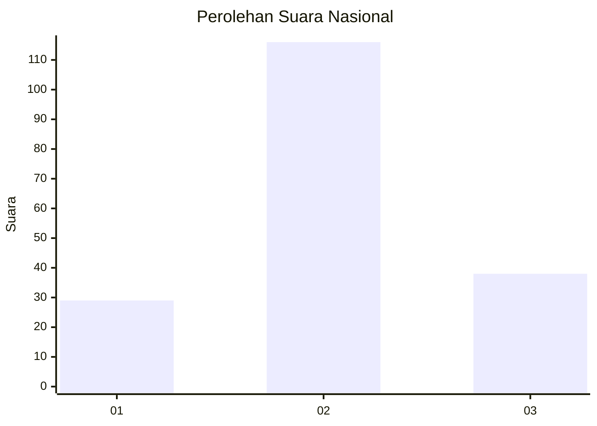
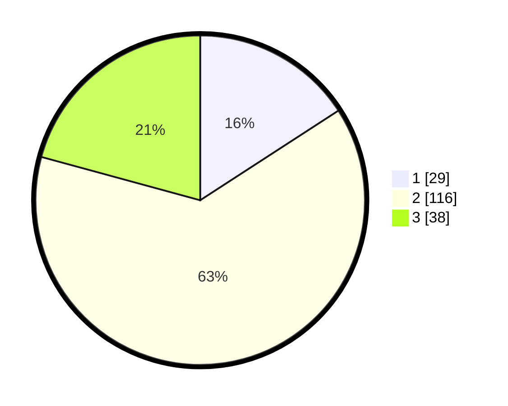

# Hasil

## Grafik

## Tabel

| No. | Nama Paslon    | Suara | Suara (raw) | Persentase |
|:--- |:-------------- | -----:| -----------:| ----------:|
| 1   | ANIES MUHAIMIN | 29    | [29][p-1]   | 15,85      |
| 2   | PRABOWO GIBRAN | 116   | [116][p-2]  | 63,39      |
| 3   | GANJAR MAHFUD  | 38    | [38][p-3]   | 20,77      |

[p-1]: https://github.com/gigit-pemilu/pemilu-2024/blob/main/pilpres/hitung-suara/sub/14-riau/sub/07--rokan-hilir/sub/05-bagansinembah/sub/1018-bagan-batu-kota/sub/002-tps/sub/paslon-1.txt
[p-2]: https://github.com/gigit-pemilu/pemilu-2024/blob/main/pilpres/hitung-suara/sub/14-riau/sub/07--rokan-hilir/sub/05-bagansinembah/sub/1018-bagan-batu-kota/sub/002-tps/sub/paslon-2.txt
[p-3]: https://github.com/gigit-pemilu/pemilu-2024/blob/main/pilpres/hitung-suara/sub/14-riau/sub/07--rokan-hilir/sub/05-bagansinembah/sub/1018-bagan-batu-kota/sub/002-tps/sub/paslon-3.txt

## Foto C Plano

https://sirekap-obj-formc.kpu.go.id/63d5/pemilu/ppwp/14/07/05/10/18/1407051018002-20240218-143709--7ea857de-f735-46a3-a9e8-9f534f31f916.jpg

https://sirekap-obj-formc.kpu.go.id/63d5/pemilu/ppwp/14/07/05/10/18/1407051018002-20240215-200831--9be9857e-7d92-490f-bde8-2d843a43181e.jpg

https://sirekap-obj-formc.kpu.go.id/63d5/pemilu/ppwp/14/07/05/10/18/1407051018002-20240215-202405--d547df62-1c9e-4256-8f19-742cefec09f9.jpg

## Metadata

| Key        | Value               |
| ---------- | ------------------- |
| Time Stamp | 2024-02-19 06:16:00 |

