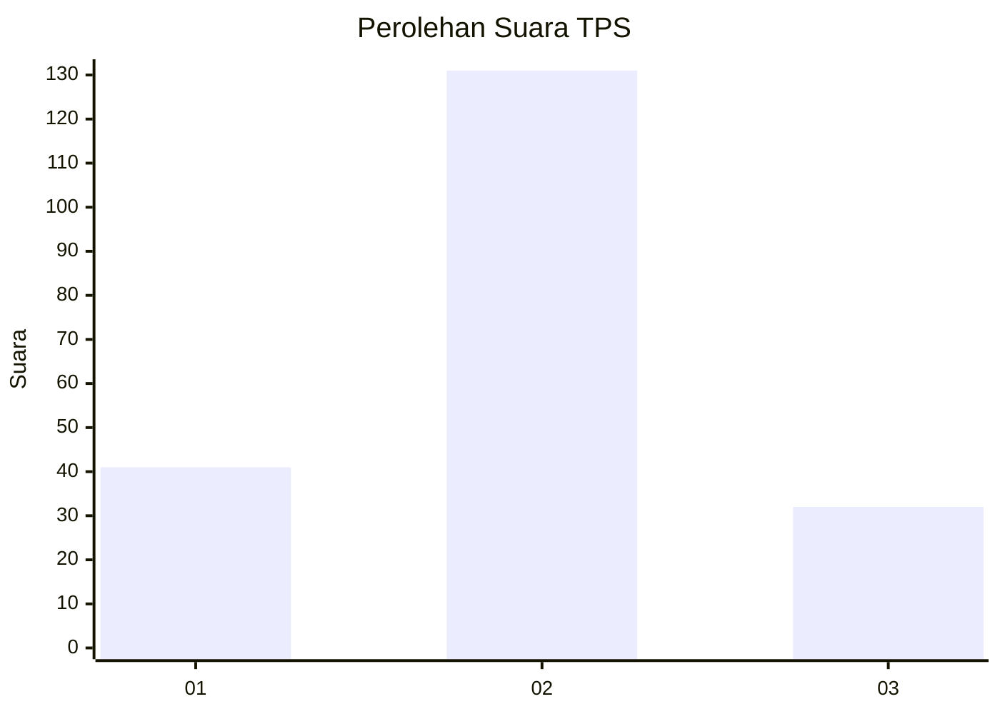
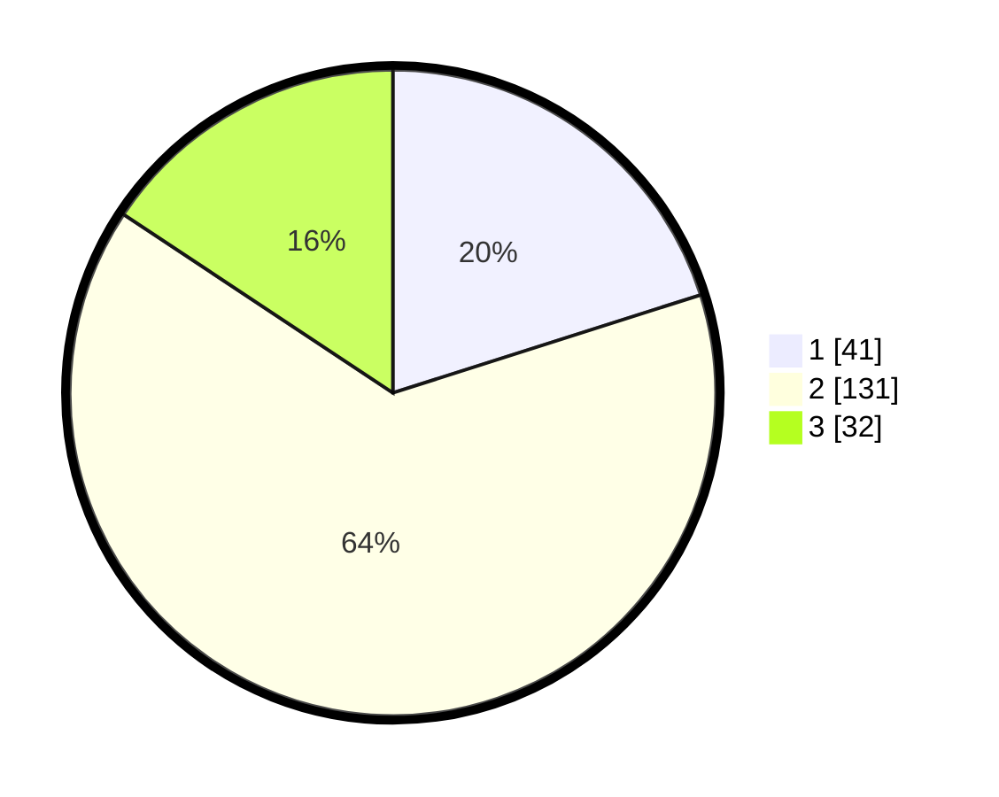

# Hasil

## Grafik

## Tabel

| No. | Nama Paslon    | Suara | Suara (raw) | Persentase |
|:--- |:-------------- | -----:| -----------:| ----------:|
| 1   | ANIES MUHAIMIN | 41    | [41][p-1]   | 20,10      |
| 2   | PRABOWO GIBRAN | 131   | [131][p-2]  | 64,22      |
| 3   | GANJAR MAHFUD  | 32    | [32][p-3]   | 15,69      |

[p-1]: https://github.com/gigit-pemilu/pemilu-2024-14-riau/blob/main/pilpres/hitung-suara/sub/14-riau/sub/07--rokan-hilir/sub/05-bagansinembah/sub/2003-bahtera-makmur/sub/001-tps/sub/paslon-1.txt
[p-2]: https://github.com/gigit-pemilu/pemilu-2024-14-riau/blob/main/pilpres/hitung-suara/sub/14-riau/sub/07--rokan-hilir/sub/05-bagansinembah/sub/2003-bahtera-makmur/sub/001-tps/sub/paslon-2.txt
[p-3]: https://github.com/gigit-pemilu/pemilu-2024-14-riau/blob/main/pilpres/hitung-suara/sub/14-riau/sub/07--rokan-hilir/sub/05-bagansinembah/sub/2003-bahtera-makmur/sub/001-tps/sub/paslon-3.txt

## Foto C Plano

https://sirekap-obj-formc.kpu.go.id/a0ca/pemilu/ppwp/14/07/05/20/03/1407052003001-20240217-105035--93266334-0ff2-4238-a6cd-492b49f93e5c.jpg

https://sirekap-obj-formc.kpu.go.id/a0ca/pemilu/ppwp/14/07/05/20/03/1407052003001-20240217-110417--29aa6eea-9d4e-48b0-9a40-6d5cffd3c58e.jpg

https://sirekap-obj-formc.kpu.go.id/a0ca/pemilu/ppwp/14/07/05/20/03/1407052003001-20240217-110253--c41360e5-446a-4fcb-9de9-89400c644352.jpg

## Metadata

| Key        | Value               |
| ---------- | ------------------- |
| Time Stamp | 2024-02-19 06:16:00 |

## DATA PEMILIH TETAP

Jumlah pemilih dalam DPT: **172**.
 * L: **33**.
 * P: **823**.

## DATA PENGGUNA HAK PILIH

Jumlah pengguna hak pilih dalam DPT: **172**.
 * L: **852**.
 * P: **223**.

Jumlah pengguna hak pilih dalam DPTb: **25**.
 * L: **884**.
 * P: **1**.

Jumlah pengguna hak pilih dalam DPK: **22**.
 * L: **13**.
 * P: **715**.

Jumlah pengguna hak pilih: **55**.
 * L: **176**.
 * P: **32**.

## JUMLAH SUARA SAH DAN TIDAK SAH

JUMLAH SELURUH SUARA SAH: **204**.

JUMLAH SUARA TIDAK SAH: **2**.

JUMLAH SELURUH SUARA SAH DAN SUARA TIDAK SAH: **206**.

