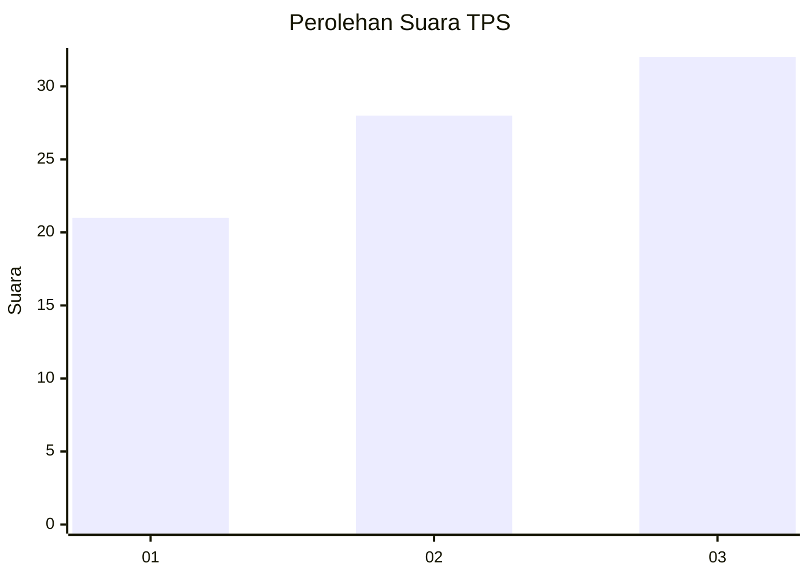
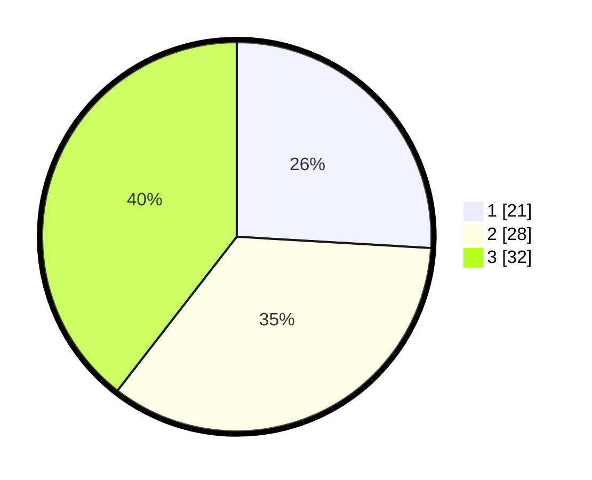

# Hasil

## Grafik

## Tabel

| No. | Nama Paslon    | Suara | Suara (raw) | Persentase |
|:--- |:-------------- | -----:| -----------:| ----------:|
| 1   | ANIES MUHAIMIN | 21    | [21][p-1]   | 25,93      |
| 2   | PRABOWO GIBRAN | 28    | [28][p-2]   | 34,57      |
| 3   | GANJAR MAHFUD  | 32    | [32][p-3]   | 39,51      |

[p-1]: https://github.com/gigit-pemilu/pemilu-2024-14-riau/blob/main/pilpres/hitung-suara/sub/14-riau/sub/07--rokan-hilir/sub/06-pasir-limau-kapas/sub/1007-panipahan/sub/007-tps/sub/paslon-1.txt
[p-2]: https://github.com/gigit-pemilu/pemilu-2024-14-riau/blob/main/pilpres/hitung-suara/sub/14-riau/sub/07--rokan-hilir/sub/06-pasir-limau-kapas/sub/1007-panipahan/sub/007-tps/sub/paslon-2.txt
[p-3]: https://github.com/gigit-pemilu/pemilu-2024-14-riau/blob/main/pilpres/hitung-suara/sub/14-riau/sub/07--rokan-hilir/sub/06-pasir-limau-kapas/sub/1007-panipahan/sub/007-tps/sub/paslon-3.txt

## Foto C Plano

https://sirekap-obj-formc.kpu.go.id/aeb0/pemilu/ppwp/14/07/06/10/07/1407061007007-20240219-112338--2d503dce-ca8c-43e7-abaf-5d59c2f9e2e8.jpg

https://sirekap-obj-formc.kpu.go.id/aeb0/pemilu/ppwp/14/07/06/10/07/1407061007007-20240219-111620--c60d663e-d7ca-4b61-b84d-1dbbee3fb94a.jpg

https://sirekap-obj-formc.kpu.go.id/aeb0/pemilu/ppwp/14/07/06/10/07/1407061007007-20240219-111715--fd9a9718-f680-4380-b588-a92fd1c747d0.jpg

## Metadata

| Key        | Value               |
| ---------- | ------------------- |
| Time Stamp | 2024-02-19 12:00:00 |

## DATA PEMILIH TETAP

Jumlah pemilih dalam DPT: **243**.
 * L: **116**.
 * P: **127**.

## DATA PENGGUNA HAK PILIH

Jumlah pengguna hak pilih dalam DPT: **86**.
 * L: **37**.
 * P: **49**.

Jumlah pengguna hak pilih dalam DPTb: **0**.
 * L: **0**.
 * P: **0**.

Jumlah pengguna hak pilih dalam DPK: **0**.
 * L: **0**.
 * P: **0**.

Jumlah pengguna hak pilih: **86**.
 * L: **37**.
 * P: **49**.

## JUMLAH SUARA SAH DAN TIDAK SAH

JUMLAH SELURUH SUARA SAH: **81**.

JUMLAH SUARA TIDAK SAH: **5**.

JUMLAH SELURUH SUARA SAH DAN SUARA TIDAK SAH: **86**.

