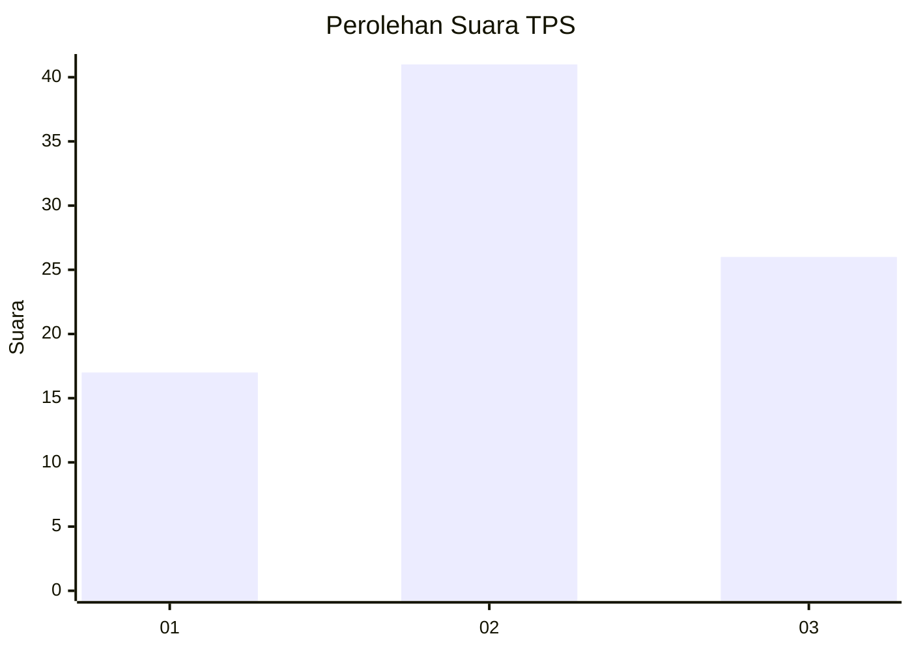
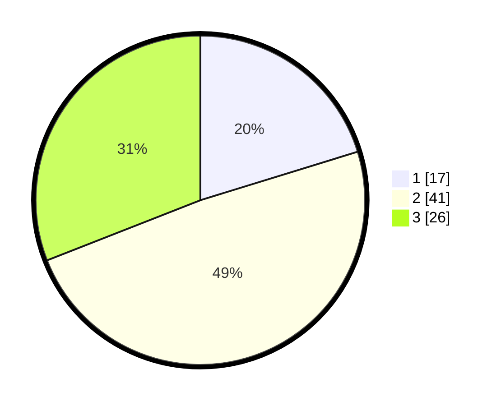

# Hasil

## Grafik

## Tabel

| No. | Nama Paslon    | Suara | Suara (raw) | Persentase |
|:--- |:-------------- | -----:| -----------:| ----------:|
| 1   | ANIES MUHAIMIN | 17    | [17][p-1]   | 20,24      |
| 2   | PRABOWO GIBRAN | 41    | [41][p-2]   | 48,81      |
| 3   | GANJAR MAHFUD  | 26    | [26][p-3]   | 30,95      |

[p-1]: https://github.com/gigit-pemilu/pemilu-2024-14-riau/blob/main/pilpres/hitung-suara/sub/14-riau/sub/07--rokan-hilir/sub/06-pasir-limau-kapas/sub/1007-panipahan/sub/008-tps/sub/paslon-1.txt
[p-2]: https://github.com/gigit-pemilu/pemilu-2024-14-riau/blob/main/pilpres/hitung-suara/sub/14-riau/sub/07--rokan-hilir/sub/06-pasir-limau-kapas/sub/1007-panipahan/sub/008-tps/sub/paslon-2.txt
[p-3]: https://github.com/gigit-pemilu/pemilu-2024-14-riau/blob/main/pilpres/hitung-suara/sub/14-riau/sub/07--rokan-hilir/sub/06-pasir-limau-kapas/sub/1007-panipahan/sub/008-tps/sub/paslon-3.txt

## Foto C Plano

https://sirekap-obj-formc.kpu.go.id/150c/pemilu/ppwp/14/07/06/10/07/1407061007008-20240219-120143--247566ee-c157-43c9-9838-27e63dbcb8ef.jpg

https://sirekap-obj-formc.kpu.go.id/150c/pemilu/ppwp/14/07/06/10/07/1407061007008-20240219-115958--7dbea735-9f4d-43d8-bc68-0e590a2880ce.jpg

https://sirekap-obj-formc.kpu.go.id/150c/pemilu/ppwp/14/07/06/10/07/1407061007008-20240219-120328--02ed78c7-85a0-4fe8-a441-a5b05f8af961.jpg

## Metadata

| Key        | Value               |
| ---------- | ------------------- |
| Time Stamp | 2024-02-19 13:00:00 |

## DATA PEMILIH TETAP

Jumlah pemilih dalam DPT: **235**.
 * L: **116**.
 * P: **119**.

## DATA PENGGUNA HAK PILIH

Jumlah pengguna hak pilih dalam DPT: **88**.
 * L: **43**.
 * P: **45**.

Jumlah pengguna hak pilih dalam DPTb: **2**.
 * L: **1**.
 * P: **1**.

Jumlah pengguna hak pilih dalam DPK: **1**.
 * L: **0**.
 * P: **1**.

Jumlah pengguna hak pilih: **91**.
 * L: **44**.
 * P: **47**.

## JUMLAH SUARA SAH DAN TIDAK SAH

JUMLAH SELURUH SUARA SAH: **84**.

JUMLAH SUARA TIDAK SAH: **7**.

JUMLAH SELURUH SUARA SAH DAN SUARA TIDAK SAH: **91**.

