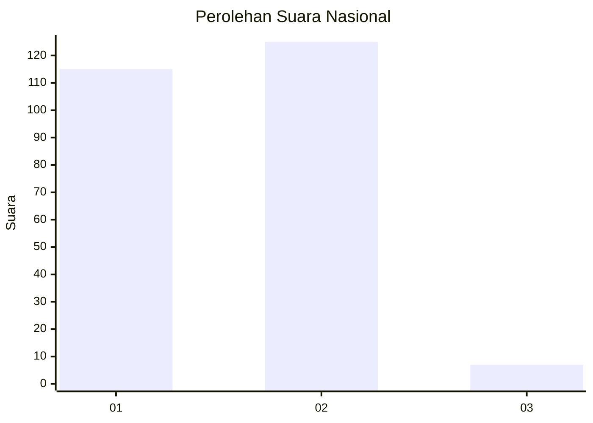
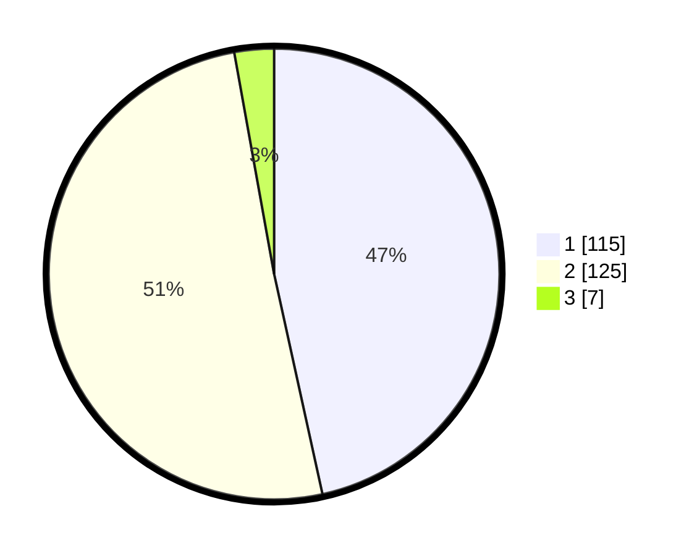

# Hasil

## Grafik

## Tabel

| No. | Nama Paslon    | Suara | Suara (raw) | Persentase |
|:--- |:-------------- | -----:| -----------:| ----------:|
| 1   | ANIES MUHAIMIN | 115   | [115][p-1]  | 46,56      |
| 2   | PRABOWO GIBRAN | 125   | [125][p-2]  | 50,61      |
| 3   | GANJAR MAHFUD  | 7     | [7][p-3]    | 2,83       |

[p-1]: https://github.com/gigit-pemilu/pemilu-2024/blob/main/pilpres/hitung-suara/sub/14-riau/sub/07--rokan-hilir/sub/06-pasir-limau-kapas/sub/1007-panipahan/sub/011-tps/sub/paslon-1.txt
[p-2]: https://github.com/gigit-pemilu/pemilu-2024/blob/main/pilpres/hitung-suara/sub/14-riau/sub/07--rokan-hilir/sub/06-pasir-limau-kapas/sub/1007-panipahan/sub/011-tps/sub/paslon-2.txt
[p-3]: https://github.com/gigit-pemilu/pemilu-2024/blob/main/pilpres/hitung-suara/sub/14-riau/sub/07--rokan-hilir/sub/06-pasir-limau-kapas/sub/1007-panipahan/sub/011-tps/sub/paslon-3.txt

## Foto C Plano

https://sirekap-obj-formc.kpu.go.id/254b/pemilu/ppwp/14/07/06/10/07/1407061007011-20240215-005204--1addce50-1d66-42ec-aae9-02fdace74f36.jpg

https://sirekap-obj-formc.kpu.go.id/254b/pemilu/ppwp/14/07/06/10/07/1407061007011-20240215-040052--68cba029-de35-4727-af1b-9731156a9f38.jpg

https://sirekap-obj-formc.kpu.go.id/254b/pemilu/ppwp/14/07/06/10/07/1407061007011-20240215-040119--795269bd-912d-4255-b291-311f1d60bd4d.jpg

## Metadata

| Key        | Value               |
| ---------- | ------------------- |
| Time Stamp | 2024-02-15 15:00:29 |

