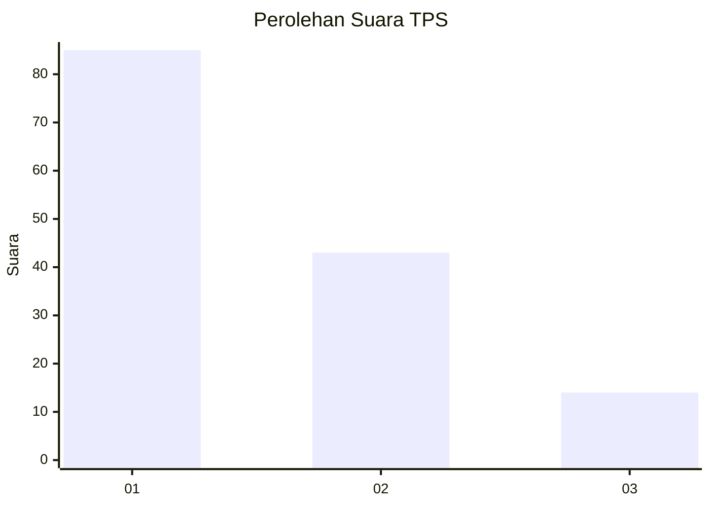
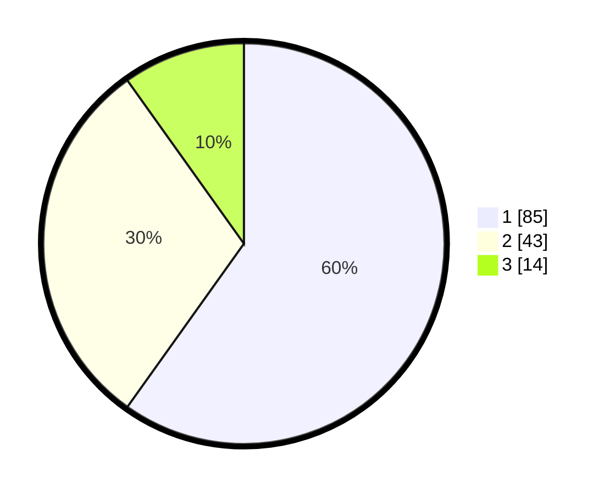

# Hasil

## Grafik

## Tabel

| No. | Nama Paslon    | Suara | Suara (raw) | Persentase |
|:--- |:-------------- | -----:| -----------:| ----------:|
| 1   | ANIES MUHAIMIN | 85    | [85][p-1]   | 59,86      |
| 2   | PRABOWO GIBRAN | 43    | [43][p-2]   | 30,28      |
| 3   | GANJAR MAHFUD  | 14    | [14][p-3]   | 9,86       |

[p-1]: https://github.com/gigit-pemilu/pemilu-2024-14-riau/blob/main/pilpres/hitung-suara/sub/14-riau/sub/07--rokan-hilir/sub/06-pasir-limau-kapas/sub/1007-panipahan/sub/012-tps/sub/paslon-1.txt
[p-2]: https://github.com/gigit-pemilu/pemilu-2024-14-riau/blob/main/pilpres/hitung-suara/sub/14-riau/sub/07--rokan-hilir/sub/06-pasir-limau-kapas/sub/1007-panipahan/sub/012-tps/sub/paslon-2.txt
[p-3]: https://github.com/gigit-pemilu/pemilu-2024-14-riau/blob/main/pilpres/hitung-suara/sub/14-riau/sub/07--rokan-hilir/sub/06-pasir-limau-kapas/sub/1007-panipahan/sub/012-tps/sub/paslon-3.txt

## Foto C Plano

https://sirekap-obj-formc.kpu.go.id/dccc/pemilu/ppwp/14/07/06/10/07/1407061007012-20240214-220037--c1463a87-7f21-4712-afd8-eec09918bce2.jpg

https://sirekap-obj-formc.kpu.go.id/dccc/pemilu/ppwp/14/07/06/10/07/1407061007012-20240214-220638--04cf6ee1-b9f5-4561-811c-e8a7cbc8a875.jpg

https://sirekap-obj-formc.kpu.go.id/dccc/pemilu/ppwp/14/07/06/10/07/1407061007012-20240214-222704--e46f5015-256e-4a2a-a3cc-fe7b4edad88c.jpg

## Metadata

| Key        | Value               |
| ---------- | ------------------- |
| Time Stamp | 2024-02-16 14:30:33 |

