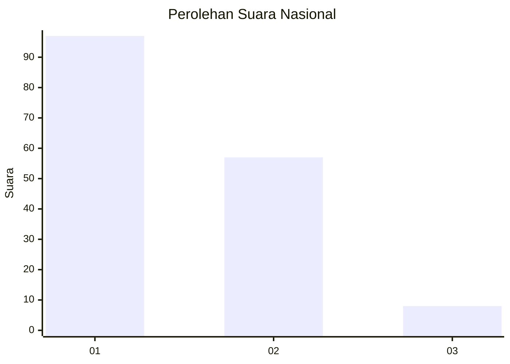
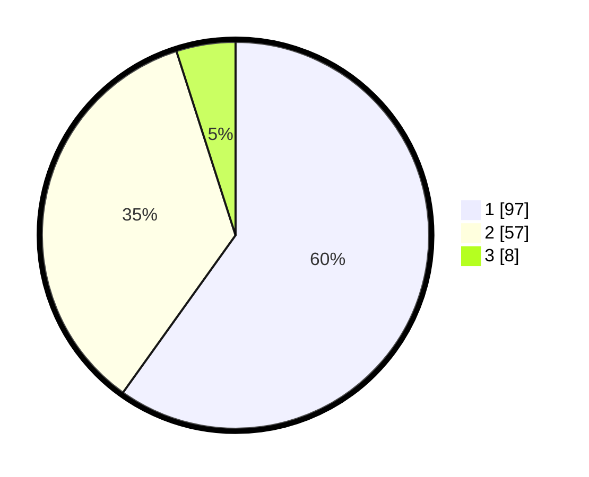

# Hasil

## Grafik

## Tabel

| No. | Nama Paslon    | Suara | Suara (raw) | Persentase |
|:--- |:-------------- | -----:| -----------:| ----------:|
| 1   | ANIES MUHAIMIN | 97    | [97][p-1]   | 59,88      |
| 2   | PRABOWO GIBRAN | 57    | [57][p-2]   | 35,19      |
| 3   | GANJAR MAHFUD  | 8     | [8][p-3]    | 4,94       |

[p-1]: https://github.com/gigit-pemilu/pemilu-2024/blob/main/pilpres/hitung-suara/sub/14-riau/sub/07--rokan-hilir/sub/06-pasir-limau-kapas/sub/2003-pasir-limau-kapas/sub/001-tps/sub/paslon-1.txt
[p-2]: https://github.com/gigit-pemilu/pemilu-2024/blob/main/pilpres/hitung-suara/sub/14-riau/sub/07--rokan-hilir/sub/06-pasir-limau-kapas/sub/2003-pasir-limau-kapas/sub/001-tps/sub/paslon-2.txt
[p-3]: https://github.com/gigit-pemilu/pemilu-2024/blob/main/pilpres/hitung-suara/sub/14-riau/sub/07--rokan-hilir/sub/06-pasir-limau-kapas/sub/2003-pasir-limau-kapas/sub/001-tps/sub/paslon-3.txt

## Foto C Plano

https://sirekap-obj-formc.kpu.go.id/1e43/pemilu/ppwp/14/07/06/20/03/1407062003001-20240215-213522--bd16423d-d907-4bf6-944f-d553430f9701.jpg

https://sirekap-obj-formc.kpu.go.id/1e43/pemilu/ppwp/14/07/06/20/03/1407062003001-20240215-213551--30d0529d-ca4a-4917-ae64-677ad749c82f.jpg

https://sirekap-obj-formc.kpu.go.id/1e43/pemilu/ppwp/14/07/06/20/03/1407062003001-20240215-213635--a3b05cfe-c89f-4279-aea8-2f8c6d15a00e.jpg

## Metadata

| Key        | Value               |
| ---------- | ------------------- |
| Time Stamp | 2024-02-16 12:51:22 |

