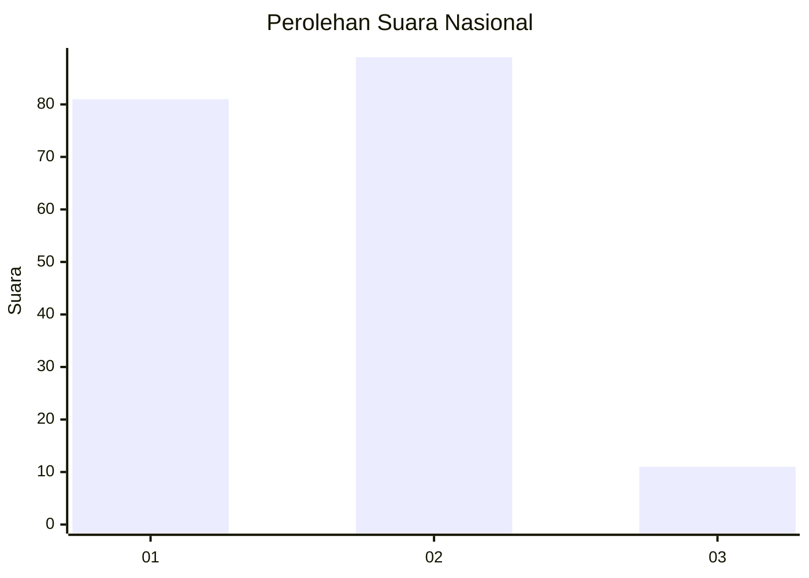
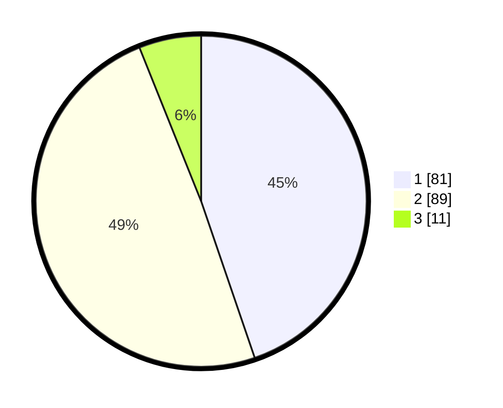

# Hasil

## Grafik

## Tabel

| No. | Nama Paslon    | Suara | Suara (raw) | Persentase |
|:--- |:-------------- | -----:| -----------:| ----------:|
| 1   | ANIES MUHAIMIN | 81    | [81][p-1]   | 44,75      |
| 2   | PRABOWO GIBRAN | 89    | [89][p-2]   | 49,17      |
| 3   | GANJAR MAHFUD  | 11    | [11][p-3]   | 6,08       |

[p-1]: https://github.com/gigit-pemilu/pemilu-2024/blob/main/pilpres/hitung-suara/sub/14-riau/sub/07--rokan-hilir/sub/06-pasir-limau-kapas/sub/2003-pasir-limau-kapas/sub/006-tps/sub/paslon-1.txt
[p-2]: https://github.com/gigit-pemilu/pemilu-2024/blob/main/pilpres/hitung-suara/sub/14-riau/sub/07--rokan-hilir/sub/06-pasir-limau-kapas/sub/2003-pasir-limau-kapas/sub/006-tps/sub/paslon-2.txt
[p-3]: https://github.com/gigit-pemilu/pemilu-2024/blob/main/pilpres/hitung-suara/sub/14-riau/sub/07--rokan-hilir/sub/06-pasir-limau-kapas/sub/2003-pasir-limau-kapas/sub/006-tps/sub/paslon-3.txt

## Foto C Plano

https://sirekap-obj-formc.kpu.go.id/dfec/pemilu/ppwp/14/07/06/20/03/1407062003006-20240215-004807--6af15cc9-5719-4cd3-8b94-057ea58236bb.jpg

https://sirekap-obj-formc.kpu.go.id/dfec/pemilu/ppwp/14/07/06/20/03/1407062003006-20240215-004952--a990cc8d-c8af-4c98-9797-788ef08a9e01.jpg

https://sirekap-obj-formc.kpu.go.id/dfec/pemilu/ppwp/14/07/06/20/03/1407062003006-20240215-005112--107595cf-de0d-40c5-a979-693f6d20700c.jpg

## Metadata

| Key        | Value               |
| ---------- | ------------------- |
| Time Stamp | 2024-02-16 14:30:33 |

