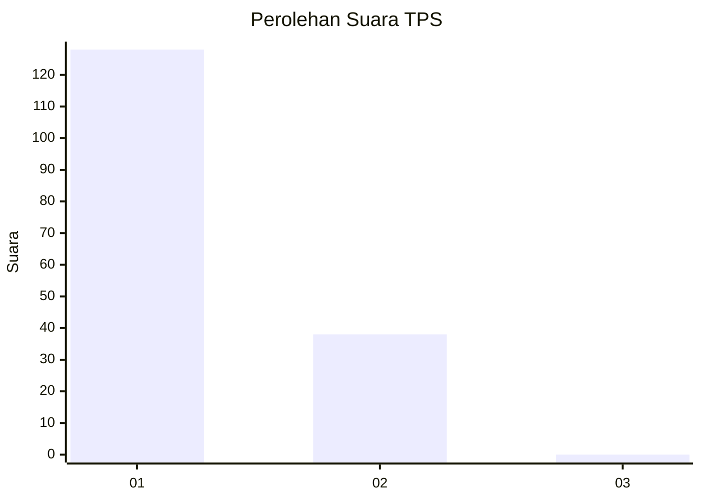
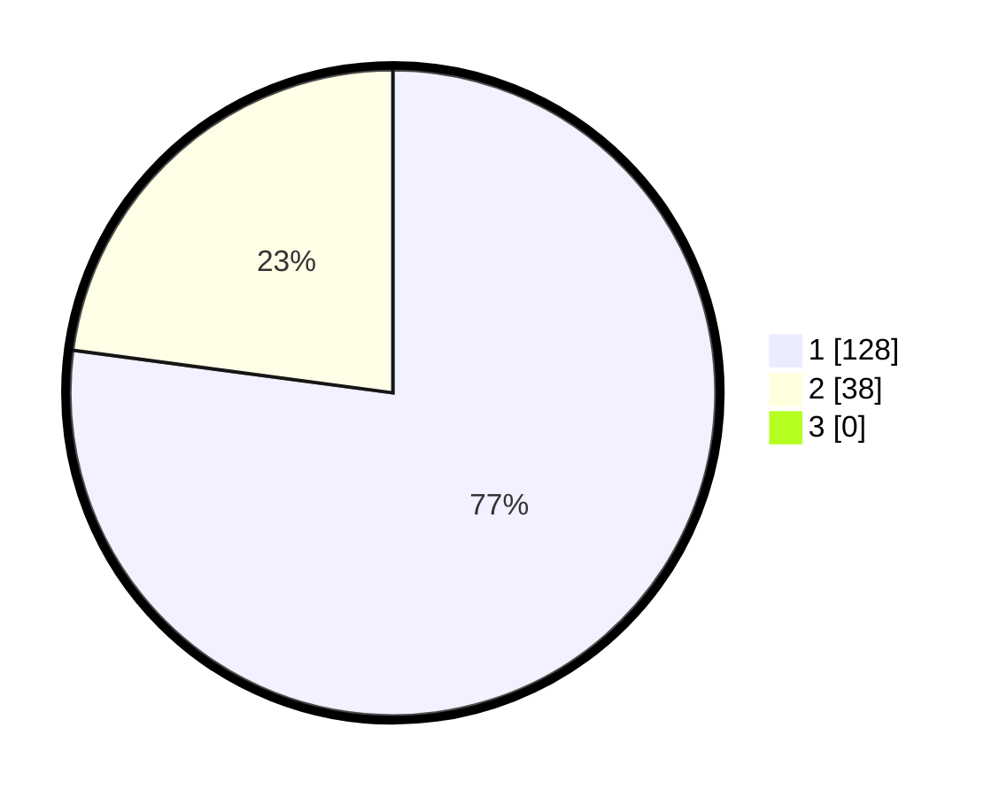

# Hasil

## Grafik

## Tabel

| No. | Nama Paslon    | Suara | Suara (raw) | Persentase |
|:--- |:-------------- | -----:| -----------:| ----------:|
| 1   | ANIES MUHAIMIN | 128   | [128][p-1]  | 77,11      |
| 2   | PRABOWO GIBRAN | 38    | [38][p-2]   | 22,89      |
| 3   | GANJAR MAHFUD  | 0     | [0][p-3]    | 0,00       |

[p-1]: https://github.com/gigit-pemilu/pemilu-2024-14-riau/blob/main/pilpres/hitung-suara/sub/14-riau/sub/07--rokan-hilir/sub/06-pasir-limau-kapas/sub/2003-pasir-limau-kapas/sub/008-tps/sub/paslon-1.txt
[p-2]: https://github.com/gigit-pemilu/pemilu-2024-14-riau/blob/main/pilpres/hitung-suara/sub/14-riau/sub/07--rokan-hilir/sub/06-pasir-limau-kapas/sub/2003-pasir-limau-kapas/sub/008-tps/sub/paslon-2.txt
[p-3]: https://github.com/gigit-pemilu/pemilu-2024-14-riau/blob/main/pilpres/hitung-suara/sub/14-riau/sub/07--rokan-hilir/sub/06-pasir-limau-kapas/sub/2003-pasir-limau-kapas/sub/008-tps/sub/paslon-3.txt

## Foto C Plano

https://sirekap-obj-formc.kpu.go.id/a1a9/pemilu/ppwp/14/07/06/20/03/1407062003008-20240214-203449--de6648a3-d0e4-45e4-9ac7-26ab5feac1ac.jpg

https://sirekap-obj-formc.kpu.go.id/a1a9/pemilu/ppwp/14/07/06/20/03/1407062003008-20240214-203636--9d34770e-a420-4e82-8d5e-90ab429fb353.jpg

https://sirekap-obj-formc.kpu.go.id/a1a9/pemilu/ppwp/14/07/06/20/03/1407062003008-20240214-203827--0a86090d-e44e-4df0-a58a-3b6c4b7cf6b0.jpg

## Metadata

| Key        | Value               |
| ---------- | ------------------- |
| Time Stamp | 2024-02-16 14:30:33 |

