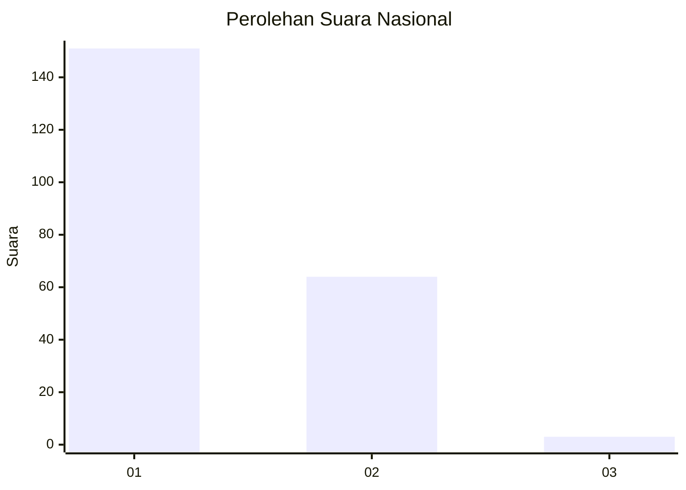
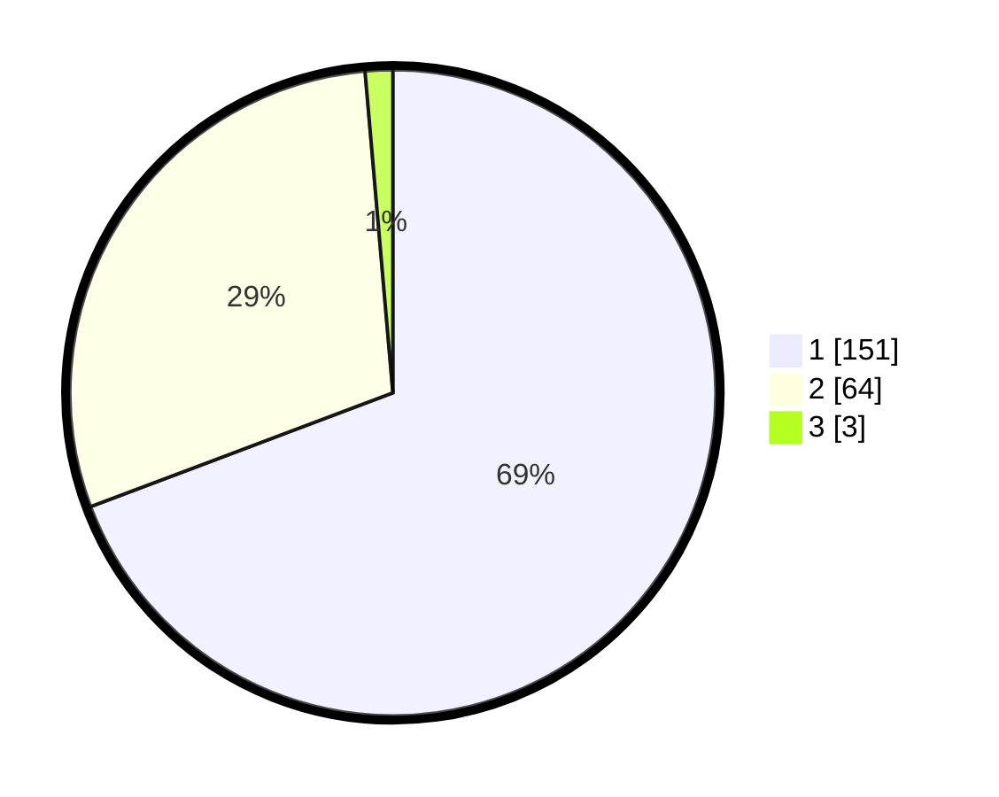

# Hasil

## Grafik

## Tabel

| No. | Nama Paslon    | Suara | Suara (raw) | Persentase |
|:--- |:-------------- | -----:| -----------:| ----------:|
| 1   | ANIES MUHAIMIN | 151   | [151][p-1]  | 69,27      |
| 2   | PRABOWO GIBRAN | 64    | [64][p-2]   | 29,36      |
| 3   | GANJAR MAHFUD  | 3     | [3][p-3]    | 1,38       |

[p-1]: https://github.com/gigit-pemilu/pemilu-2024/blob/main/pilpres/hitung-suara/sub/14-riau/sub/07--rokan-hilir/sub/06-pasir-limau-kapas/sub/2006-panipahan-laut/sub/002-tps/sub/paslon-1.txt
[p-2]: https://github.com/gigit-pemilu/pemilu-2024/blob/main/pilpres/hitung-suara/sub/14-riau/sub/07--rokan-hilir/sub/06-pasir-limau-kapas/sub/2006-panipahan-laut/sub/002-tps/sub/paslon-2.txt
[p-3]: https://github.com/gigit-pemilu/pemilu-2024/blob/main/pilpres/hitung-suara/sub/14-riau/sub/07--rokan-hilir/sub/06-pasir-limau-kapas/sub/2006-panipahan-laut/sub/002-tps/sub/paslon-3.txt

## Foto C Plano

https://sirekap-obj-formc.kpu.go.id/49c3/pemilu/ppwp/14/07/06/20/06/1407062006002-20240215-080608--a92787ac-ae24-4540-bd61-73b77b339c73.jpg

https://sirekap-obj-formc.kpu.go.id/49c3/pemilu/ppwp/14/07/06/20/06/1407062006002-20240215-080808--8264a449-cb11-4814-bc2f-14eb60ba2203.jpg

https://sirekap-obj-formc.kpu.go.id/49c3/pemilu/ppwp/14/07/06/20/06/1407062006002-20240215-080939--e2f62ecd-7d2e-42e9-bde5-0c8b974085af.jpg

## Metadata

| Key        | Value               |
| ---------- | ------------------- |
| Time Stamp | 2024-02-16 12:51:22 |

