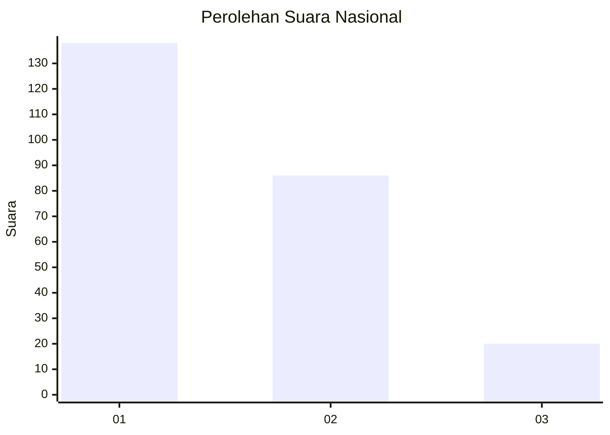
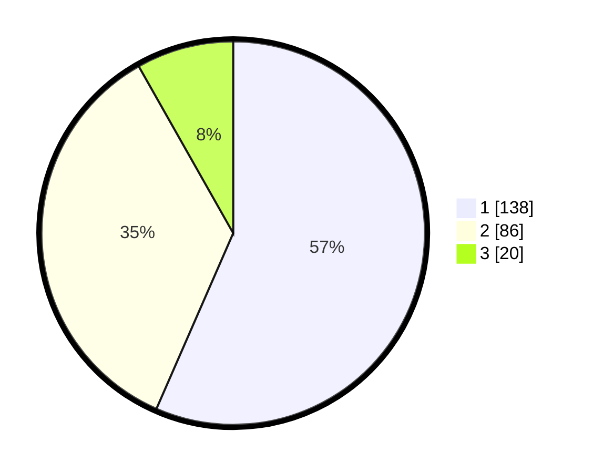

# Hasil

## Grafik

## Tabel

| No. | Nama Paslon    | Suara | Suara (raw) | Persentase |
|:--- |:-------------- | -----:| -----------:| ----------:|
| 1   | ANIES MUHAIMIN | 138   | [138][p-1]  | 56,56      |
| 2   | PRABOWO GIBRAN | 86    | [86][p-2]   | 35,25      |
| 3   | GANJAR MAHFUD  | 20    | [20][p-3]   | 8,20       |

[p-1]: https://github.com/gigit-pemilu/pemilu-2024/blob/main/pilpres/hitung-suara/sub/14-riau/sub/07--rokan-hilir/sub/06-pasir-limau-kapas/sub/2008-pulaujemur/sub/002-tps/sub/paslon-1.txt
[p-2]: https://github.com/gigit-pemilu/pemilu-2024/blob/main/pilpres/hitung-suara/sub/14-riau/sub/07--rokan-hilir/sub/06-pasir-limau-kapas/sub/2008-pulaujemur/sub/002-tps/sub/paslon-2.txt
[p-3]: https://github.com/gigit-pemilu/pemilu-2024/blob/main/pilpres/hitung-suara/sub/14-riau/sub/07--rokan-hilir/sub/06-pasir-limau-kapas/sub/2008-pulaujemur/sub/002-tps/sub/paslon-3.txt

## Foto C Plano

https://sirekap-obj-formc.kpu.go.id/11a1/pemilu/ppwp/14/07/06/20/08/1407062008002-20240215-012635--94a051e4-6fc0-4900-bb43-1d0120b1626b.jpg

https://sirekap-obj-formc.kpu.go.id/11a1/pemilu/ppwp/14/07/06/20/08/1407062008002-20240215-012710--e9811caa-06cb-41fb-b04c-00456b6d435f.jpg

https://sirekap-obj-formc.kpu.go.id/11a1/pemilu/ppwp/14/07/06/20/08/1407062008002-20240215-012730--49bdfb93-4a23-413c-a63f-c57dcf96431d.jpg

## Metadata

| Key        | Value               |
| ---------- | ------------------- |
| Time Stamp | 2024-02-16 14:30:33 |

