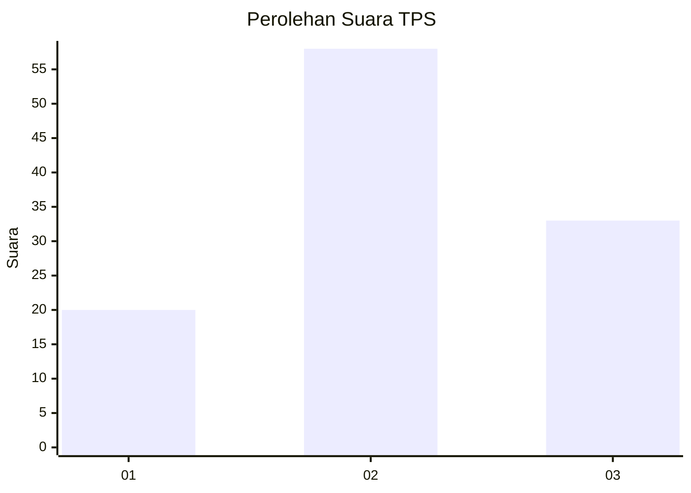
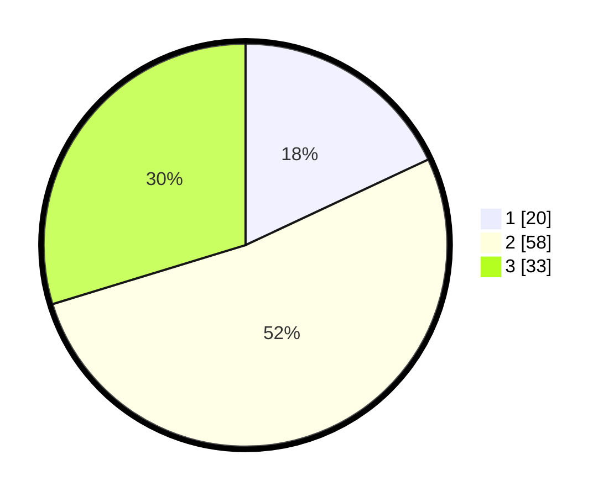

# Hasil

## Grafik

## Tabel

| No. | Nama Paslon    | Suara | Suara (raw) | Persentase |
|:--- |:-------------- | -----:| -----------:| ----------:|
| 1   | ANIES MUHAIMIN | 20    | [20][p-1]   | 18,02      |
| 2   | PRABOWO GIBRAN | 58    | [58][p-2]   | 52,25      |
| 3   | GANJAR MAHFUD  | 33    | [33][p-3]   | 29,73      |

[p-1]: https://github.com/gigit-pemilu/pemilu-2024-14-riau/blob/main/pilpres/hitung-suara/sub/14-riau/sub/07--rokan-hilir/sub/07-sinaboi/sub/1005-sinaboi-kota/sub/002-tps/sub/paslon-1.txt
[p-2]: https://github.com/gigit-pemilu/pemilu-2024-14-riau/blob/main/pilpres/hitung-suara/sub/14-riau/sub/07--rokan-hilir/sub/07-sinaboi/sub/1005-sinaboi-kota/sub/002-tps/sub/paslon-2.txt
[p-3]: https://github.com/gigit-pemilu/pemilu-2024-14-riau/blob/main/pilpres/hitung-suara/sub/14-riau/sub/07--rokan-hilir/sub/07-sinaboi/sub/1005-sinaboi-kota/sub/002-tps/sub/paslon-3.txt

## Foto C Plano

https://sirekap-obj-formc.kpu.go.id/d721/pemilu/ppwp/14/07/07/10/05/1407071005002-20240218-165601--956ef9fe-80a0-4241-acce-c4b9dcd3cb95.jpg

https://sirekap-obj-formc.kpu.go.id/d721/pemilu/ppwp/14/07/07/10/05/1407071005002-20240218-165113--3a78bc4f-3fe0-43b2-b23a-9854653aaed4.jpg

https://sirekap-obj-formc.kpu.go.id/d721/pemilu/ppwp/14/07/07/10/05/1407071005002-20240218-165154--e5c9a400-a405-4f8e-bbf4-95de94e249f9.jpg

## Metadata

| Key        | Value               |
| ---------- | ------------------- |
| Time Stamp | 2024-02-19 21:00:00 |

