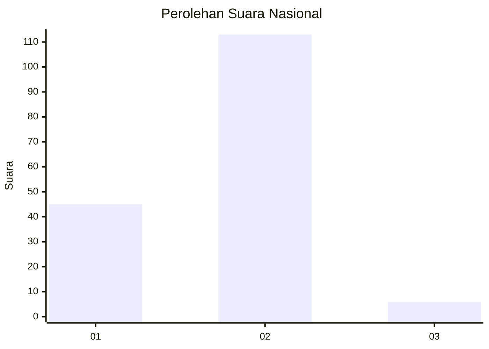
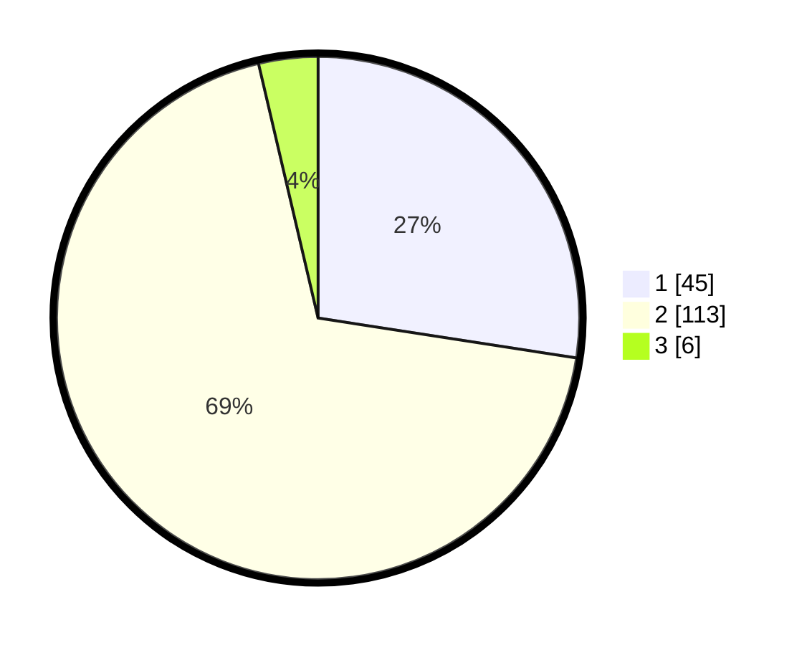

# Hasil

## Grafik

## Tabel

| No. | Nama Paslon    | Suara | Suara (raw) | Persentase |
|:--- |:-------------- | -----:| -----------:| ----------:|
| 1   | ANIES MUHAIMIN | 45    | [45][p-1]   | 27,44      |
| 2   | PRABOWO GIBRAN | 113   | [113][p-2]  | 68,90      |
| 3   | GANJAR MAHFUD  | 6     | [6][p-3]    | 3,66       |

[p-1]: https://github.com/gigit-pemilu/pemilu-2024/blob/main/pilpres/hitung-suara/sub/14-riau/sub/07--rokan-hilir/sub/07-sinaboi/sub/2001-sinaboi/sub/001-tps/sub/paslon-1.txt
[p-2]: https://github.com/gigit-pemilu/pemilu-2024/blob/main/pilpres/hitung-suara/sub/14-riau/sub/07--rokan-hilir/sub/07-sinaboi/sub/2001-sinaboi/sub/001-tps/sub/paslon-2.txt
[p-3]: https://github.com/gigit-pemilu/pemilu-2024/blob/main/pilpres/hitung-suara/sub/14-riau/sub/07--rokan-hilir/sub/07-sinaboi/sub/2001-sinaboi/sub/001-tps/sub/paslon-3.txt

## Foto C Plano

https://sirekap-obj-formc.kpu.go.id/ad89/pemilu/ppwp/14/07/07/20/01/1407072001001-20240219-095926--4e6f0ddd-4abf-423a-a734-eae509846498.jpg

https://sirekap-obj-formc.kpu.go.id/ad89/pemilu/ppwp/14/07/07/20/01/1407072001001-20240219-100036--2c31e105-1415-44a5-a752-10c6ac8246ff.jpg

https://sirekap-obj-formc.kpu.go.id/ad89/pemilu/ppwp/14/07/07/20/01/1407072001001-20240219-100143--bbd4be62-3ef1-40f9-b9a6-ecec2c7f4ccb.jpg

## Metadata

| Key        | Value               |
| ---------- | ------------------- |
| Time Stamp | 2024-02-19 21:00:00 |

