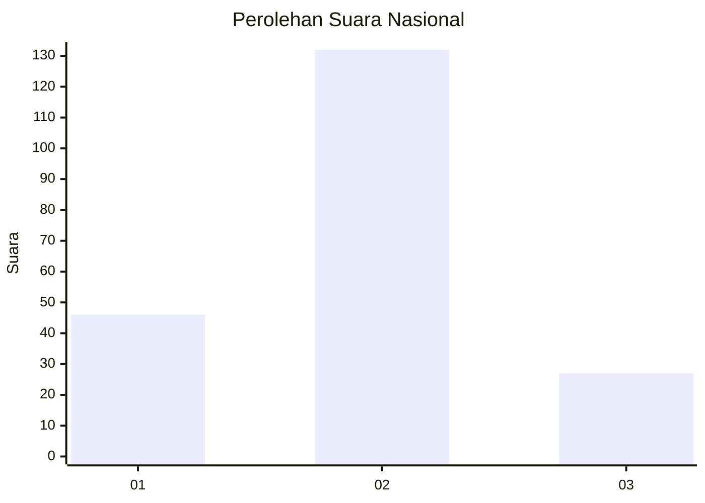
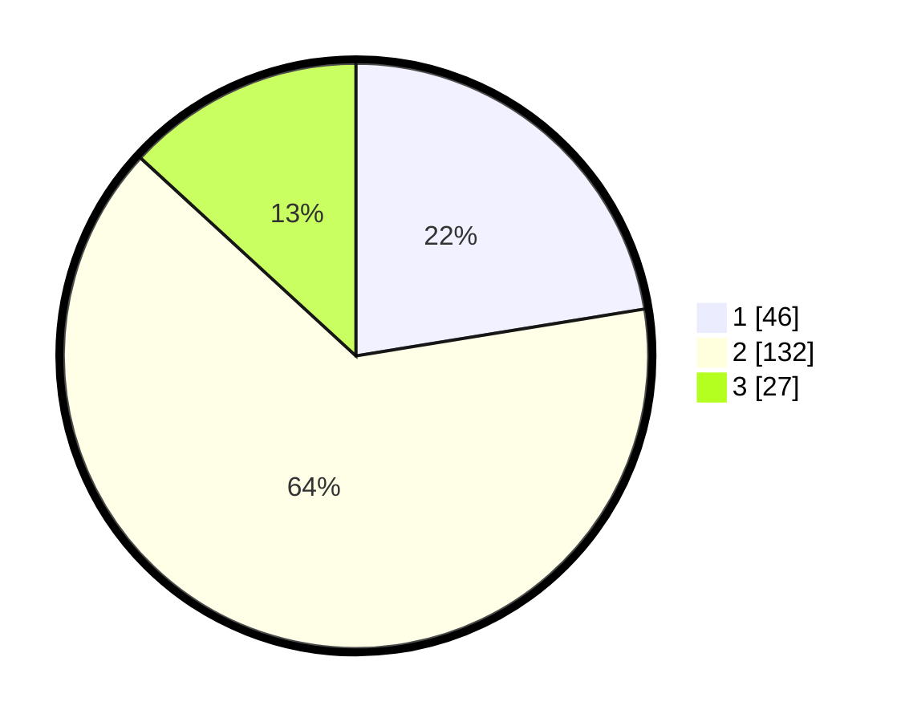

# Hasil

## Grafik

## Tabel

| No. | Nama Paslon    | Suara | Suara (raw) | Persentase |
|:--- |:-------------- | -----:| -----------:| ----------:|
| 1   | ANIES MUHAIMIN | 46    | [46][p-1]   | 22,44      |
| 2   | PRABOWO GIBRAN | 132   | [132][p-2]  | 64,39      |
| 3   | GANJAR MAHFUD  | 27    | [27][p-3]   | 13,17      |

[p-1]: https://github.com/gigit-pemilu/pemilu-2024/blob/main/pilpres/hitung-suara/sub/14-riau/sub/07--rokan-hilir/sub/07-sinaboi/sub/2002-sei-bakau/sub/001-tps/sub/paslon-1.txt
[p-2]: https://github.com/gigit-pemilu/pemilu-2024/blob/main/pilpres/hitung-suara/sub/14-riau/sub/07--rokan-hilir/sub/07-sinaboi/sub/2002-sei-bakau/sub/001-tps/sub/paslon-2.txt
[p-3]: https://github.com/gigit-pemilu/pemilu-2024/blob/main/pilpres/hitung-suara/sub/14-riau/sub/07--rokan-hilir/sub/07-sinaboi/sub/2002-sei-bakau/sub/001-tps/sub/paslon-3.txt

## Foto C Plano

https://sirekap-obj-formc.kpu.go.id/1aba/pemilu/ppwp/14/07/07/20/02/1407072002001-20240215-072759--c7b8fe41-3472-4345-a734-7d2d361415b0.jpg

https://sirekap-obj-formc.kpu.go.id/1aba/pemilu/ppwp/14/07/07/20/02/1407072002001-20240215-073529--8b694da4-633d-49cd-bd75-2513d8f0508c.jpg

https://sirekap-obj-formc.kpu.go.id/1aba/pemilu/ppwp/14/07/07/20/02/1407072002001-20240215-073654--e4f683be-f938-48a9-a54d-d9ecda31d8ca.jpg

## Metadata

| Key        | Value               |
| ---------- | ------------------- |
| Time Stamp | 2024-02-16 14:30:33 |

