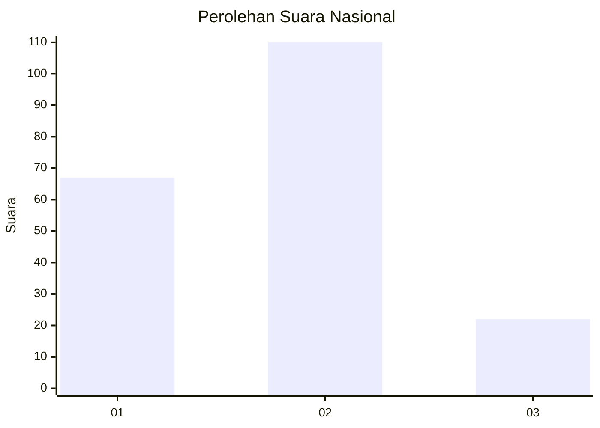
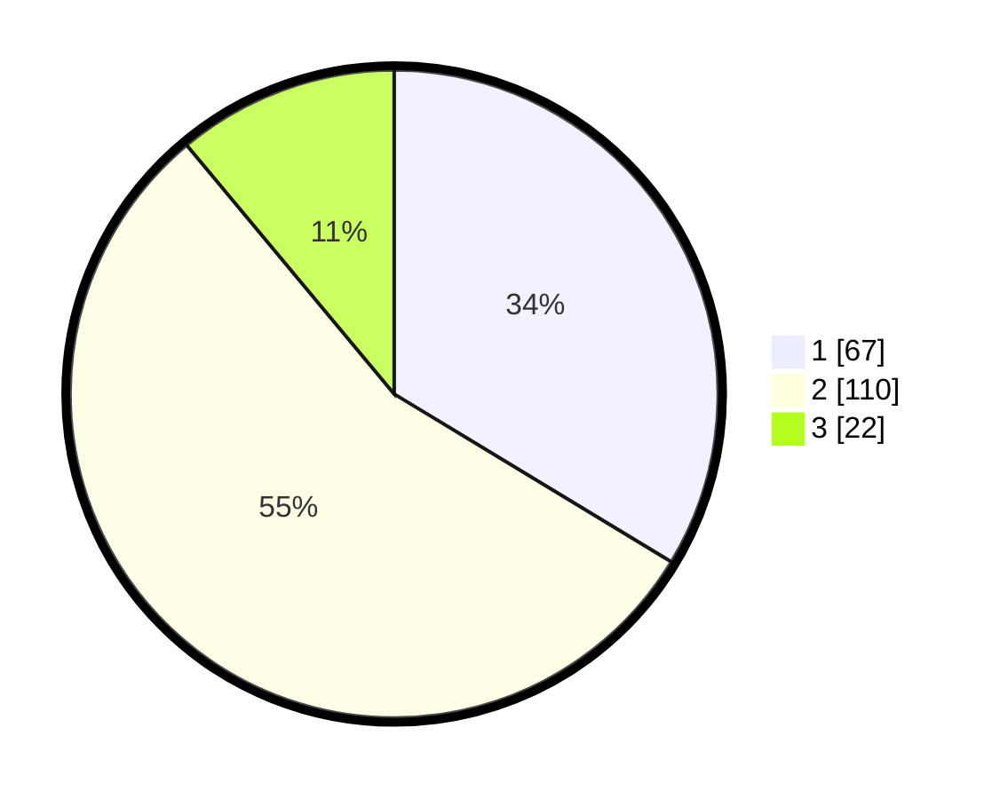

# Hasil

## Grafik

## Tabel

| No. | Nama Paslon    | Suara | Suara (raw) | Persentase |
|:--- |:-------------- | -----:| -----------:| ----------:|
| 1   | ANIES MUHAIMIN | 67    | [67][p-1]   | 33,67      |
| 2   | PRABOWO GIBRAN | 110   | [110][p-2]  | 55,28      |
| 3   | GANJAR MAHFUD  | 22    | [22][p-3]   | 11,06      |

[p-1]: https://github.com/gigit-pemilu/pemilu-2024/blob/main/pilpres/hitung-suara/sub/14-riau/sub/07--rokan-hilir/sub/07-sinaboi/sub/2002-sei-bakau/sub/007-tps/sub/paslon-1.txt
[p-2]: https://github.com/gigit-pemilu/pemilu-2024/blob/main/pilpres/hitung-suara/sub/14-riau/sub/07--rokan-hilir/sub/07-sinaboi/sub/2002-sei-bakau/sub/007-tps/sub/paslon-2.txt
[p-3]: https://github.com/gigit-pemilu/pemilu-2024/blob/main/pilpres/hitung-suara/sub/14-riau/sub/07--rokan-hilir/sub/07-sinaboi/sub/2002-sei-bakau/sub/007-tps/sub/paslon-3.txt

## Foto C Plano

https://sirekap-obj-formc.kpu.go.id/0b94/pemilu/ppwp/14/07/07/20/02/1407072002007-20240215-090718--05fff57b-eeb4-4bc0-8ba2-ff7880796d02.jpg

https://sirekap-obj-formc.kpu.go.id/0b94/pemilu/ppwp/14/07/07/20/02/1407072002007-20240215-090741--ae7a9bfe-db93-40b3-9ec4-8ab9930e9a9e.jpg

https://sirekap-obj-formc.kpu.go.id/0b94/pemilu/ppwp/14/07/07/20/02/1407072002007-20240215-090808--1502a302-1034-4a25-9544-2a81c219508e.jpg

## Metadata

| Key        | Value               |
| ---------- | ------------------- |
| Time Stamp | 2024-02-16 12:51:22 |

