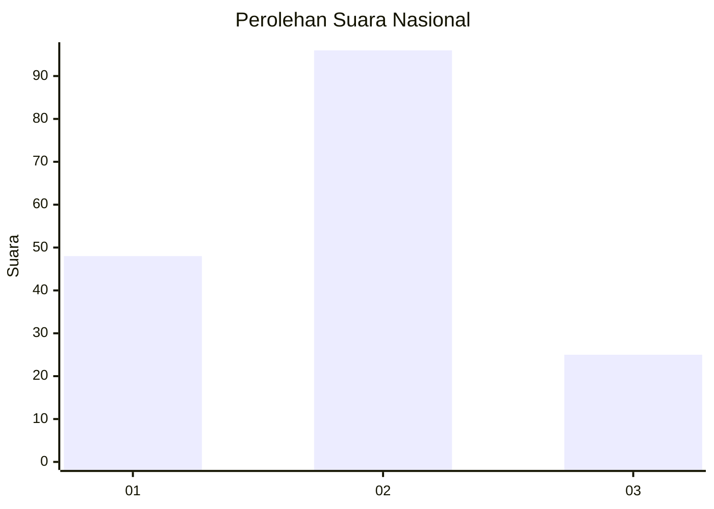
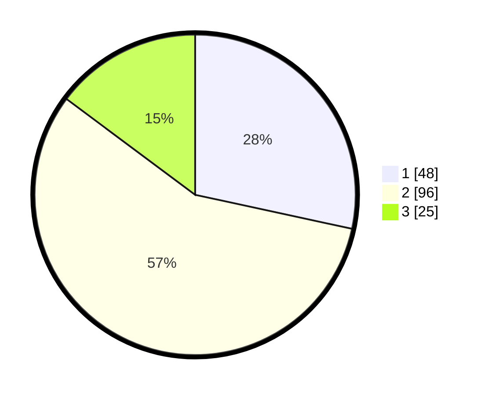

# Hasil

## Grafik

## Tabel

| No. | Nama Paslon    | Suara | Suara (raw) | Persentase |
|:--- |:-------------- | -----:| -----------:| ----------:|
| 1   | ANIES MUHAIMIN | 48    | [48][p-1]   | 28,40      |
| 2   | PRABOWO GIBRAN | 96    | [96][p-2]   | 56,80      |
| 3   | GANJAR MAHFUD  | 25    | [25][p-3]   | 14,79      |

[p-1]: https://github.com/gigit-pemilu/pemilu-2024/blob/main/pilpres/hitung-suara/sub/14-riau/sub/07--rokan-hilir/sub/07-sinaboi/sub/2004-sungai-nyamuk/sub/004-tps/sub/paslon-1.txt
[p-2]: https://github.com/gigit-pemilu/pemilu-2024/blob/main/pilpres/hitung-suara/sub/14-riau/sub/07--rokan-hilir/sub/07-sinaboi/sub/2004-sungai-nyamuk/sub/004-tps/sub/paslon-2.txt
[p-3]: https://github.com/gigit-pemilu/pemilu-2024/blob/main/pilpres/hitung-suara/sub/14-riau/sub/07--rokan-hilir/sub/07-sinaboi/sub/2004-sungai-nyamuk/sub/004-tps/sub/paslon-3.txt

## Foto C Plano

https://sirekap-obj-formc.kpu.go.id/a3ab/pemilu/ppwp/14/07/07/20/04/1407072004004-20240215-170125--de9b0db6-265c-4b02-89e3-578e7c4634ad.jpg

https://sirekap-obj-formc.kpu.go.id/a3ab/pemilu/ppwp/14/07/07/20/04/1407072004004-20240215-170303--2cf805d3-b789-48b1-bd13-890ca1bbd1f3.jpg

https://sirekap-obj-formc.kpu.go.id/a3ab/pemilu/ppwp/14/07/07/20/04/1407072004004-20240215-170446--addc4c0f-2a7e-410b-8045-6cac67f96981.jpg

## Metadata

| Key        | Value               |
| ---------- | ------------------- |
| Time Stamp | 2024-02-16 12:51:22 |

