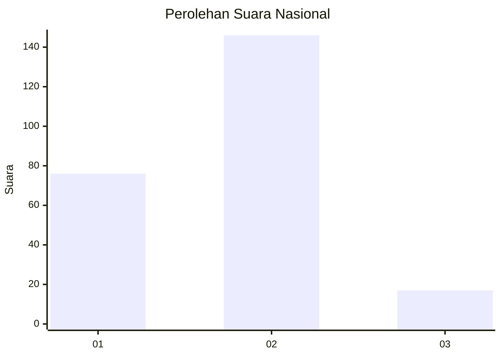
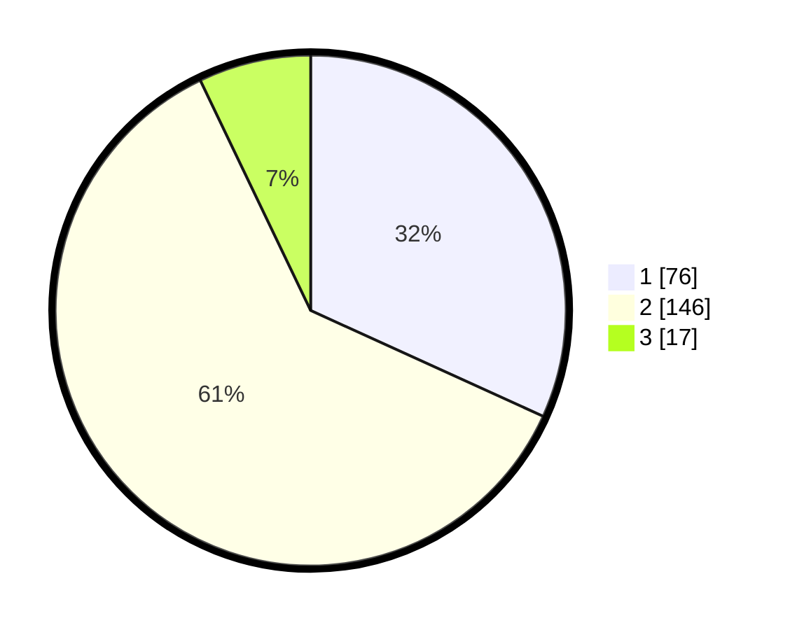

# Hasil

## Grafik

## Tabel

| No. | Nama Paslon    | Suara | Suara (raw) | Persentase |
|:--- |:-------------- | -----:| -----------:| ----------:|
| 1   | ANIES MUHAIMIN | 76    | [76][p-1]   | 31,80      |
| 2   | PRABOWO GIBRAN | 146   | [146][p-2]  | 61,09      |
| 3   | GANJAR MAHFUD  | 17    | [17][p-3]   | 7,11       |

[p-1]: https://github.com/gigit-pemilu/pemilu-2024/blob/main/pilpres/hitung-suara/sub/14-riau/sub/07--rokan-hilir/sub/09-tanah-putih-tanjung-melawan/sub/2001-melayu-besar/sub/011-tps/sub/paslon-1.txt
[p-2]: https://github.com/gigit-pemilu/pemilu-2024/blob/main/pilpres/hitung-suara/sub/14-riau/sub/07--rokan-hilir/sub/09-tanah-putih-tanjung-melawan/sub/2001-melayu-besar/sub/011-tps/sub/paslon-2.txt
[p-3]: https://github.com/gigit-pemilu/pemilu-2024/blob/main/pilpres/hitung-suara/sub/14-riau/sub/07--rokan-hilir/sub/09-tanah-putih-tanjung-melawan/sub/2001-melayu-besar/sub/011-tps/sub/paslon-3.txt

## Foto C Plano

https://sirekap-obj-formc.kpu.go.id/6f81/pemilu/ppwp/14/07/09/20/01/1407092001011-20240215-063116--6126d366-3db1-44d8-881b-4c29c5675801.jpg

https://sirekap-obj-formc.kpu.go.id/6f81/pemilu/ppwp/14/07/09/20/01/1407092001011-20240215-061412--3133ffbf-b464-4992-9df4-504052b604ad.jpg

https://sirekap-obj-formc.kpu.go.id/6f81/pemilu/ppwp/14/07/09/20/01/1407092001011-20240215-063441--8fb0083c-003c-469e-850a-ce8b611774a5.jpg

## Metadata

| Key        | Value               |
| ---------- | ------------------- |
| Time Stamp | 2024-02-16 14:00:34 |

