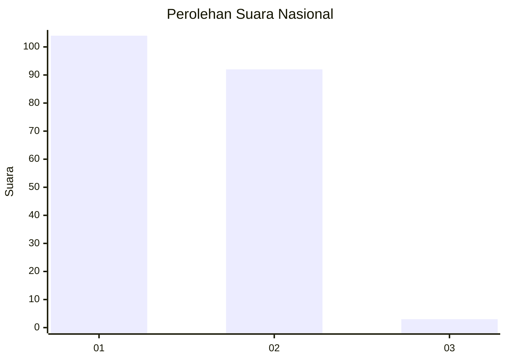
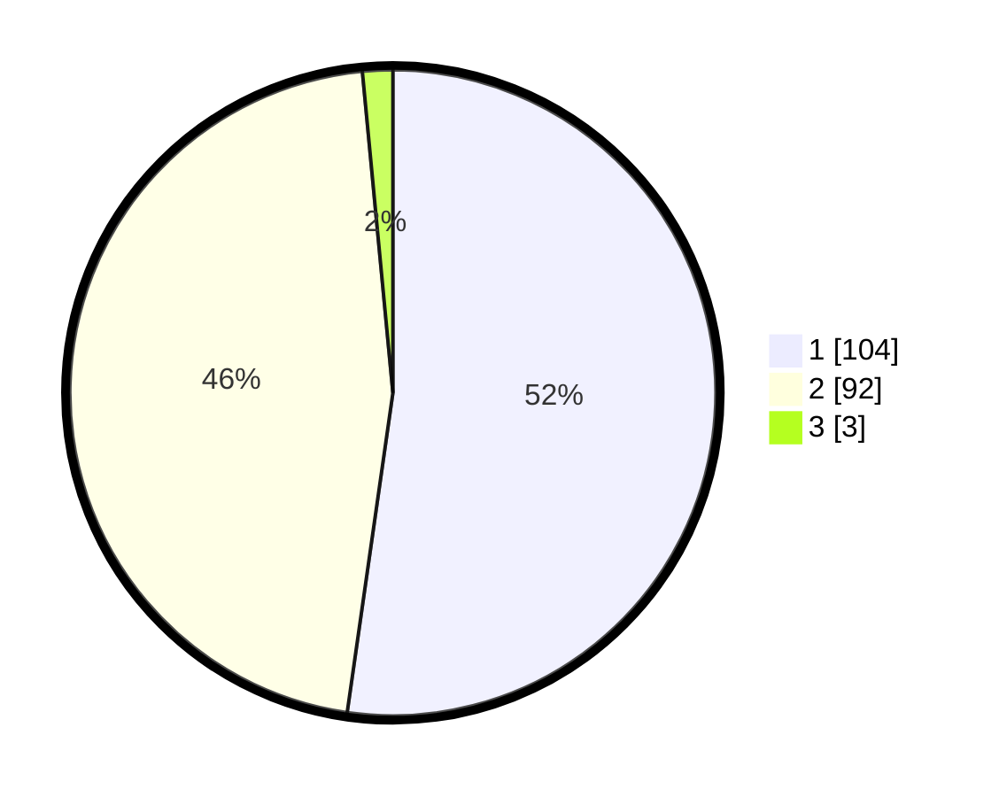

# Hasil

## Grafik

## Tabel

| No. | Nama Paslon    | Suara | Suara (raw) | Persentase |
|:--- |:-------------- | -----:| -----------:| ----------:|
| 1   | ANIES MUHAIMIN | 104   | [104][p-1]  | 52,26      |
| 2   | PRABOWO GIBRAN | 92    | [92][p-2]   | 46,23      |
| 3   | GANJAR MAHFUD  | 3     | [3][p-3]    | 1,51       |

[p-1]: https://github.com/gigit-pemilu/pemilu-2024/blob/main/pilpres/hitung-suara/sub/14-riau/sub/07--rokan-hilir/sub/10-bangko-pusako/sub/1001-bangko-kanan/sub/004-tps/sub/paslon-1.txt
[p-2]: https://github.com/gigit-pemilu/pemilu-2024/blob/main/pilpres/hitung-suara/sub/14-riau/sub/07--rokan-hilir/sub/10-bangko-pusako/sub/1001-bangko-kanan/sub/004-tps/sub/paslon-2.txt
[p-3]: https://github.com/gigit-pemilu/pemilu-2024/blob/main/pilpres/hitung-suara/sub/14-riau/sub/07--rokan-hilir/sub/10-bangko-pusako/sub/1001-bangko-kanan/sub/004-tps/sub/paslon-3.txt

## Foto C Plano

https://sirekap-obj-formc.kpu.go.id/dbbb/pemilu/ppwp/14/07/10/10/01/1407101001004-20240215-073518--1ef2cb30-26dc-4f3e-b1d7-e2c3fe56bd5d.jpg

https://sirekap-obj-formc.kpu.go.id/dbbb/pemilu/ppwp/14/07/10/10/01/1407101001004-20240215-073558--651fc966-7f6f-44b4-b514-786924a678c7.jpg

https://sirekap-obj-formc.kpu.go.id/dbbb/pemilu/ppwp/14/07/10/10/01/1407101001004-20240215-073637--5d4683bc-bb42-47e0-ac4c-3a59406cf626.jpg

## Metadata

| Key        | Value               |
| ---------- | ------------------- |
| Time Stamp | 2024-02-16 14:00:34 |

