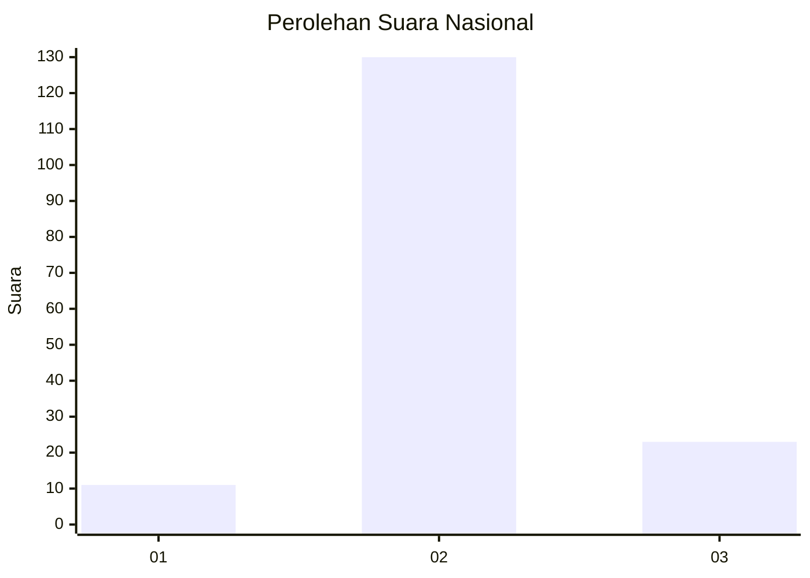
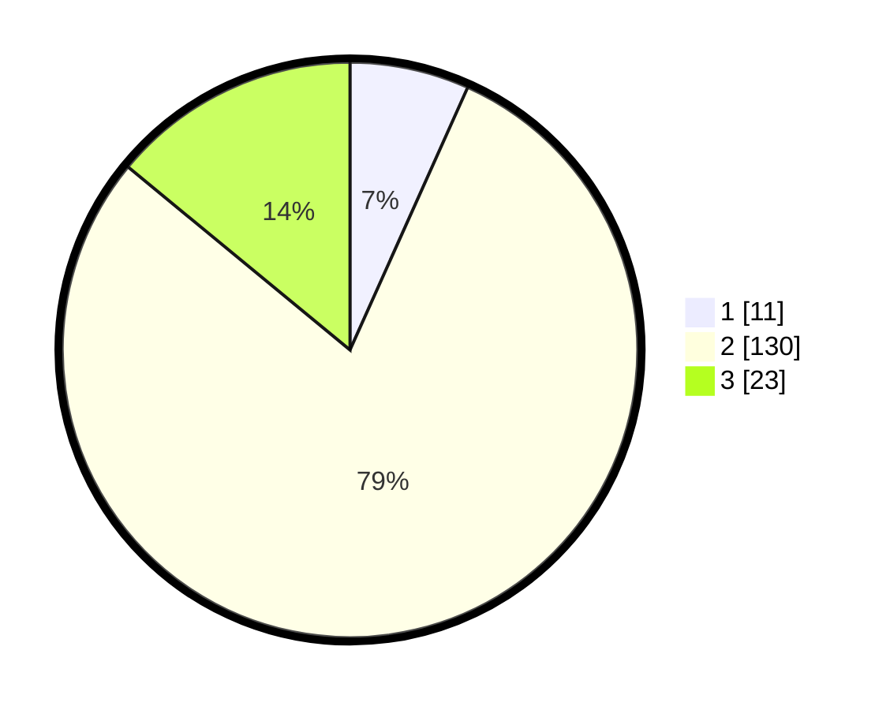

# Hasil

## Grafik

## Tabel

| No. | Nama Paslon    | Suara | Suara (raw) | Persentase |
|:--- |:-------------- | -----:| -----------:| ----------:|
| 1   | ANIES MUHAIMIN | 11    | [11][p-1]   | 6,71       |
| 2   | PRABOWO GIBRAN | 130   | [130][p-2]  | 79,27      |
| 3   | GANJAR MAHFUD  | 23    | [23][p-3]   | 14,02      |

[p-1]: https://github.com/gigit-pemilu/pemilu-2024/blob/main/pilpres/hitung-suara/sub/14-riau/sub/07--rokan-hilir/sub/10-bangko-pusako/sub/1001-bangko-kanan/sub/006-tps/sub/paslon-1.txt
[p-2]: https://github.com/gigit-pemilu/pemilu-2024/blob/main/pilpres/hitung-suara/sub/14-riau/sub/07--rokan-hilir/sub/10-bangko-pusako/sub/1001-bangko-kanan/sub/006-tps/sub/paslon-2.txt
[p-3]: https://github.com/gigit-pemilu/pemilu-2024/blob/main/pilpres/hitung-suara/sub/14-riau/sub/07--rokan-hilir/sub/10-bangko-pusako/sub/1001-bangko-kanan/sub/006-tps/sub/paslon-3.txt

## Foto C Plano

https://sirekap-obj-formc.kpu.go.id/4c6a/pemilu/ppwp/14/07/10/10/01/1407101001006-20240215-054442--12055ffd-fe52-42b5-b780-b6ea15a5e256.jpg

https://sirekap-obj-formc.kpu.go.id/4c6a/pemilu/ppwp/14/07/10/10/01/1407101001006-20240215-054952--b922818d-5678-4682-8023-97674f8c12e8.jpg

https://sirekap-obj-formc.kpu.go.id/4c6a/pemilu/ppwp/14/07/10/10/01/1407101001006-20240215-055138--5c81b528-e49e-4f3a-a948-e6b15470e15a.jpg

## Metadata

| Key        | Value               |
| ---------- | ------------------- |
| Time Stamp | 2024-02-16 12:51:22 |

