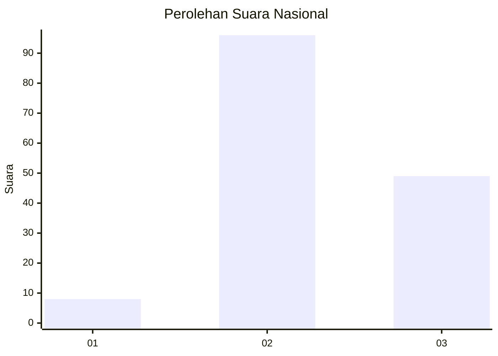
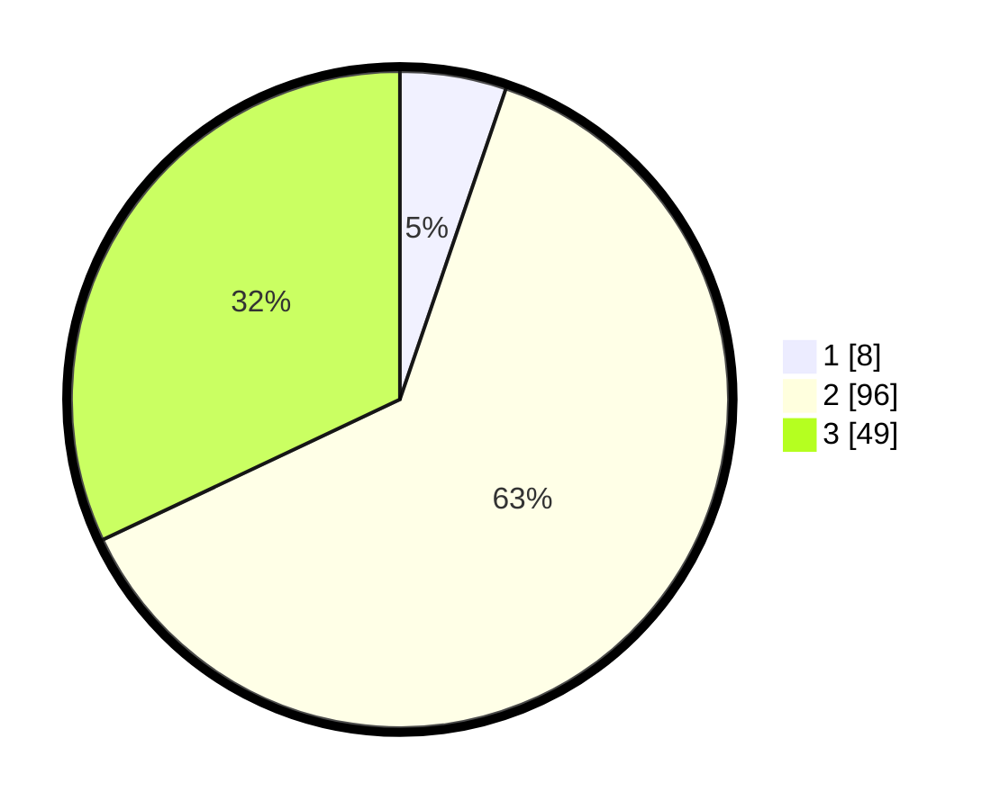

# Hasil

## Grafik

## Tabel

| No. | Nama Paslon    | Suara | Suara (raw) | Persentase |
|:--- |:-------------- | -----:| -----------:| ----------:|
| 1   | ANIES MUHAIMIN | 8     | [8][p-1]    | 5,23       |
| 2   | PRABOWO GIBRAN | 96    | [96][p-2]   | 62,75      |
| 3   | GANJAR MAHFUD  | 49    | [49][p-3]   | 32,03      |

[p-1]: https://github.com/gigit-pemilu/pemilu-2024/blob/main/pilpres/hitung-suara/sub/14-riau/sub/07--rokan-hilir/sub/10-bangko-pusako/sub/1001-bangko-kanan/sub/008-tps/sub/paslon-1.txt
[p-2]: https://github.com/gigit-pemilu/pemilu-2024/blob/main/pilpres/hitung-suara/sub/14-riau/sub/07--rokan-hilir/sub/10-bangko-pusako/sub/1001-bangko-kanan/sub/008-tps/sub/paslon-2.txt
[p-3]: https://github.com/gigit-pemilu/pemilu-2024/blob/main/pilpres/hitung-suara/sub/14-riau/sub/07--rokan-hilir/sub/10-bangko-pusako/sub/1001-bangko-kanan/sub/008-tps/sub/paslon-3.txt

## Foto C Plano

https://sirekap-obj-formc.kpu.go.id/6117/pemilu/ppwp/14/07/10/10/01/1407101001008-20240215-041735--c344c2dd-9fbf-4cf8-b35f-0bbbc497b66d.jpg

https://sirekap-obj-formc.kpu.go.id/6117/pemilu/ppwp/14/07/10/10/01/1407101001008-20240215-042058--cd52e74f-e835-4bbf-81fe-59486464c86a.jpg

https://sirekap-obj-formc.kpu.go.id/6117/pemilu/ppwp/14/07/10/10/01/1407101001008-20240215-042242--ab3cde5b-30fb-487c-8b3f-093cbad0d163.jpg

## Metadata

| Key        | Value               |
| ---------- | ------------------- |
| Time Stamp | 2024-02-16 14:00:34 |

