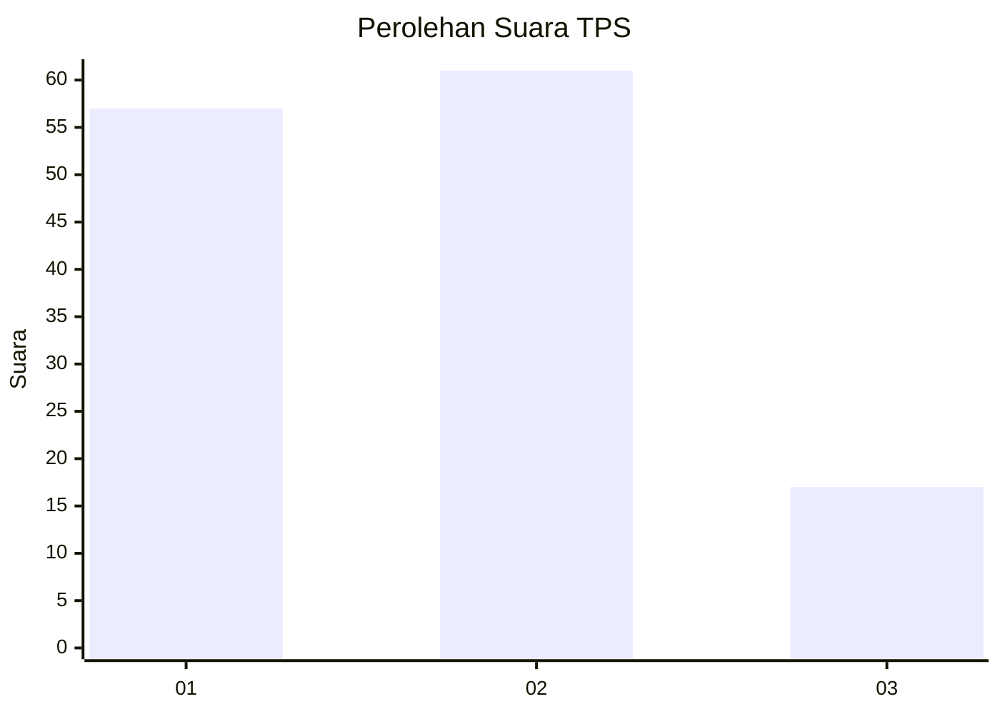
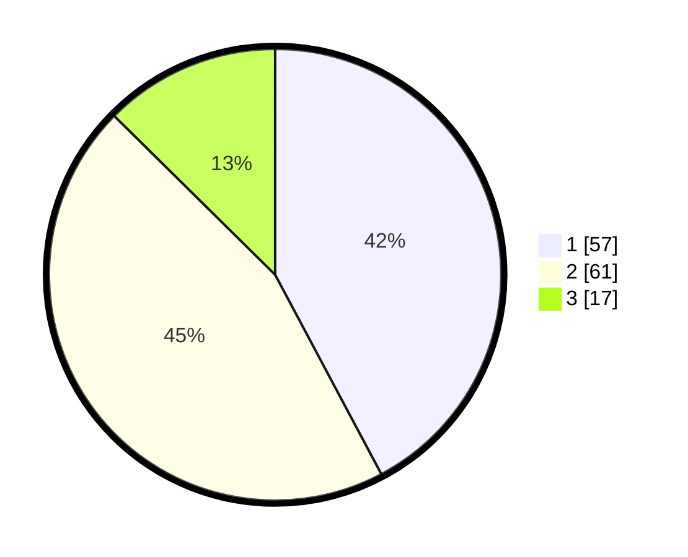

# Hasil

## Grafik

## Tabel

| No. | Nama Paslon    | Suara | Suara (raw) | Persentase |
|:--- |:-------------- | -----:| -----------:| ----------:|
| 1   | ANIES MUHAIMIN | 57    | [57][p-1]   | 42,22      |
| 2   | PRABOWO GIBRAN | 61    | [61][p-2]   | 45,19      |
| 3   | GANJAR MAHFUD  | 17    | [17][p-3]   | 12,59      |

[p-1]: https://github.com/gigit-pemilu/pemilu-2024-14-riau/blob/main/pilpres/hitung-suara/sub/14-riau/sub/07--rokan-hilir/sub/10-bangko-pusako/sub/1006-bangko-kiri/sub/007-tps/sub/paslon-1.txt
[p-2]: https://github.com/gigit-pemilu/pemilu-2024-14-riau/blob/main/pilpres/hitung-suara/sub/14-riau/sub/07--rokan-hilir/sub/10-bangko-pusako/sub/1006-bangko-kiri/sub/007-tps/sub/paslon-2.txt
[p-3]: https://github.com/gigit-pemilu/pemilu-2024-14-riau/blob/main/pilpres/hitung-suara/sub/14-riau/sub/07--rokan-hilir/sub/10-bangko-pusako/sub/1006-bangko-kiri/sub/007-tps/sub/paslon-3.txt

## Foto C Plano

https://sirekap-obj-formc.kpu.go.id/990f/pemilu/ppwp/14/07/10/10/06/1407101006007-20240214-212153--f5f596a6-5ca0-4808-9903-d004f8288efd.jpg

https://sirekap-obj-formc.kpu.go.id/990f/pemilu/ppwp/14/07/10/10/06/1407101006007-20240214-212231--bdcbcb87-27fa-4fad-ab69-feee4153a7ac.jpg

https://sirekap-obj-formc.kpu.go.id/990f/pemilu/ppwp/14/07/10/10/06/1407101006007-20240214-212330--43135b5c-95b7-4264-8acc-213368665b56.jpg

## Metadata

| Key        | Value               |
| ---------- | ------------------- |
| Time Stamp | 2024-02-16 14:00:34 |

