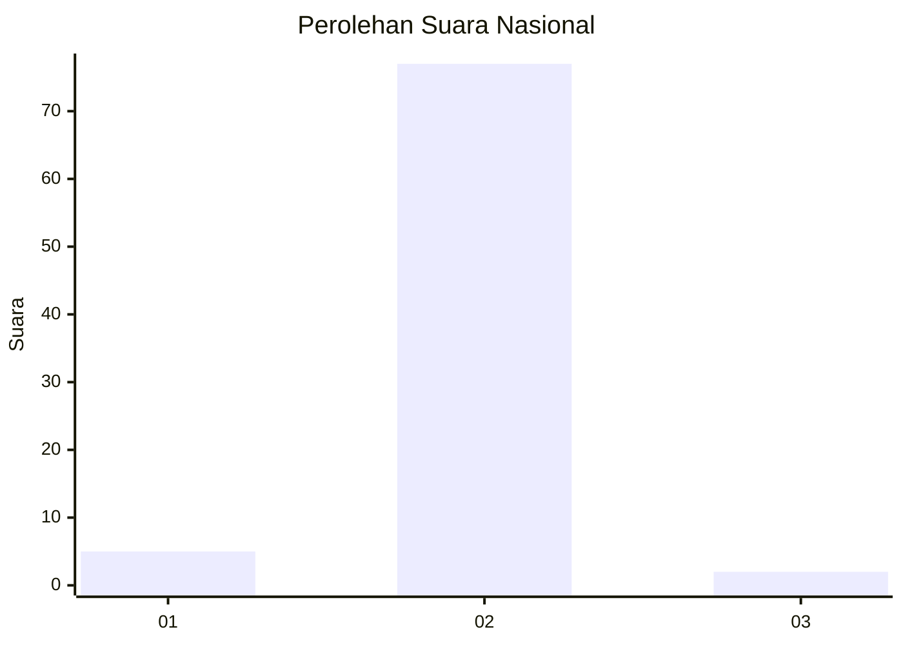
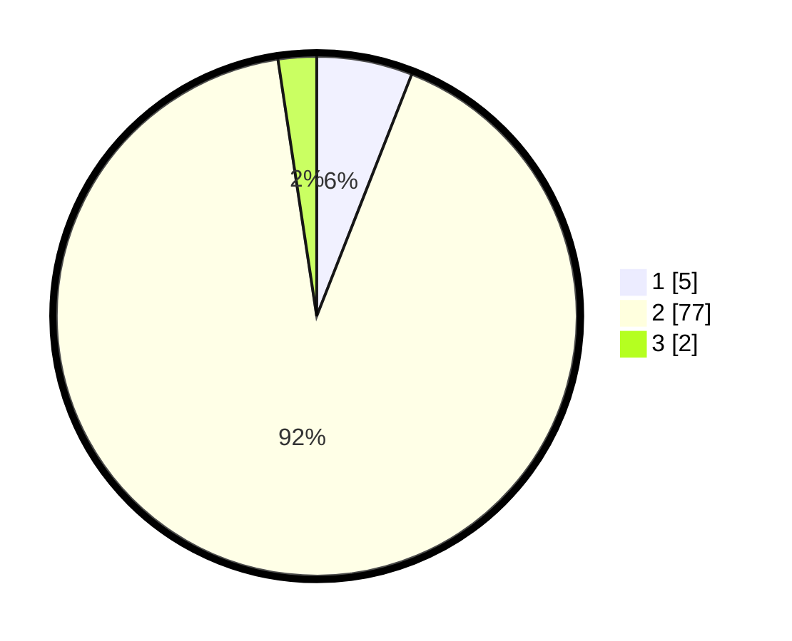

# Hasil

## Grafik

## Tabel

| No. | Nama Paslon    | Suara | Suara (raw) | Persentase |
|:--- |:-------------- | -----:| -----------:| ----------:|
| 1   | ANIES MUHAIMIN | 5     | [5][p-1]    | 5,95       |
| 2   | PRABOWO GIBRAN | 77    | [77][p-2]   | 91,67      |
| 3   | GANJAR MAHFUD  | 2     | [2][p-3]    | 2,38       |

[p-1]: https://github.com/gigit-pemilu/pemilu-2024/blob/main/pilpres/hitung-suara/sub/14-riau/sub/07--rokan-hilir/sub/10-bangko-pusako/sub/2004-bangko-bakti/sub/011-tps/sub/paslon-1.txt
[p-2]: https://github.com/gigit-pemilu/pemilu-2024/blob/main/pilpres/hitung-suara/sub/14-riau/sub/07--rokan-hilir/sub/10-bangko-pusako/sub/2004-bangko-bakti/sub/011-tps/sub/paslon-2.txt
[p-3]: https://github.com/gigit-pemilu/pemilu-2024/blob/main/pilpres/hitung-suara/sub/14-riau/sub/07--rokan-hilir/sub/10-bangko-pusako/sub/2004-bangko-bakti/sub/011-tps/sub/paslon-3.txt

## Foto C Plano

https://sirekap-obj-formc.kpu.go.id/fc4a/pemilu/ppwp/14/07/10/20/04/1407102004011-20240214-141145--71b70c7b-de1a-45dd-a201-e951ed32b812.jpg

https://sirekap-obj-formc.kpu.go.id/fc4a/pemilu/ppwp/14/07/10/20/04/1407102004011-20240214-141310--e9e841e6-379c-448d-b139-10488ba949fa.jpg

https://sirekap-obj-formc.kpu.go.id/fc4a/pemilu/ppwp/14/07/10/20/04/1407102004011-20240214-141442--adfa6ade-4a6a-4e32-a312-e5e465ce61c5.jpg

## Metadata

| Key        | Value               |
| ---------- | ------------------- |
| Time Stamp | 2024-02-14 21:46:01 |

