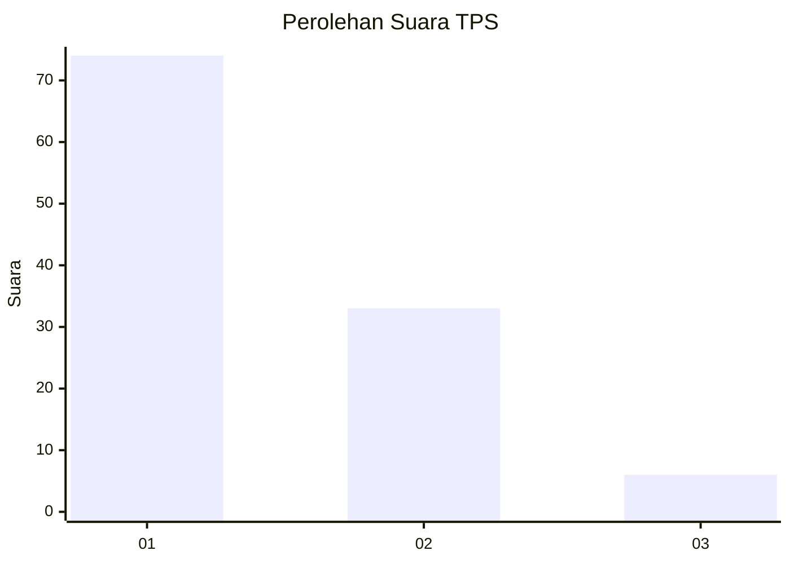
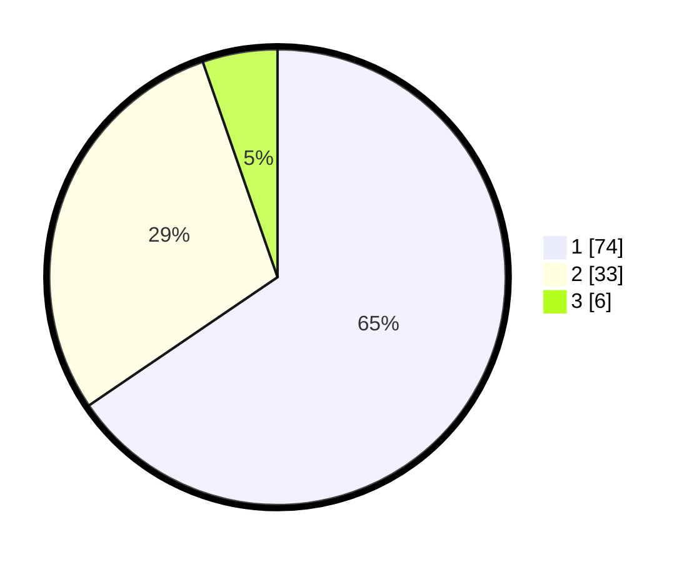

# Hasil

## Grafik

## Tabel

| No. | Nama Paslon    | Suara | Suara (raw) | Persentase |
|:--- |:-------------- | -----:| -----------:| ----------:|
| 1   | ANIES MUHAIMIN | 74    | [74][p-1]   | 65,49      |
| 2   | PRABOWO GIBRAN | 33    | [33][p-2]   | 29,20      |
| 3   | GANJAR MAHFUD  | 6     | [6][p-3]    | 5,31       |

[p-1]: https://github.com/gigit-pemilu/pemilu-2024-14-riau/blob/main/pilpres/hitung-suara/sub/14-riau/sub/07--rokan-hilir/sub/10-bangko-pusako/sub/2005-bangko-pusako/sub/002-tps/sub/paslon-1.txt
[p-2]: https://github.com/gigit-pemilu/pemilu-2024-14-riau/blob/main/pilpres/hitung-suara/sub/14-riau/sub/07--rokan-hilir/sub/10-bangko-pusako/sub/2005-bangko-pusako/sub/002-tps/sub/paslon-2.txt
[p-3]: https://github.com/gigit-pemilu/pemilu-2024-14-riau/blob/main/pilpres/hitung-suara/sub/14-riau/sub/07--rokan-hilir/sub/10-bangko-pusako/sub/2005-bangko-pusako/sub/002-tps/sub/paslon-3.txt

## Foto C Plano

https://sirekap-obj-formc.kpu.go.id/7200/pemilu/ppwp/14/07/10/20/05/1407102005002-20240214-204158--82bcb939-87b0-42df-977f-b850ddabc8d5.jpg

https://sirekap-obj-formc.kpu.go.id/7200/pemilu/ppwp/14/07/10/20/05/1407102005002-20240214-204344--3efaf800-095f-445b-9ab7-5b865424290f.jpg

https://sirekap-obj-formc.kpu.go.id/7200/pemilu/ppwp/14/07/10/20/05/1407102005002-20240214-204528--b466c6f2-805c-4605-811a-fdffcbd702a5.jpg

## Metadata

| Key        | Value               |
| ---------- | ------------------- |
| Time Stamp | 2024-02-16 12:51:22 |

