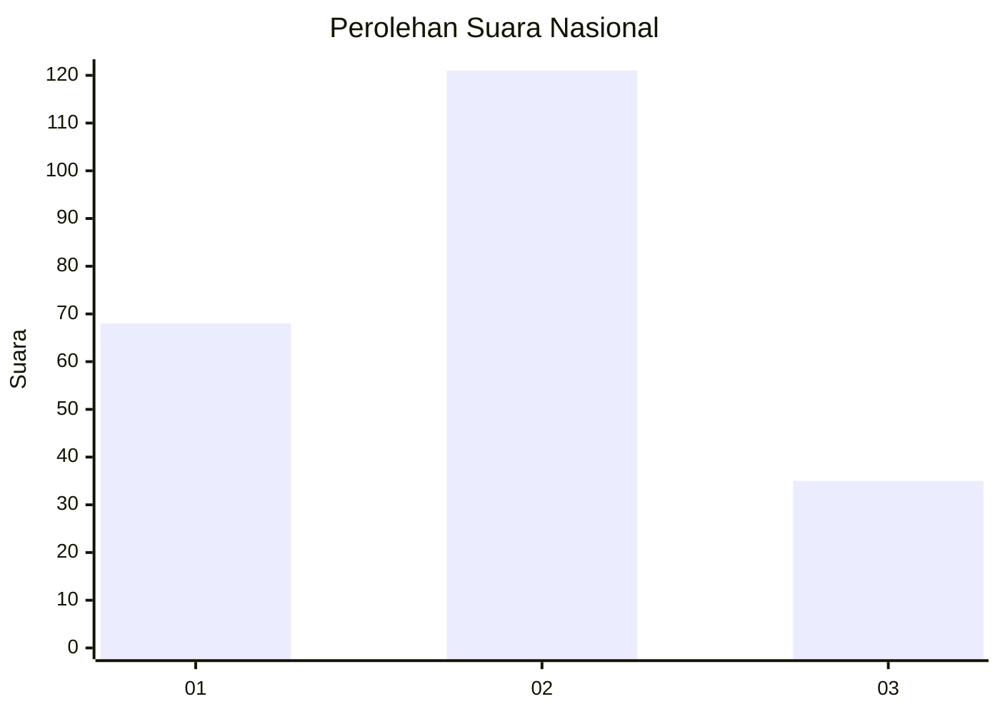
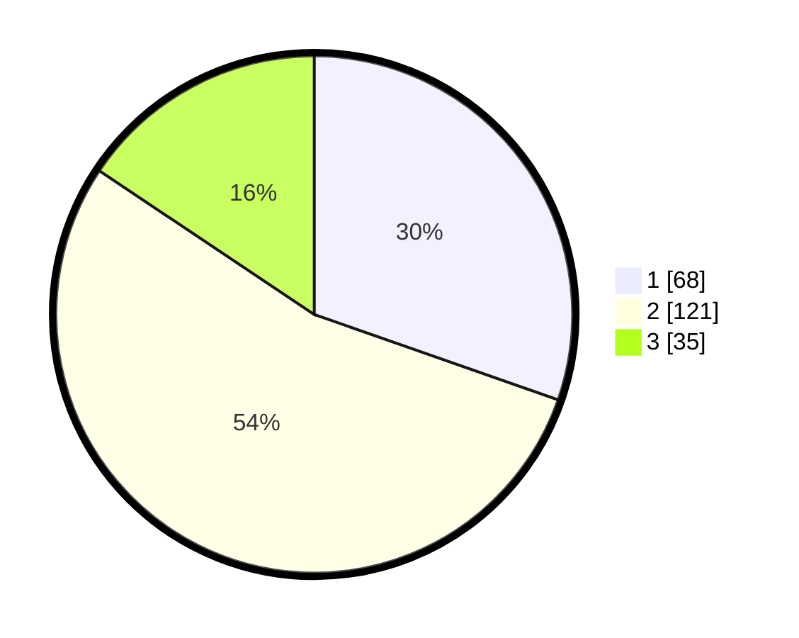

# Hasil

## Grafik

## Tabel

| No. | Nama Paslon    | Suara | Suara (raw) | Persentase |
|:--- |:-------------- | -----:| -----------:| ----------:|
| 1   | ANIES MUHAIMIN | 68    | [68][p-1]   | 30,36      |
| 2   | PRABOWO GIBRAN | 121   | [121][p-2]  | 54,02      |
| 3   | GANJAR MAHFUD  | 35    | [35][p-3]   | 15,63      |

[p-1]: https://github.com/gigit-pemilu/pemilu-2024/blob/main/pilpres/hitung-suara/sub/14-riau/sub/07--rokan-hilir/sub/10-bangko-pusako/sub/2011-pematang-ibul/sub/004-tps/sub/paslon-1.txt
[p-2]: https://github.com/gigit-pemilu/pemilu-2024/blob/main/pilpres/hitung-suara/sub/14-riau/sub/07--rokan-hilir/sub/10-bangko-pusako/sub/2011-pematang-ibul/sub/004-tps/sub/paslon-2.txt
[p-3]: https://github.com/gigit-pemilu/pemilu-2024/blob/main/pilpres/hitung-suara/sub/14-riau/sub/07--rokan-hilir/sub/10-bangko-pusako/sub/2011-pematang-ibul/sub/004-tps/sub/paslon-3.txt

## Foto C Plano

https://sirekap-obj-formc.kpu.go.id/a5fa/pemilu/ppwp/14/07/10/20/11/1407102011004-20240215-023207--26164219-575f-4153-a911-832b2c1fd9db.jpg

https://sirekap-obj-formc.kpu.go.id/a5fa/pemilu/ppwp/14/07/10/20/11/1407102011004-20240215-023140--965450d7-e4f3-4454-ae82-fc275d80c84a.jpg

https://sirekap-obj-formc.kpu.go.id/a5fa/pemilu/ppwp/14/07/10/20/11/1407102011004-20240215-023424--78c31e0e-c5e4-4a25-8c57-6139c1fe350c.jpg

## Metadata

| Key        | Value               |
| ---------- | ------------------- |
| Time Stamp | 2024-02-16 14:00:34 |

