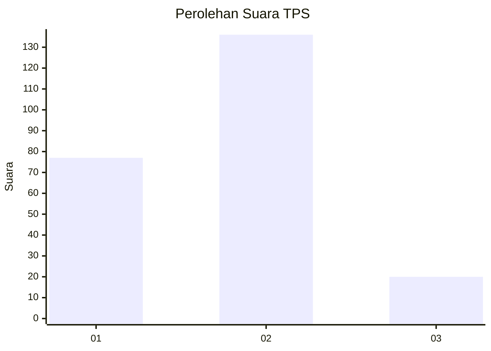
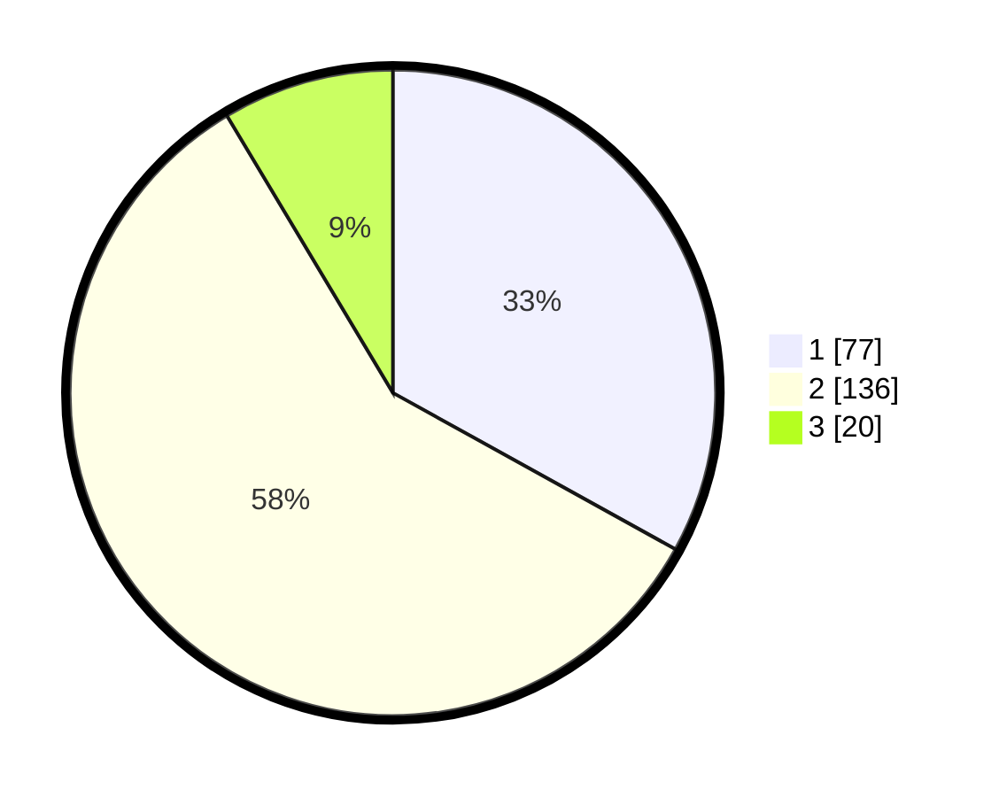

# Hasil

## Grafik

## Tabel

| No. | Nama Paslon    | Suara | Suara (raw) | Persentase |
|:--- |:-------------- | -----:| -----------:| ----------:|
| 1   | ANIES MUHAIMIN | 77    | [77][p-1]   | 33,05      |
| 2   | PRABOWO GIBRAN | 136   | [136][p-2]  | 58,37      |
| 3   | GANJAR MAHFUD  | 20    | [20][p-3]   | 8,58       |

[p-1]: https://github.com/gigit-pemilu/pemilu-2024-14-riau/blob/main/pilpres/hitung-suara/sub/14-riau/sub/07--rokan-hilir/sub/11-simpang-kanan/sub/1001-simpang-kanan/sub/003-tps/sub/paslon-1.txt
[p-2]: https://github.com/gigit-pemilu/pemilu-2024-14-riau/blob/main/pilpres/hitung-suara/sub/14-riau/sub/07--rokan-hilir/sub/11-simpang-kanan/sub/1001-simpang-kanan/sub/003-tps/sub/paslon-2.txt
[p-3]: https://github.com/gigit-pemilu/pemilu-2024-14-riau/blob/main/pilpres/hitung-suara/sub/14-riau/sub/07--rokan-hilir/sub/11-simpang-kanan/sub/1001-simpang-kanan/sub/003-tps/sub/paslon-3.txt

## Foto C Plano

https://sirekap-obj-formc.kpu.go.id/48c3/pemilu/ppwp/14/07/11/10/01/1407111001003-20240215-011528--1ed75b21-2519-4ca0-9dd6-8ef67c4debef.jpg

https://sirekap-obj-formc.kpu.go.id/48c3/pemilu/ppwp/14/07/11/10/01/1407111001003-20240215-011805--d9a83f7b-454c-4aa7-80bf-92c4140de617.jpg

https://sirekap-obj-formc.kpu.go.id/48c3/pemilu/ppwp/14/07/11/10/01/1407111001003-20240215-012013--078708ba-2f75-4356-a8a1-d17941933ed9.jpg

## Metadata

| Key        | Value               |
| ---------- | ------------------- |
| Time Stamp | 2024-02-16 12:51:22 |

