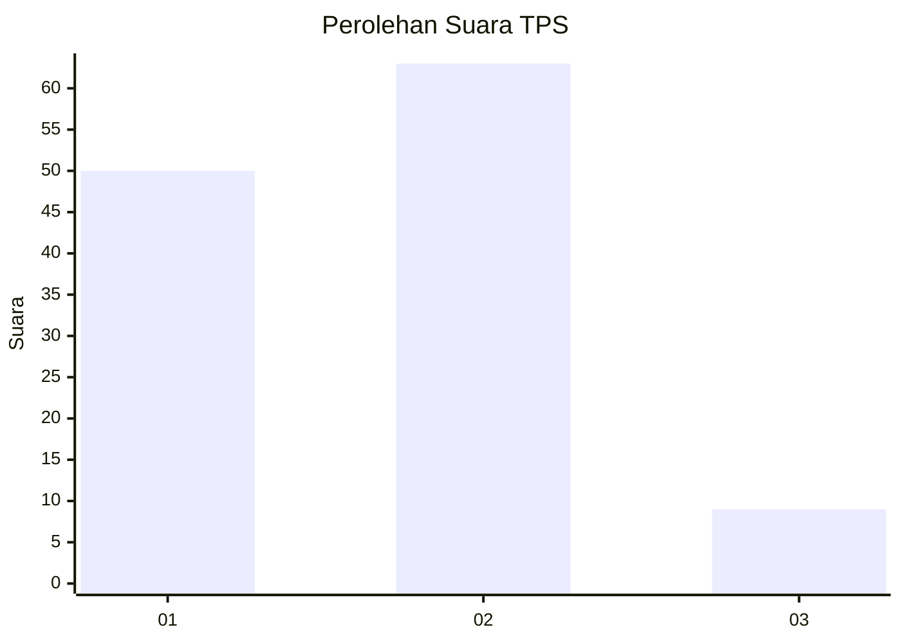

# Hasil

## Grafik

## Tabel

| No. | Nama Paslon    | Suara | Suara (raw) | Persentase |
|:--- |:-------------- | -----:| -----------:| ----------:|
| 1   | ANIES MUHAIMIN | 50    | [50][p-1]   | 40,98      |
| 2   | PRABOWO GIBRAN | 63    | [63][p-2]   | 51,64      |
| 3   | GANJAR MAHFUD  | 9     | [9][p-3]    | 7,38       |

[p-1]: https://github.com/gigit-pemilu/pemilu-2024-14-riau/blob/main/pilpres/hitung-suara/sub/14-riau/sub/07--rokan-hilir/sub/11-simpang-kanan/sub/1001-simpang-kanan/sub/006-tps/sub/paslon-1.txt
[p-2]: https://github.com/gigit-pemilu/pemilu-2024-14-riau/blob/main/pilpres/hitung-suara/sub/14-riau/sub/07--rokan-hilir/sub/11-simpang-kanan/sub/1001-simpang-kanan/sub/006-tps/sub/paslon-2.txt
[p-3]: https://github.com/gigit-pemilu/pemilu-2024-14-riau/blob/main/pilpres/hitung-suara/sub/14-riau/sub/07--rokan-hilir/sub/11-simpang-kanan/sub/1001-simpang-kanan/sub/006-tps/sub/paslon-3.txt

## Foto C Plano

https://sirekap-obj-formc.kpu.go.id/a9f6/pemilu/ppwp/14/07/11/10/01/1407111001006-20240214-234535--8fe5ac1f-a46e-4d82-a0e6-6255411ac644.jpg

https://sirekap-obj-formc.kpu.go.id/a9f6/pemilu/ppwp/14/07/11/10/01/1407111001006-20240214-220015--055aba66-d2c9-42b7-8a6a-a805de4853e2.jpg

https://sirekap-obj-formc.kpu.go.id/a9f6/pemilu/ppwp/14/07/11/10/01/1407111001006-20240214-220141--31ca8638-f0a4-43ad-aef9-901e792c5bbe.jpg

## Metadata

| Key        | Value               |
| ---------- | ------------------- |
| Time Stamp | 2024-02-16 12:51:22 |

