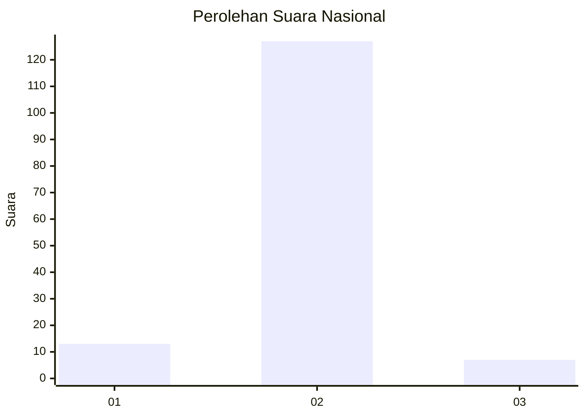
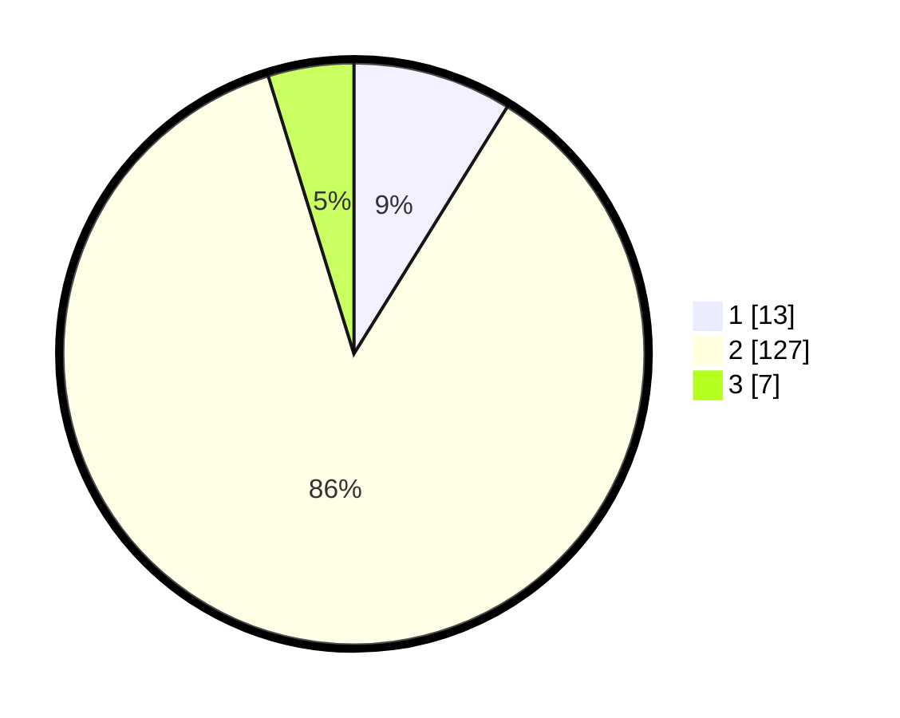

# Hasil

## Grafik

## Tabel

| No. | Nama Paslon    | Suara | Suara (raw) | Persentase |
|:--- |:-------------- | -----:| -----------:| ----------:|
| 1   | ANIES MUHAIMIN | 13    | [13][p-1]   | 8,84       |
| 2   | PRABOWO GIBRAN | 127   | [127][p-2]  | 86,39      |
| 3   | GANJAR MAHFUD  | 7     | [7][p-3]    | 4,76       |

[p-1]: https://github.com/gigit-pemilu/pemilu-2024/blob/main/pilpres/hitung-suara/sub/14-riau/sub/07--rokan-hilir/sub/11-simpang-kanan/sub/2004-bukit-damar/sub/003-tps/sub/paslon-1.txt
[p-2]: https://github.com/gigit-pemilu/pemilu-2024/blob/main/pilpres/hitung-suara/sub/14-riau/sub/07--rokan-hilir/sub/11-simpang-kanan/sub/2004-bukit-damar/sub/003-tps/sub/paslon-2.txt
[p-3]: https://github.com/gigit-pemilu/pemilu-2024/blob/main/pilpres/hitung-suara/sub/14-riau/sub/07--rokan-hilir/sub/11-simpang-kanan/sub/2004-bukit-damar/sub/003-tps/sub/paslon-3.txt

## Foto C Plano

https://sirekap-obj-formc.kpu.go.id/ed3b/pemilu/ppwp/14/07/11/20/04/1407112004003-20240215-022710--6230a888-708e-4ac1-a9a9-6c530097ff9f.jpg

https://sirekap-obj-formc.kpu.go.id/ed3b/pemilu/ppwp/14/07/11/20/04/1407112004003-20240215-022916--dae3eecf-d889-4437-b314-484a473bad9e.jpg

https://sirekap-obj-formc.kpu.go.id/ed3b/pemilu/ppwp/14/07/11/20/04/1407112004003-20240215-015814--b45aac7f-3d21-4e5d-b4a5-b6ba4fb5e799.jpg

## Metadata

| Key        | Value               |
| ---------- | ------------------- |
| Time Stamp | 2024-02-16 12:51:22 |

