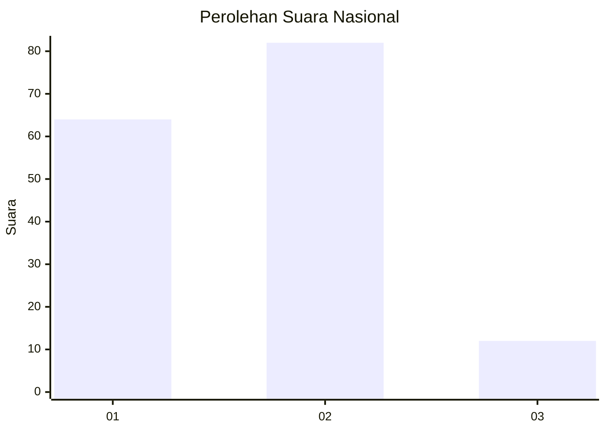

# Hasil

## Grafik

## Tabel

| No. | Nama Paslon    | Suara | Suara (raw) | Persentase |
|:--- |:-------------- | -----:| -----------:| ----------:|
| 1   | ANIES MUHAIMIN | 64    | [64][p-1]   | 40,51      |
| 2   | PRABOWO GIBRAN | 82    | [82][p-2]   | 51,90      |
| 3   | GANJAR MAHFUD  | 12    | [12][p-3]   | 7,59       |

[p-1]: https://github.com/gigit-pemilu/pemilu-2024/blob/main/pilpres/hitung-suara/sub/14-riau/sub/07--rokan-hilir/sub/12-batu-hampar/sub/2001-bantaian/sub/006-tps/sub/paslon-1.txt
[p-2]: https://github.com/gigit-pemilu/pemilu-2024/blob/main/pilpres/hitung-suara/sub/14-riau/sub/07--rokan-hilir/sub/12-batu-hampar/sub/2001-bantaian/sub/006-tps/sub/paslon-2.txt
[p-3]: https://github.com/gigit-pemilu/pemilu-2024/blob/main/pilpres/hitung-suara/sub/14-riau/sub/07--rokan-hilir/sub/12-batu-hampar/sub/2001-bantaian/sub/006-tps/sub/paslon-3.txt

## Foto C Plano

https://sirekap-obj-formc.kpu.go.id/4981/pemilu/ppwp/14/07/12/20/01/1407122001006-20240221-151925--856c7766-e8d0-4ae6-b3b2-3124e848f660.jpg

https://sirekap-obj-formc.kpu.go.id/4981/pemilu/ppwp/14/07/12/20/01/1407122001006-20240221-152022--260a6265-dfbb-40f6-85b2-bf6e3c613771.jpg

https://sirekap-obj-formc.kpu.go.id/4981/pemilu/ppwp/14/07/12/20/01/1407122001006-20240221-152115--776cade1-13e5-4fba-a6f1-45c41f413b5b.jpg

## Metadata

| Key        | Value               |
| ---------- | ------------------- |
| Time Stamp | 2024-02-25 15:00:00 |

