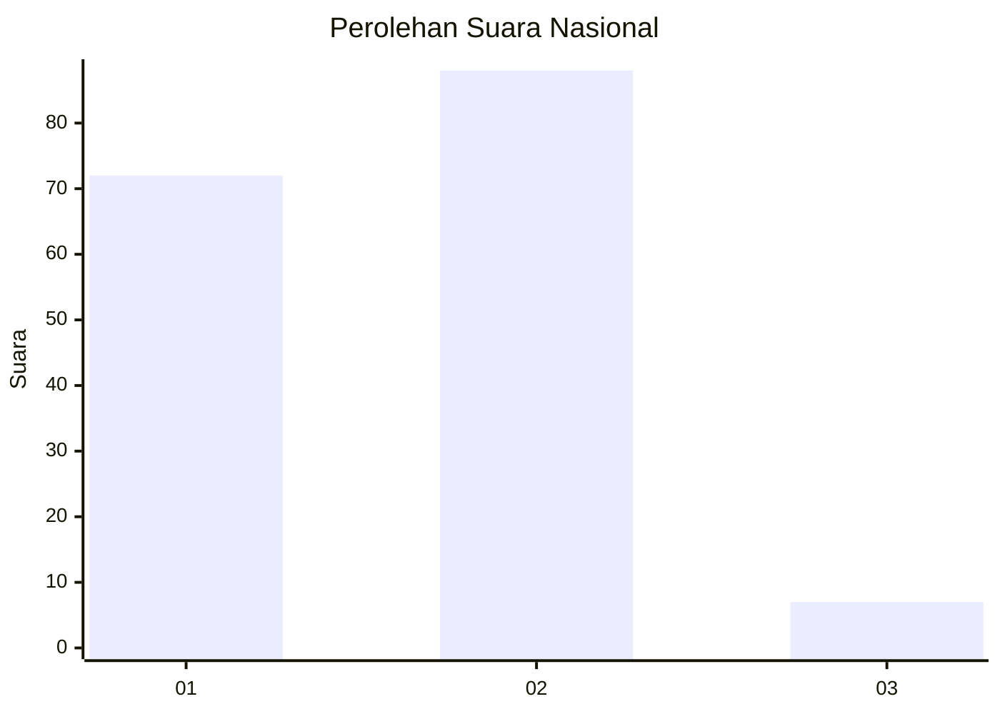
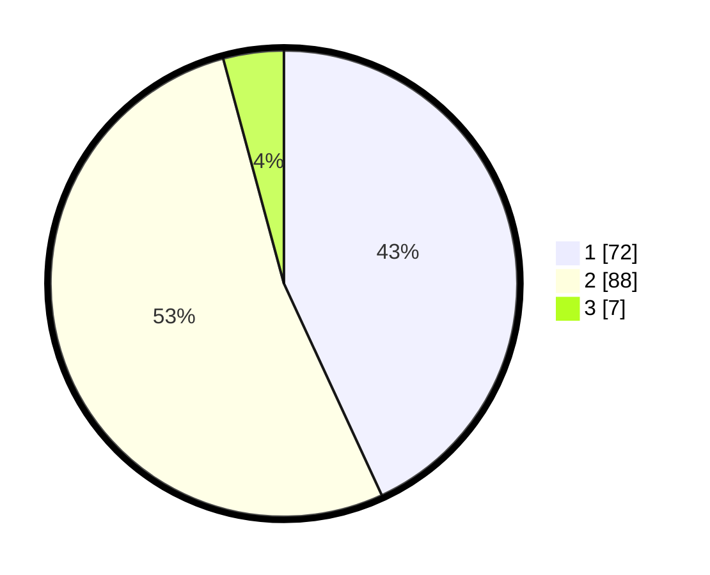

# Hasil

## Grafik

## Tabel

| No. | Nama Paslon    | Suara | Suara (raw) | Persentase |
|:--- |:-------------- | -----:| -----------:| ----------:|
| 1   | ANIES MUHAIMIN | 72    | [72][p-1]   | 43,11      |
| 2   | PRABOWO GIBRAN | 88    | [88][p-2]   | 52,69      |
| 3   | GANJAR MAHFUD  | 7     | [7][p-3]    | 4,19       |

[p-1]: https://github.com/gigit-pemilu/pemilu-2024/blob/main/pilpres/hitung-suara/sub/14-riau/sub/07--rokan-hilir/sub/12-batu-hampar/sub/2002-sungaisialang/sub/006-tps/sub/paslon-1.txt
[p-2]: https://github.com/gigit-pemilu/pemilu-2024/blob/main/pilpres/hitung-suara/sub/14-riau/sub/07--rokan-hilir/sub/12-batu-hampar/sub/2002-sungaisialang/sub/006-tps/sub/paslon-2.txt
[p-3]: https://github.com/gigit-pemilu/pemilu-2024/blob/main/pilpres/hitung-suara/sub/14-riau/sub/07--rokan-hilir/sub/12-batu-hampar/sub/2002-sungaisialang/sub/006-tps/sub/paslon-3.txt

## Foto C Plano

https://sirekap-obj-formc.kpu.go.id/c2ef/pemilu/ppwp/14/07/12/20/02/1407122002006-20240214-190600--0811d63e-f6b2-4270-8257-e90c4ef3af01.jpg

https://sirekap-obj-formc.kpu.go.id/c2ef/pemilu/ppwp/14/07/12/20/02/1407122002006-20240214-191745--5344a37c-c085-43de-86c1-538025d36b41.jpg

https://sirekap-obj-formc.kpu.go.id/c2ef/pemilu/ppwp/14/07/12/20/02/1407122002006-20240214-191006--9c64d60f-b2c9-4df1-8e76-73a858ed3532.jpg

## Metadata

| Key        | Value               |
| ---------- | ------------------- |
| Time Stamp | 2024-02-15 22:00:27 |

