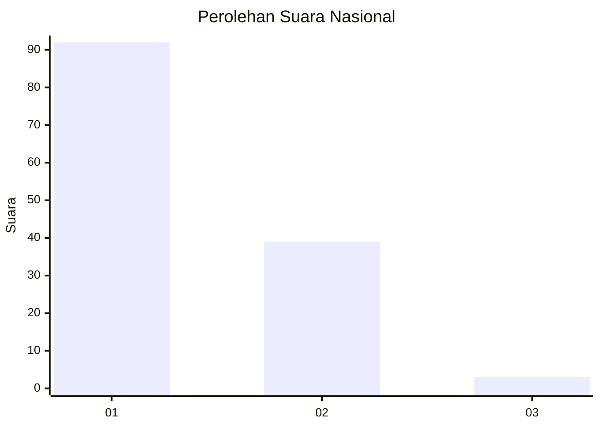
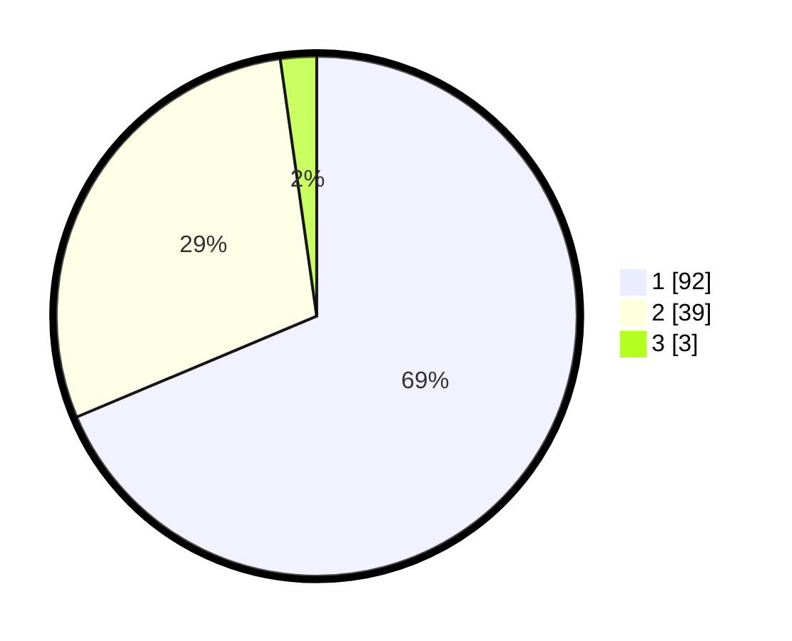

# Hasil

## Grafik

## Tabel

| No. | Nama Paslon    | Suara | Suara (raw) | Persentase |
|:--- |:-------------- | -----:| -----------:| ----------:|
| 1   | ANIES MUHAIMIN | 92    | [92][p-1]   | 68,66      |
| 2   | PRABOWO GIBRAN | 39    | [39][p-2]   | 29,10      |
| 3   | GANJAR MAHFUD  | 3     | [3][p-3]    | 2,24       |

[p-1]: https://github.com/gigit-pemilu/pemilu-2024/blob/main/pilpres/hitung-suara/sub/14-riau/sub/07--rokan-hilir/sub/12-batu-hampar/sub/2005-sungaisialang-hulu/sub/002-tps/sub/paslon-1.txt
[p-2]: https://github.com/gigit-pemilu/pemilu-2024/blob/main/pilpres/hitung-suara/sub/14-riau/sub/07--rokan-hilir/sub/12-batu-hampar/sub/2005-sungaisialang-hulu/sub/002-tps/sub/paslon-2.txt
[p-3]: https://github.com/gigit-pemilu/pemilu-2024/blob/main/pilpres/hitung-suara/sub/14-riau/sub/07--rokan-hilir/sub/12-batu-hampar/sub/2005-sungaisialang-hulu/sub/002-tps/sub/paslon-3.txt

## Foto C Plano

https://sirekap-obj-formc.kpu.go.id/e7f9/pemilu/ppwp/14/07/12/20/05/1407122005002-20240214-191238--7b0f46a2-191e-4b0c-8352-2105ae704565.jpg

https://sirekap-obj-formc.kpu.go.id/e7f9/pemilu/ppwp/14/07/12/20/05/1407122005002-20240214-191401--cc259f9b-bf13-469f-bfb4-019eb9fe0afa.jpg

https://sirekap-obj-formc.kpu.go.id/e7f9/pemilu/ppwp/14/07/12/20/05/1407122005002-20240216-234932--fab0f647-43ba-4be4-b3dd-ad02b7e6b3c6.jpg

## Metadata

| Key        | Value               |
| ---------- | ------------------- |
| Time Stamp | 2024-02-17 00:00:00 |

