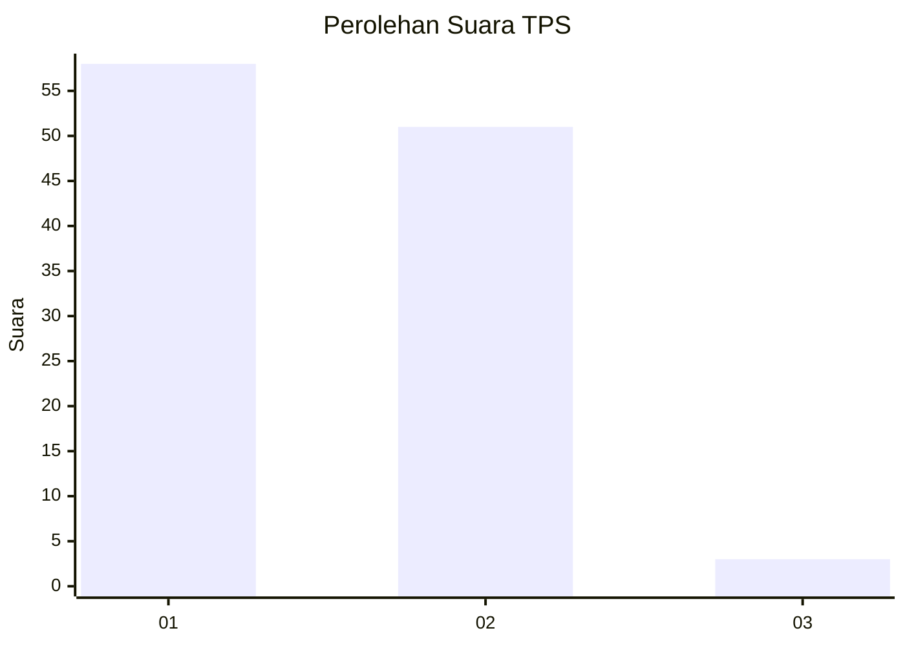
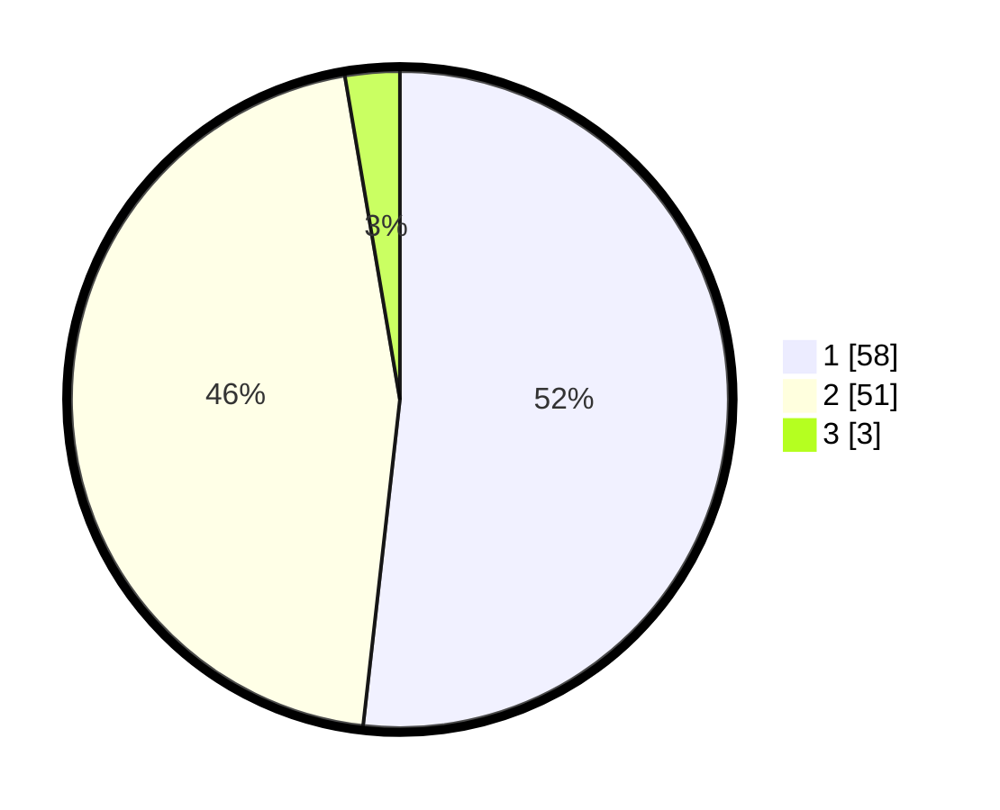

# Hasil

## Grafik

## Tabel

| No. | Nama Paslon    | Suara | Suara (raw) | Persentase |
|:--- |:-------------- | -----:| -----------:| ----------:|
| 1   | ANIES MUHAIMIN | 58    | [58][p-1]   | 51,79      |
| 2   | PRABOWO GIBRAN | 51    | [51][p-2]   | 45,54      |
| 3   | GANJAR MAHFUD  | 3     | [3][p-3]    | 2,68       |

[p-1]: https://github.com/gigit-pemilu/pemilu-2024-14-riau/blob/main/pilpres/hitung-suara/sub/14-riau/sub/07--rokan-hilir/sub/12-batu-hampar/sub/2005-sungaisialang-hulu/sub/003-tps/sub/paslon-1.txt
[p-2]: https://github.com/gigit-pemilu/pemilu-2024-14-riau/blob/main/pilpres/hitung-suara/sub/14-riau/sub/07--rokan-hilir/sub/12-batu-hampar/sub/2005-sungaisialang-hulu/sub/003-tps/sub/paslon-2.txt
[p-3]: https://github.com/gigit-pemilu/pemilu-2024-14-riau/blob/main/pilpres/hitung-suara/sub/14-riau/sub/07--rokan-hilir/sub/12-batu-hampar/sub/2005-sungaisialang-hulu/sub/003-tps/sub/paslon-3.txt

## Foto C Plano

https://sirekap-obj-formc.kpu.go.id/78b1/pemilu/ppwp/14/07/12/20/05/1407122005003-20240218-174703--5e9fc5b9-1518-4fbd-aca3-9ead3065e9a3.jpg

https://sirekap-obj-formc.kpu.go.id/78b1/pemilu/ppwp/14/07/12/20/05/1407122005003-20240218-175020--c7a48e39-f709-45b1-9b4a-0714b3bebd95.jpg

https://sirekap-obj-formc.kpu.go.id/78b1/pemilu/ppwp/14/07/12/20/05/1407122005003-20240218-175212--162a4c29-9aa2-4b38-9cdf-c7b25af70e5c.jpg

## Metadata

| Key        | Value               |
| ---------- | ------------------- |
| Time Stamp | 2024-02-19 21:00:00 |

