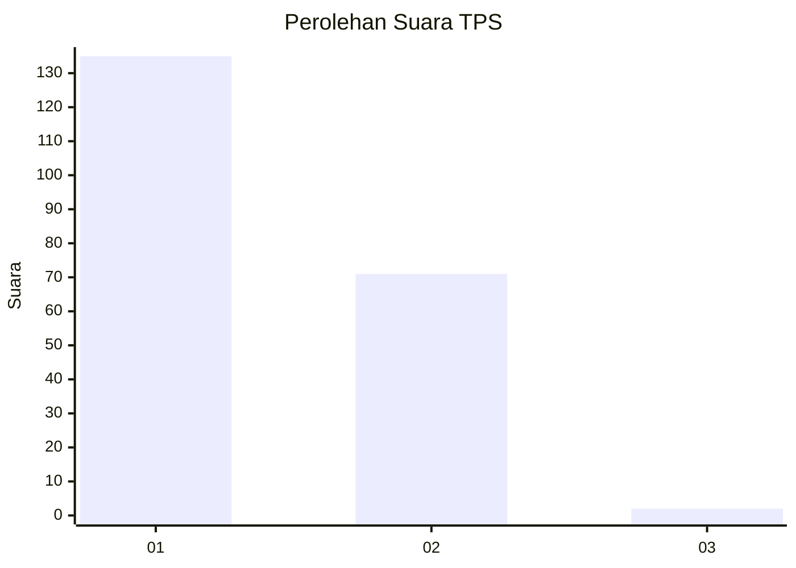
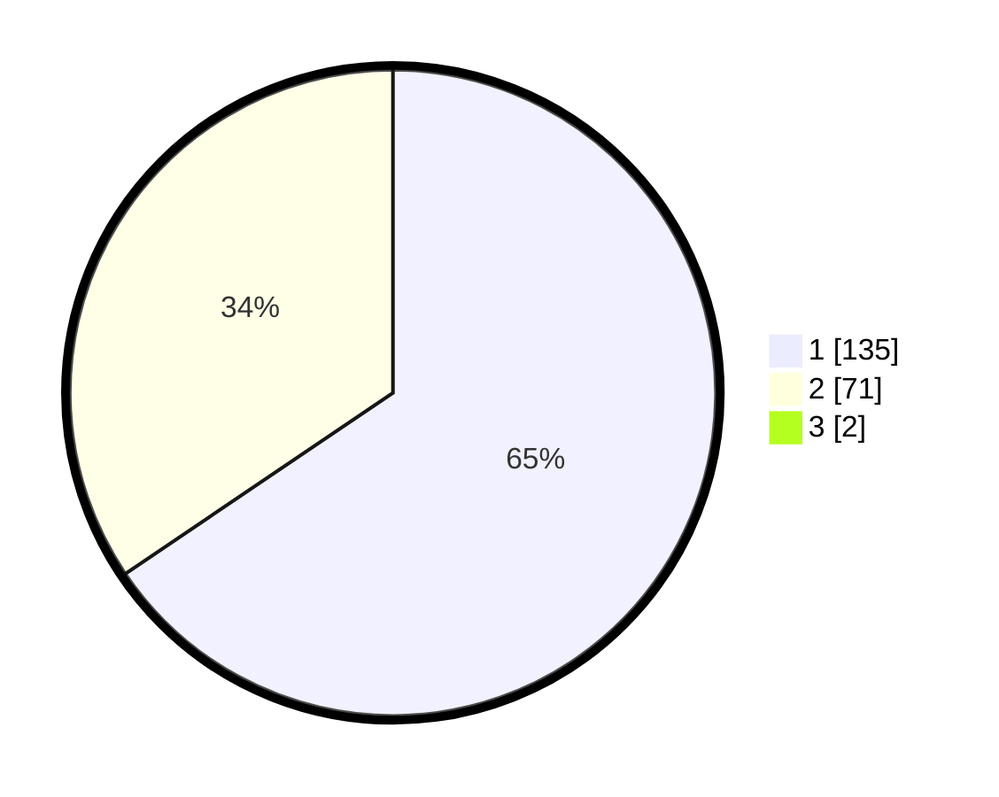

# Hasil

## Grafik

## Tabel

| No. | Nama Paslon    | Suara | Suara (raw) | Persentase |
|:--- |:-------------- | -----:| -----------:| ----------:|
| 1   | ANIES MUHAIMIN | 135   | [135][p-1]  | 64,90      |
| 2   | PRABOWO GIBRAN | 71    | [71][p-2]   | 34,13      |
| 3   | GANJAR MAHFUD  | 2     | [2][p-3]    | 0,96       |

[p-1]: https://github.com/gigit-pemilu/pemilu-2024-14-riau/blob/main/pilpres/hitung-suara/sub/14-riau/sub/07--rokan-hilir/sub/13-rantau-kopar/sub/1002-rantau-kopar/sub/001-tps/sub/paslon-1.txt
[p-2]: https://github.com/gigit-pemilu/pemilu-2024-14-riau/blob/main/pilpres/hitung-suara/sub/14-riau/sub/07--rokan-hilir/sub/13-rantau-kopar/sub/1002-rantau-kopar/sub/001-tps/sub/paslon-2.txt
[p-3]: https://github.com/gigit-pemilu/pemilu-2024-14-riau/blob/main/pilpres/hitung-suara/sub/14-riau/sub/07--rokan-hilir/sub/13-rantau-kopar/sub/1002-rantau-kopar/sub/001-tps/sub/paslon-3.txt

## Foto C Plano

https://sirekap-obj-formc.kpu.go.id/d03d/pemilu/ppwp/14/07/13/10/02/1407131002001-20240214-193703--bedb7c3d-6152-4084-a58b-c2e3d83aad01.jpg

https://sirekap-obj-formc.kpu.go.id/d03d/pemilu/ppwp/14/07/13/10/02/1407131002001-20240214-193944--0dce21ad-52ac-4c0b-8ebb-cad48ac9df2f.jpg

https://sirekap-obj-formc.kpu.go.id/d03d/pemilu/ppwp/14/07/13/10/02/1407131002001-20240214-194024--16dee270-9a6f-43b5-ba95-9a1ae258295a.jpg

## Metadata

| Key        | Value               |
| ---------- | ------------------- |
| Time Stamp | 2024-02-16 14:00:34 |

